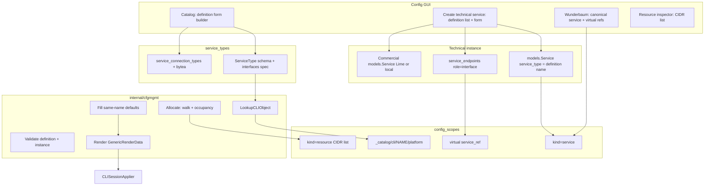
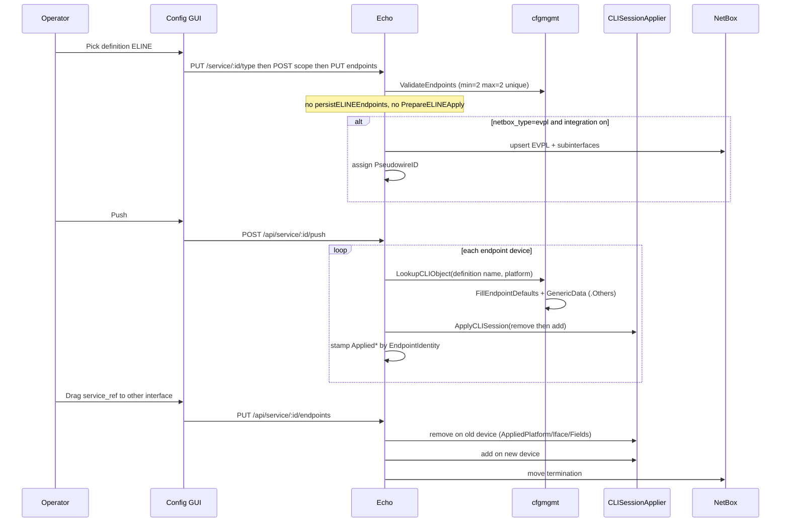
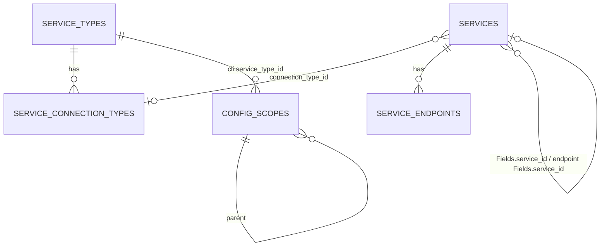

# Service definitions in the GUI: no built-in products

| Field | Value |
| ----- | ----- |
| Status | Implemented (engine + GUI); operator how-to is `docs/cfgmgmt-service-design.md` |
| Author | Factum |
| Date | 2026-09-13 |
| Audience | Factum maintainers (cfgmgmt, web, GUI) |
| Supersedes | Seeded builtin types and ELINE CLI in `docs/cfgmgmt-tree-objects.md` and `docs/cfgmgmt-service-design.md`; JSON schema/roles textareas; named `EndpointRole`s; ELINE-only `.Remote` / `.PeerLocal*` render; ELINE-only delete cleanup |
| Related | `docs/cfgmgmt-tree-objects.md` (tree kinds, canonical + virtual refs — **kept**), `docs/cfgmgmt-service-design.md` (rewrite as operator how-to after this lands), `docs/user/config.md`, `docs/user/services.md`, `AGENTS.md` (capacity service types) |

The **Current state** / PR plan sections below are the pre-change baseline and rollout notes. Operator how-to after landing: [cfgmgmt-service-design.md](cfgmgmt-service-design.md). Tree architecture: [cfgmgmt-tree-objects.md](cfgmgmt-tree-objects.md).

## Overview

Operators must define capacity services (ELINE, ELAN, POLARIX, …) entirely in the web GUI. Factum ships **no built-in service types and no seeded translation CLI**. A `ServiceType` catalog row (Config → Catalog → Service types) is the **definition**: a form-built schema, one homogeneous interfaces spec (min/max, no named roles), optional connection types with uploaded images, and optional NetBox mapping. A technical **service object** in the config tree is still a `models.Service` row (`service_type` = definition name) plus `service_endpoints`. Commercial Lime/local rows stay customer info on the Services page; a ServiceID field on the definition links a technical instance (or each interface) to those rows.

Provisioning looks up `kind=cli` by definition name + device platform (`LookupCLIObject` / `_catalog/cli/<name>/<platform>`), renders feature blobs with a generic template context (`.Fields`, `.FieldMeta`, `.ConnectionType`, `.Interfaces` with peers, engine-filled defaults, `.Vars`), and pushes via `CLISessionApplier`. NetBox reconcile is generic from endpoints when `sync_source` / `netbox_type` are set. This is a **breaking one-shot goose migrate** (`internal/dbmigrate/sql/00004_service_definitions.sql`): wipe types, translation CLI, and all `services` / `service_endpoints` rows (lab/dev; next Lime sync recreates commercial rows). No dual-read of `endpoint_roles`. `cfgmgmt.Seed` does **not** wipe on subsequent starts.

## Background & Motivation

### Current state

The tree model in `docs/cfgmgmt-tree-objects.md` is implemented: `config_scopes.kind` includes `folder`, `site`, `location`, `device`, `interface`, `parameter`, `cli`, `service`, `service_endpoint`, plus virtual `service_ref`. Translation CLI lives under `global/_catalog/cli/<ServiceType.Name>/<platform>` and is looked up by `(service_type_id, platform)` in `cfgmgmt.LookupCLIObject` (`internal/cfgmgmt/pack.go`, `lookupCLIObjectByTypeID` in `internal/cfgmgmt/cli.go`) with `sros-md` → `sros` fallback.

Production schema is **goose SQL** (`internal/dbmigrate/sql/00001_baseline.sql`, `00002_dns_zone_editor.sql`, `00003_dns_db_file.sql`) applied by `dbmigrate.Up` from `util.MigrateDatabase`. GORM `AutoMigrateAll` is SQLite tests only (`models/automigrate.go`). `cfgmgmt.Seed` runs after migrate on **every** start; it is not a one-shot schema step. There is no `MigrateTree` symbol.

What is **not** operator-owned yet:

- `cfgmgmt.Seed` (`internal/cfgmgmt/seed.go`) still inserts builtin `ELINE` / `ELAN` / `L3VPN` / `POLARIX` (`seedServiceTypes`) and checksum-refreshes ELINE CLI from `internal/drivers/templates/*.tmpl` (`seedELINECLI`).
- `ServiceType` stores `Schema []FieldSchema` and `EndpointRoles []EndpointRole` as **separate text columns** (`service_types.schema`, `service_types.endpoint_roles` in `00001_baseline.sql`; each `gorm:"serializer:json"` on `models/config.go`). The catalog dialog in `web/frontend/src/views/config/ConfigPage.vue` (`openType` / `saveType`, FormModal title "Service type") is two JSON textareas (`schema_text`, `roles_text`).
- `FieldSchema` is only `{name, type, required, description}`. Enum values, int min/max/unit, MAC, prefix-from-pool, ServiceID pickers, and lists are not first-class. `cfgmgmt.TypeCheck` is the config-variable engine; endpoint validation (`ValidateEndpoints` in `internal/cfgmgmt/endpoints.go`) wraps it with a bare `ConfigVariableDef{Name, Type}` — no field-level constraints.
- Named roles (`a`/`b`, `endpoint`) drive cardinality. `GenericRenderData` (`internal/cfgmgmt/device.go`) still special-cases `ServiceType == "ELINE"`: `fillELINEPeer` sets `.Remote`, `.PeerLocalIface`, `.PeerLocalVLAN`, `.SDPID`; `vlan` is promoted to `.LocalVLAN`.
- `PUT /api/service/:id/endpoints` (`web/handler_config.go`) still branches: `ValidateELINEShape` + `persistELINEEndpoints` when the type **name** is `ELINE`. Generic push (`apiServiceGenericPush`) requires `PseudowireID != 0` for that name, calls `PrepareELINEApply(elineIntentFromData(...))` (copies `.Remote` / `.LocalVLAN` / `.PeerLocal*` / `.StaleSubinterfaces`), and stamps `AppliedEndpointA/B*` by roles `a`/`b`. Tree endpoint delete still calls `ValidateELINEShape` when the type name is `ELINE` (`internal/cfgmgmt/scope.go`).
- `ApiServiceDelete` (`web/handler_service.go`) only tears down NetBox/device state when `ServiceType == "ELINE"` (`removeELINEServiceFromNetbox` / `removeELINEServiceFromDevices` in `web/handler_service_eline.go`).
- The Services create wizard (`ServiceCreateWizard.vue`) lists every catalog type as a product. `_services` is the default parent for canonical technical nodes; `_catalog` is reserved folders for translation CLI, **not** a customer-service listing — but operators still experience “Factum has ELINE built in.”

Commercial `models.Service` (`models/organisation.go`) is one row for both Lime customer info and cfgmgmt instance (type, `Fields`, endpoints). Wavelength (VL/VI) and dark fiber (LF/LI) have no `ServiceType`.

**Required today:** endpoint `FieldSchema.Required` **is** enforced in `ValidateEndpoints`. Service-level `schema[].required` is documentation-only (`docs/cfgmgmt-service-design.md`); `CreateServiceRecord` / `PUT /api/service/:id/type` do not type-check it.

`config_cli_features.scope_id`, `service_endpoints.service_id`, and `config_scopes.service_id` / `service_type_id` have **no SQL FOREIGN KEY** in `00001_baseline.sql`. Feature cleanup is application-level in `deleteScopeSubtree` (`internal/cfgmgmt/scope.go`): delete `config_assignments` and `config_cli_features` for each scope, then the scope row.

### Pain points

1. **Cannot define a product in the GUI.** JSON roles/schema and seeded builtins mean a new ELAN/POLARIX is a code/seed change or an error-prone textarea.
2. **Named roles overfit ELINE.** Homogeneous UNIs (ELAN, POLARIX) do not need `a`/`b`. Templates and Go still assume two-sided `.Remote`.
3. **Built-in products contradict the product goal.** Drivers must stay generic (`CLISessionApplier`). Seeded ELINE templates and `Builtin` delete/rename guards (`ApiConfigServiceTypeDelete`) make types look like code.
4. **Commercial vs technical is conflated.** A Lime CN is customer info; realizing it on devices should be a service object driven by a definition, including ELAN where each UNI has its own commercial ServiceID.
5. **Delete/move cleanup is ELINE-only.** Moving a UNI to another PE must remove old CLI, add new CLI, and update NetBox for any mapped type.
6. **No prefix pool in the tree.** POLARIX needs “pick a free peering prefix from the site pool” without involving `models.IpamPrefix` (`models/ipam.go`).

### What stays (from tree-objects)

- One polymorphic `config_scopes` tree; canonical `kind=service` node + virtual `service_ref` under involved interfaces; drag-ref rebinds the endpoint (`docs/cfgmgmt-tree-objects.md` § Service objects).
- CLI objects, features (add / optional update / remove), enter/exit **pattern language** (`interface <name>`, `router bgp <as>` — not raw RE2). Missing update ⇒ remove then add. v1 GUI may still hide `update_commands` (`ConfigCLIFeature` in `models/config.go`).
- Parameter objects and `Resolve` closest-ancestor-wins.
- Drivers apply CLI sessions only. `payload_kind` other than `cli` remains preview-only (`RequireCLIObject`). Push stays `POST /api/service/:id/push` (service translation only).
- Lime-owned commercial fields when `Service.Source == "lime"`. Do not create/delete NetBox DCIM devices from the tree.
- Wavelength / dark fiber stay inventory-only. No definition, no CLI for VL/VI/LF/LI.

## Goals & Non-Goals

### Goals

- Operators create/edit/delete **definitions** in Catalog with a form builder (fields, interfaces spec, connection types + image upload, NetBox mapping). **Zero** seeded types and **zero** seeded ELINE CLI after migrate.
- Creating a **technical instance** lists definitions; the selected definition renders a form. Data is stored as `Service.Fields` + homogeneous `service_endpoints`.
- Provisioning: per endpoint device, `LookupCLIObject(definitionName, platform)`, render, push. Engine fills empty interface fields from the same-named service-level field at render/push only.
- Connection type is one choice per instance; templates branch on `.ConnectionType`.
- New tree kind `resource` (named CIDR list). Prefix fields with `resource` allocate by walking interface → device → ancestors → `global`.
- ServiceID field type picks commercial `models.Service` rows (Lime or local). Service-level and/or per-interface.
- Generic NetBox reconcile and generic delete/move/unrealize device cleanup. No remaining `ServiceType == "ELINE"` persist/push/NetBox branches by the time the instance GUI lands.
- Breaking wipe of types, translation CLI, and all Service inventory rows — **once**, in goose.

### Non-Goals

- Import/export of definitions (JSON/YAML package). Follow-up.
- A separately shipped package of ELINE/ELAN/POLARIX definitions. Follow-up; embed templates may remain as **example files** but `Seed` must not insert them.
- L3VPN definition (similar to POLARIX; unique RT/RD). Follow-up.
- Dual-read of old `endpoint_roles` JSON, migration of existing services, or preserving lab instances.
- Named endpoint roles (`a`/`b`, hub/spoke).
- Splitting/carving CIDRs; IPAM tables (`ipam_*`).
- New apply protocols, golden/baseline push, NetBox DCIM create/delete, hub allowlist changes.
- Inventing CLI for VL/VI/LF/LI.
- Changing Lime sync field ownership.
- Occupancy locking / unique occupancy table (v1 is last-write-wins).
- SVG connection-type images (v1 PNG/WebP only).

## Key Decisions

1. **Evolve `ServiceType`, do not add a tree kind for definitions.** Catalog row remains `service_types`. Rationale: lookup, `Service.ServiceType` string, CLI `service_type_id`, and device-sync maps already key off this table (`LookupServiceType`, `InventoryMaps` in `internal/cfgmgmt/pack.go`). A definition node in `_catalog` would duplicate uniqueness and confuse `_catalog` (CLI home) with customer services.

2. **Homogeneous interfaces: one spec, `max == 0` means unlimited.** Replace `EndpointRoles []EndpointRole` with `Interfaces ServiceInterfacesSpec`. Stored `ServiceEndpoint.Role` is always the sentinel `"interface"` (column stays `NOT NULL`). Goose **adds** `service_types.interfaces` and **`DROP COLUMN endpoint_roles`**. Rationale: matches today’s `EndpointRole.Max == 0` unlimited convention (`ValidateEndpoints`, `EndpointRolesForCount`); no dual-read; `endpoint_roles` is its own column, not a JSON key Gorm can overwrite.

3. **No built-in products; breaking wipe in goose, not Seed.** `internal/dbmigrate/sql/00004_service_definitions.sql` runs once via `dbmigrate.Up`. `Seed` stops calling `seedServiceTypes` / `seedELINECLI` but **never** `DELETE`s operator data. `Builtin` is ignored (always false after wipe). Delete/rename guards based on `Builtin` go away. SQLite tests: `AutoMigrateAll` + Seed without builtins; no goose. Rationale: `Seed` runs on every `util.MigrateDatabase`; an “idempotent” full delete would re-wipe definitions on every migrate.

4. **CLI lookup stays `(definition name, platform)` via `service_type_id`, conventional path `_catalog/cli/<name>/<platform>`.** `LookupCLIObject` is unchanged in contract; `sros-md` falls back to `sros`. Tree location is still ignored for translation lookup (unique index `idx_config_scopes_cli_type_plat`). Saving a definition ensures the folder path. Rationale: already implemented; path is the operator convention, id is the index.

5. **Connection types are a child table with bytea images, not a `FieldSchema` row.** One choice per technical instance (`services.connection_type_id`). Templates see `.ConnectionType` (name string). PUT of the definition **replaces connection types by id** in one transaction, **DELETE omitted (if unreferenced) → UPDATE remaining ids → INSERT nameless DTOs**, so unique `(service_type_id, name)` cannot fire mid-replace. 409 if an omitted id is still referenced by a service; preserve `image` bytea on id match. Images: PNG/WebP only, 512KiB enforced in the handler before a full slurp. Rationale: images must round-trip in Postgres backup; SVG is stored XSS.

6. **Canonical node + virtual refs unchanged.** Parent of the real node is folder/site/location (or device as grouping); refs under involved interfaces. Drag-ref rebinds via the existing `PUT /api/service/:id/endpoints` (server-side remove-old/add-new). `_services` is only the default parent for new technical nodes. `_catalog` is not a list of customer services. Services page remains commercial inventory.

7. **`kind=resource` is a named CIDR list on the tree.** Occupancy is exact canonical prefix string on any service/endpoint field (including list items) whose **prefix-typed** schema node has `resource` equal to that name. No carve. Closest ancestor with matching child name wins. Unique `(parent_id, kind, name)` for `kind=resource` only (`409` in `CreateScope`/`MoveScope`/`UpdateScope`). Allowed parents: folder, site, location, device, **interface**. **Not** under `service` (or parameter/cli/service_endpoint/resource). The canonical service node is not an ancestor of a UNI; Allocate walks **interface → device → ancestors → global** only. A pool hung on the service object would never win. Parameter-under-service works because render **merges** those assignments into `.Vars` for that service — Allocate has no such overlay. Walk starts at the endpoint’s interface scope if present, else the device scope, else **`global`** (device not in the tree). Allocate does not write; two concurrent saves can pick the same prefix (**last-write-wins**; no occupancy table in v1).

8. **Engine default fill is same-name, render-only.** Interface field `bandwidth` empty → copy service-level `bandwidth`. Not `default_bandwidth`. Stored endpoint JSON stays empty. `empty` for fill/required: missing, JSON null, `""`, and for `service_id` **also `0`**. `0`/`false`/`[]` are otherwise explicit. Rationale: one convention; templates always see a value.

9. **ServiceID field stores commercial `services.id` (uint JSON number).** `0` / omit / null = unset. Render resolves to the row for the CN/CI string and Lime metadata. Rationale: PK is unique and indexed; the display string can change shape for old Lime IDs. Same-row realization sets the field to the technical row’s own id.

10. **Fewer magic template names.** Drop `.LocalVLAN` / `.Remote` / `.PeerLocal*` / ELINE-only `fillELINEPeer`. Keep `.LocalIface`. Keep copying `bandwidth_mbps` / `max_mac_addresses` onto `Service` columns for list views when those **exact** schema names exist. Neighbor loopback is set on `.Others[i].NeighborIP` only when that peer’s device ≠ current device; same-device peers leave `NeighborIP` empty (templates use `.LocalIface` / `.Fields`). SDPID is FuncMap `sdpid`, not a struct field. **`.FieldMeta`** exposes definition metadata (including `Unit`) to templates. Hardcoded `DefaultELINEMTU` / `DefaultELINEControlWord` go away; operators put `mtu` / `control_word` on the definition schema if templates need them.

11. **Wipe is goose `00004`, not dual-write.** Accepted risk: Lime-owned commercial rows disappear until the next `factum2-lime` sync. Optical paths removed; **`maintenance_notifications.service_ids`** cleared (`models.MaintenanceNotification`; there is no `service_ids` on `maintenance_windows`). Application-level delete order matches `deleteScopeSubtree` (features + assignments, then scopes). Do not claim SQL `ON DELETE CASCADE` — baseline has no those FKs.

12. **Generic teardown on delete, unrealize, and endpoint PUT.** No `ServiceType == "ELINE"` persist/push/NetBox/delete branches remain after the engine PRs. `PrepareELINEApply` / `elineIntentFromData` / `persistELINEEndpoints` / `stampELINEApplied` / `ValidateELINEShape` leave the generic path (drivers may keep `ELINEApplier` for unit tests only). **`PUT /api/service/:id/eline` and `POST /api/service/:id/eline/push` return 410** (body points at `PUT .../endpoints` and `POST .../push`); drop `updateServiceEline` / `pushServiceEline` from `web/frontend/src/api/services.js`. Pseudowire assignment is gated on **`netbox_type=evpl` and NetBox integration active**, not the type name. Applied snapshot lives on `service_endpoints` (`AppliedDeviceID`, `AppliedIface`, `AppliedPlatform`, `AppliedFields`), copied across `ReplaceEndpoints` by `EndpointIdentity` when the binding is unchanged. Remove-old/add-new runs **inside** `PUT .../endpoints` when identity’s device/iface changed and Applied* is set — not a new route.

13. **Type rename cascades in the same PR that drops `Builtin` guards (PR 1).** `PUT /api/config/service-types/:id` that changes `Name` runs in one transaction: `UPDATE services SET service_type = $new WHERE service_type = $old` and rename the `_catalog/cli/<old>` folder to `<new>` (child CLI objects keep `service_type_id`). Delete still 409s if any `services.service_type` equals the **current** name (after the rename, that is the new name). Do not ship rename-without-cascade.

14. **Unrealize same-row Lime (and any realized row).** `POST /api/service/:id/unrealize` is allowed on Lime rows. It honors `remove_from_device` / `remove_from_netbox`, clears `service_type`, `fields` cfgmgmt keys, `connection_type_id`, `pseudowire_id` (leave commercial columns), deletes endpoints after teardown, detaches the canonical tree node. It does **not** delete the commercial row. `ApiServiceDelete` still 403s Lime. Lime prune (`deleteLimeService`) still deletes the whole row including realization.

15. **List item schemas are nameless.** `FieldSchema.name` uniqueness applies to `schema[]` and `interfaces.fields[]` only. `items` is exempt (no name required). `resource` is allowed on any prefix-typed node including `items` (`type=list` with `items.type=ipv4_prefix` and `items.resource=peering-v4`). Occupancy walks list elements using `items.resource`.

16. **No regex on definition string fields.** Intentional: `FieldSchema` has no `regex` (that stays on `config_variable_defs.constraints` only). `TypeCheckField` canonicalizes MAC and prefixes on write (`netip.Prefix.Masked().String()`).

17. **Service-level required is enforced on fields write.** `CreateServiceRecord`, `PUT /api/service/:id/type`, and tree create that sets `fields` run `ValidateServiceFields` against `st.Schema` (same `empty` rules as fill, including `service_id` 0).

18. **Same-row realize order.** Distinct JSON: `ConfigScopeDTO.ServiceID` remains the attach pk (existing). Definition field `service_id` is inside `fields`. New realize does **not** overload `attach.service_id` for “empty-type CN”. Order: `PUT /api/service/:id/type` on the commercial row (sets definition; allowed on Lime), then `POST /api/config/scopes` with `service_id=<pk>` (`AttachService` / `assertTypedCapacityService` — type is now set), then `PUT .../endpoints`. **`GET /api/service`:** omit `category` → **all rows** (today’s Services page, including VL/VI/LF/LI). Optional `q` (ILIKE `service_id`, `name`, customer) does not change that. The ServiceID picker **always sends** `category=CN,CI,freetext` (two-letter prefixes plus ids `CategoryFromServiceID` does not parse).

19. **DeviceInterfacePicker: unique = device+iface only.** No physical-port filter, no eos/sros/sros-md/ios-xr allowlist. Missing CLI / missing `CLISessionApplier` fails preview. A future `physical: true` on the interfaces spec is out of v1.

20. **Auth matches today’s config routes.** Group `api.Group("/config", ctrl.RequireAPIAuth)` in `web/web.go`; list/get service-types (and image GET) add `ctrl.RequireRead`; create/update/delete and image PUT add `ctrl.RequireWrite`. Service unrealize/search use `RequireAPIAuth` + `RequireWrite` / `RequireRead` on `/api/service` like the other service routes. Images are not added to the hub allowlist.

## Proposed Design

### Architecture



### Definitions (catalog `ServiceType`)

A definition is **not** a tree node. CRUD remains:

| Method | Path | Notes |
| ------ | ---- | ------ |
| GET/POST | `/api/config/service-types` | `RequireAPIAuth` + `RequireRead` / `RequireWrite`. POST validates the new shape. POST may include `connection_types` without ids (created in the same transaction). |
| GET/PUT/DELETE | `/api/config/service-types/:id` | Any type may be renamed or deleted (no `Builtin` guard). Rename: see Key Decision 13. Delete 409 if any `services.service_type` equals its **current** name. Child connection types deleted with the type (application delete of `service_connection_types` in the same tx; no SQL FK required). |
| PUT | `/api/config/service-types/:id/connection-types/:ctid/image` | `RequireWrite`. 512KiB cap in handler. |
| GET | `/api/config/service-types/:id/connection-types/:ctid/image` | `RequireRead`. PNG/WebP `Content-Type` + `X-Content-Type-Options: nosniff`. |

On create/update of a type, ensure folder `global/_catalog/cli/<Name>` exists (`catalogCLITypeFolder` in `seed.go`). Do **not** create per-platform CLI objects. On rename, rename that folder in the same transaction.

`Builtin` column: leave in place default `false`; stop reading it. A later cleanup PR may drop the column.

Reject posted `endpoint_roles` with 400 (unknown field / explicit check). Clients send `interfaces` only.

### Definition field model (JSON/Go the GUI posts)

Evolve `FieldSchema` in `models/config.go`. This is the body of both `schema` (service-level) and `interfaces.fields`. Nested `items` uses the same struct minus `name` uniqueness.

```go
// models/config.go — FieldSchema (replaces the 4-field struct)

const (
    FieldTypeString     = "string"
    FieldTypeInt        = "int"
    FieldTypeBool       = "bool"
    FieldTypeEnum       = "enum"
    FieldTypeVLAN       = "vlan"
    FieldTypeMAC        = "mac"
    FieldTypeSNPA       = "snpa" // accepted alias of mac; stored/normalized as mac
    FieldTypeIPv4       = "ipv4"
    FieldTypeIPv6       = "ipv6"
    FieldTypeIP         = "ip"
    FieldTypeIPv4Prefix = "ipv4_prefix"
    FieldTypeIPv6Prefix = "ipv6_prefix"
    FieldTypePrefix     = "prefix"
    FieldTypeServiceID  = "service_id"
    FieldTypeList       = "list"
)

type EnumChoice struct {
    Label string `json:"label"`
    Value string `json:"value"`
}

type FieldSchema struct {
    Name        string `json:"name"`
    Type        string `json:"type"`
    Required    bool   `json:"required"`
    Description string `json:"description"`

    // int / vlan / list-length: inclusive. For vlan, defaults are 1 and 4094
    // when both are nil. For int, nil means no bound.
    Min *float64 `json:"min,omitempty"`
    Max *float64 `json:"max,omitempty"`
    // int only: display suffix. Copied to GenericRenderData.FieldMeta[name].Unit.
    Unit string `json:"unit,omitempty"`

    // bool display pair. Empty → "Yes" / "No".
    BoolTrueLabel  string `json:"bool_true_label,omitempty"`
    BoolFalseLabel string `json:"bool_false_label,omitempty"`

    // enum: at least one entry required when type=enum.
    Enum []EnumChoice `json:"enum,omitempty"`

    // list: element schema (Type + constraints; Name ignored). GUI add/update/remove; never a JSON textarea.
    Items *FieldSchema `json:"items,omitempty"`

    // prefix / ipv4_prefix / ipv6_prefix, including on items: name of kind=resource to Allocate from.
    Resource string `json:"resource,omitempty"`
}
```

**Validation on definition save** (`cfgmgmt.ValidateFieldSchema`, called from `ApiConfigServiceTypeCreate/Update`):

- Top-level `name` required, `[a-z][a-z0-9_]*`, unique within `schema` and separately unique within `interfaces.fields`. **`items` is exempt** (name may be empty; not part of uniqueness).
- `type` in the list above. `snpa` is rewritten to `mac` on save so instances see one type.
- `enum`: non-empty `value`s, unique values.
- `list`: `items` required; `items.type` must not be `list` (one level). `min`/`max` on the list field are **length** bounds (same as `VarTypeList` in `validate.go`).
- `resource` allowed on `prefix`, `ipv4_prefix`, `ipv6_prefix` **including `items` of those types**. Not on `type=list` itself. Non-empty string; no existence check at definition save.
- `service_id` has no extra constraints on the definition.
- **No `regex` on string** (intentional; regex stays on config-variable constraints).
- Nesting depth ≤ 8 (reuse `maxTypeDepth`).

**Instance value JSON** (in `Service.Fields` or `ServiceEndpoint.Fields`):

| Type | JSON | Notes |
| ---- | ---- | ----- |
| string | string | No regex. |
| int | number | Unit is not stored; see `.FieldMeta`. |
| bool | boolean | |
| enum | string | Must match an `Enum[].Value`. |
| vlan | number | Bounds from Min/Max or 1–4094. |
| mac / snpa | string | **`TypeCheckField` stores canonical** `aabb.ccdd.eeff` (lowercase, dots). Accept colon/hyphen/Cisco/bare on write; reject otherwise. |
| ipv4 / ipv6 / ip | string | `netip.ParseAddr`; family enforced for ipv4/ipv6. |
| ipv4_prefix / ipv6_prefix / prefix | string | **`TypeCheckField` stores** `netip.ParsePrefix` then `Masked().String()`. Family enforced. Occupancy compares this form. |
| service_id | number (uint) | `services.id` of the **commercial** row. `0` / omit / null = unset (**empty** for fill and required). |
| list | array | Each element type-checked against `items`. |

**Required on instance save:**

- Service-level: `ValidateServiceFields` on `CreateServiceRecord`, `PUT /api/service/:id/type`, and tree create that writes `fields`.
- Interface-level: `ValidateEndpoints` — required means present on the endpoint **or** same-name service field present (after treating `service_id` 0 as empty). Render/push still fills then re-checks required so templates never see a missing required key.

#### Interfaces spec

```go
// ServiceInterfacesSpec replaces EndpointRole[].
// Max == 0 means unlimited (same meaning as EndpointRole.Max today).
type ServiceInterfacesSpec struct {
    Min    int           `json:"min"`
    Max    int           `json:"max"`
    Unique bool          `json:"unique"` // no two endpoints share device_id+interface_id
    Fields []FieldSchema `json:"fields"`
}
```

Rules: `Min >= 0`; if `Max > 0` then `Max >= Min`. ELINE: `min=2, max=2, unique=true`. ELAN/POLARIX: `min=0, max=0` (unlimited), `unique` typically false (two VLANs on one port). No `physical` flag in v1.

`ServiceType`:

```go
type ServiceType struct {
    FactumModel
    Name        string                `json:"name" gorm:"uniqueIndex;not null;type:varchar(64)"`
    Description string                `json:"description" gorm:"type:varchar(255)"`
    Schema      []FieldSchema         `json:"schema" gorm:"serializer:json"`
    Interfaces  ServiceInterfacesSpec `json:"interfaces" gorm:"serializer:json"`
    Builtin     bool                  `json:"builtin"` // unused; always false
    SyncSource  string                `json:"sync_source" gorm:"type:varchar(32)"`
    NetboxType  string                `json:"netbox_type" gorm:"type:varchar(32)"`
    ConnectionTypes []ServiceConnectionType `json:"connection_types" gorm:"foreignKey:ServiceTypeID"`
}

type ServiceTypeDTO struct {
    ID          uint                  `json:"id"`
    Name        string                `json:"name"`
    Description string                `json:"description"`
    Schema      []FieldSchema         `json:"schema"`
    Interfaces  ServiceInterfacesSpec `json:"interfaces"`
    SyncSource  string                `json:"sync_source"`
    NetboxType  string                `json:"netbox_type"`
    ConnectionTypes []ServiceConnectionTypeDTO `json:"connection_types"`
}
```

**Breaking:** goose adds `interfaces text` and `DROP COLUMN endpoint_roles`. The Go field `EndpointRoles` is removed; SQLite AutoMigrate adds `Interfaces` and stops mapping `EndpointRoles`. Posted `endpoint_roles` is 400.

`EndpointRolesForCount` (NetBox reverse-import) becomes: return `n` copies of `"interface"`. Bounded `Max` truncates; `Max==0` absorbs the rest (same as today’s unlimited role).

#### Connection types

```go
type ServiceConnectionType struct {
    FactumModel
    ServiceTypeID uint   `json:"service_type_id" gorm:"uniqueIndex:idx_svc_ct_type_name;not null"`
    Name          string `json:"name" gorm:"uniqueIndex:idx_svc_ct_type_name;not null;type:varchar(64)"`
    SortOrder     int    `json:"sort_order"`
    Image         []byte `json:"-" gorm:"type:bytea"`
    ContentType   string `json:"content_type" gorm:"type:varchar(64)"`
}

type ServiceConnectionTypeDTO struct {
    ID          uint   `json:"id"`
    Name        string `json:"name"`
    SortOrder   int    `json:"sort_order"`
    ContentType string `json:"content_type,omitempty"`
    HasImage    bool   `json:"has_image"`
    ImageURL    string `json:"image_url,omitempty"`
}
```

**Replace-by-id on PUT of the parent type** (same transaction as schema/interfaces). Unique index is `(service_type_id, name)` (`idx_svc_ct_type_name`). **Order is mandatory** so a rename/recreate does not 409 mid-transaction (inserting `"nni"` while the omitted old `"nni"` still exists, or swapping two names):

1. **DELETE omitted ids** whose `id` is not in the DTO list: if any `services.connection_type_id` points at them → **409** “connection type in use” and abort; else DELETE (including bytea).
2. **UPDATE remaining ids:** name/sort_order; **leave `image` / `content_type` unchanged**. 404 if id is not a child of this type.
3. **INSERT** DTOs with `id == 0` (name, sort_order); image empty until the image endpoint.
4. Names unique per definition after the replace. Two existing ids swapping names work because UPDATEs run after DELETEs and before INSERTs (Postgres unique checks per statement; if a swap still collides inside the UPDATE batch, apply UPDATEs via a two-step temp name or `DEFERRABLE INITIALLY DEFERRED` unique constraint — prefer **deferrable unique** on `idx_svc_ct_type_name` in goose 00004).

Create type with first connection types in one POST: all DTOs have no id; they are inserted as in (3). Client then PUTs images using the returned ids.

- At least zero connection types; if the definition has ≥1, the instance **must** pick one (`connection_type_id` required on `PUT .../type` and create). If the definition goes from ≥1 to 0, existing instances with a now-deleted type 409 the PUT (step 1) unless the operator first clears `connection_type_id` on instances — GUI should clear instance FKs only via explicit unrealize/edit, not implicitly.
- Images: **bytea in Postgres**. Max **512 KiB**, enforced in the image handler with `http.MaxBytesReader` (or read-at-most 512KiB+1) **before** buffering the whole body. Echo has no global `BodyLimit` in `web/`. Allowed types: **`image/png`, `image/webp` only**. Detect from magic bytes + declared type; reject mismatch. **No SVG** in v1.
- List/get type **omits** `Image`. `HasImage` + `ImageURL` = `/api/config/service-types/:id/connection-types/:ctid/image`.
- GET image: `Content-Type` from row, `X-Content-Type-Options: nosniff`. `` in the wizard uses this URL (PNG/WebP).
- PUT image: empty body clears the image.

Instance column:

```go
// models.Service
ConnectionTypeID *uint `json:"connection_type_id"`
```

Must belong to the instance’s definition (`ValidateServiceFields` / `PUT .../type`). Templates: `.ConnectionType` = that row’s `Name` (empty string if none). Images are GUI-only.

Same CLI object for every connection type; operators write `{{if eq .ConnectionType "nni-vlan"}}` in add/remove blobs.

### Commercial vs technical `models.Service`

| Kind | How it appears | `ServiceType` | Tree node | Endpoints |
| ---- | -------------- | ------------- | --------- | --------- |
| Commercial | Services page; Lime sync or local wizard (customer, delivery points, VL/VI/LF/LI, CN/CI without realization) | empty, or set if same-row realized | only if realized | only if realized |
| Technical | Config tree canonical node; create-from-definition | definition `Name` | required (default parent `_services`) | homogeneous list |

**Same-row realization (typical ELINE):**

1. Operator picks a commercial CN in the ServiceID picker (search API below).
2. `PUT /api/service/:id/type` with `service_type`, `fields` (including `service_id` = this row’s own id), `connection_type_id`. Allowed on Lime (cfgmgmt only; not `ApiServiceUpdate`).
3. `POST /api/config/scopes` with `service_id` = that pk (`AttachService`). `assertTypedCapacityService` now passes because type is set. Do **not** use `Attach` DTO to insert a second row.
4. `PUT /api/service/:id/endpoints`.

**Two-row realization (typical ELAN):** `CreateServiceFromTree` inserts a new Factum-sourced CN/CI (`CreateServiceRecord` requires `service_type` already). Each interface `fields.service_id` points at a commercial row. Commercial Lime rows are not given endpoints.

**Unrealize:** `POST /api/service/:id/unrealize` with the same cleanup flags as delete. Allowed on Lime. After success the row is commercial-only again (`service_type=""`, no endpoints, no tree node). Lime prune still deletes the row.

**ServiceID picker:** `GET /api/service?q=<substr>&category=CN,CI,freetext` (extend `APIServiceList`, which today only filters `customer_id`). `q` matches `service_id`, `name`, customer name (ILIKE). `category` is a comma list of two-letter prefixes **or** the token `freetext` for ids that `CategoryFromServiceID` does not parse. **Omit `category` → all rows** (Services page today, including VL/VI/LF/LI). The picker **always sends** `category=CN,CI,freetext`; it does not rely on a server default. Response is the existing service list shape. Picker may include already-realized rows.

**JSON keys (do not overload):**

| Key | Where | Meaning |
| --- | ----- | ------- |
| `service_id` | `models.Service` / `ServiceDTO` | Commercial CN/CI **string** (`CN00012`) |
| `service_id` | `ConfigScopeDTO` | Attach **pk** (`services.id`) — existing attach-existing |
| `service_id` | `Fields` JSON, type `service_id` | Commercial **pk** (`services.id` uint) |
| `attach` | `ConfigScopeDTO.Attach` | Insert a **new** technical row (`CreateServiceFromTree`) |

Wavelength/fiber never appear as definitions. The picker excludes them by sending `category=CN,CI,freetext`; the unfiltered list endpoint does not.

### Instance GUI

**Create technical service** (Config tree context menu on folder/site/location, and a primary “New service” on the Config page — **not** listing `_catalog` as customer services):

1. List definitions (`GET /api/config/service-types`) as cards: name, description, connection-type thumbnails if any.
2. Selected definition renders `SchemaFields`-style controls from `schema` + connection-type radio (PNG/WebP + name) + interface block from `interfaces`.
3. Save follows Key Decision 18 (same-row) or `CreateServiceFromTree` (new technical row) then `PUT .../endpoints`.

**ELINE (definition min=2 max=2):** no add/remove interface. Two slots “Interface 1 / 2”. Click opens `DeviceInterfacePicker.vue` with `mode: 'service'`. If `interfaces.unique`, reject the same device+interface twice **client-side**; backend `ValidateEndpoints` enforces Unique. **Do not** filter virtual/lag or platforms.

**ELAN (min=0 max=0):** add/remove interfaces. Service-level: default bandwidth, max MAC (`max_mac_addresses` if on schema). Per interface: ServiceID, VLAN, optional bandwidth.

**POLARIX:** service-level default bandwidth, max prefixes, static vs BGP (enum or bool on schema), IPv4/IPv6 prefix **lists** (`type=list`, `items.type=ipv4_prefix` / `ipv6_prefix`, `items.resource=...`). Per interface: ServiceID, optional bandwidth, Allocate from named resources (popup).

Inspector (`ConfigNodeInspector.vue`) uses the same form as create (no role dropdowns, no JSON). `seedEndpointsForType` today loops `endpoint_roles` min; replace with `interfaces.min` slots of `role: "interface"`.

`SchemaFields.vue` grows widgets: enum select, bool labels, list editor, ServiceID search modal, resource allocate modal, MAC input with live canonicalization, prefix/IP inputs.

Services page (`docs/user/services.md`): remains commercial list + wizard for customer/wavelength/fiber/local CN. **Do not** require a definition to create a commercial row. Optional “Realize…” / “Unrealize…” actions. Push remains on the technical instance (edit dialog / inspector).

### Resource tree object

```go
const ConfigScopeKindResource = "resource"
```

`ValidScopeKind` (`internal/cfgmgmt/validate.go`) and `assertParentKind` (`internal/cfgmgmt/scope.go`) gain:

| Child | Allowed parents |
| ----- | --------------- |
| `resource` | folder, site, location, device, **interface** |

**Not** under `service`, parameter, cli, service_endpoint, or resource. Interface is allowed so a PE-port-specific pool works; typical placement is site or device. **Do not parent a resource under a service node:** Allocate walks the UNI’s interface → device → ancestors → global. The canonical `kind=service` node (under `_services` or a site) is **not** on that chain; virtual `service_ref` is not stored. Parameter-under-service is a different mechanism (`ResolveMap` overlay into `.Vars` for that service only) and does **not** make a service-scoped CIDR pool visible to Allocate. A follow-up that wants service-local pools must pass `service_id` into Allocate and walk the canonical service scope **in addition** — out of v1.

**Payload** (`ConfigScopePayload` extended):

```go
type ConfigScopePayload struct {
    // existing fields…
    CIDRs []string `json:"cidrs,omitempty"` // kind=resource; canonical prefixes
}
```

- `Name` is the lookup key (`FieldSchema.Resource`). **Unique among siblings of the same kind:** `assertScopeUnique` (or equivalent) rejects create/rename/move that would duplicate `(parent_id, kind, name)` for `kind=resource` with **409**. Different parents may reuse a name (closest ancestor wins). This uniqueness is **new and kind=resource only** — folders today may share names.
- `Payload.CIDRs`: each `netip.ParsePrefix`, stored `Masked().String()`, unique within the node. Mixed family allowed; Allocate filters by field type. Cap 256 CIDRs per node on write.
- `Enabled` honored (same as parameter/cli).
- Description: `Payload.Description`.

**Walk / Allocate** (`cfgmgmt.AllocateResource(db, interfaceID, resourceName, family)`):

```
start = interface scope if present
      else device scope if present
      else global                    // PE never attached to the tree
chain = WalkParents(start)           // closest first; global is the last hop
for node in chain:
  kids = enabled children of node where kind=resource AND name==resourceName
          ordered by sort_order DESC, name DESC
  if len(kids)>0: winner = kids[0]; break
if no winner: 400 "no resource named %q on the ancestor chain"
```

Query: `GET /api/config/resources/free?interface_id=&name=&family=` (`family` = `4`/`6`/`0`). `device_id` accepted as fallback when the interface is unknown. **No `service_id` query param** (service is not on the walk). Returns `{scope_id, cidrs:[{prefix, free}]}`.

**Occupancy (v1):** a CIDR on the winner is **occupied** iff any `service_endpoints.fields` or `services.fields` JSON value equals that canonical prefix string **and** the matching `FieldSchema` on that instance’s definition has `resource == resourceName`. Walk:

- each service-level field; if `type=list`, each element against `items` (use `items.resource` / `items.type`);
- each endpoint field, same.

Scan is global by resource **name**, not by scope id.

Allocate does **not** write. Two operators can save the same prefix; last `PUT .../endpoints` wins. Documented; a unique occupancy table is a follow-up.

**GUI:** tree context menu “Add resource” (alongside parameter). Inspector: name, description, CIDR list form (add/remove rows), not JSON.

### Render / template context

Replace ELINE branches in `genericData` / `fillELINEPeer`. New struct (rename in place `GenericRenderData`):

```go
type FieldMeta struct {
    Name        string
    Type        string
    Unit        string
    Description string
}

type GenericRenderData struct {
    Name             string
    Description      string // Service.Comment (no ELINE customer-string special case)
    ServiceNumericID int    // PseudowireID if set, else Fields["service_numeric_id"]
    ConnectionType   string
    Fields           map[string]any
    FieldMeta        map[string]FieldMeta // service-level + interface schema; key = field name
    Vars             map[string]any
    Device           DCIMDevice
    Interface        DCIMInterface
    LocalIface       string
    Current          RenderEndpoint
    Interfaces       []RenderEndpoint
    Others           []RenderEndpoint // Interfaces without Current
}

type RenderEndpoint struct {
    Device     DCIMDevice
    Interface  DCIMInterface
    LocalIface string
    Fields     map[string]any
    Commercial *RenderCommercial
    // NeighborIP is the other device's loopback (loopbackAddr) when
    // Device.ID != current device. Empty for same-device peers.
    NeighborIP string
}

type RenderCommercial struct {
    ID        uint
    ServiceID string
    Name      string
    Customer  string
}
```

**Peer access:** `range .Others` or `range .Interfaces` and skip `.Current`. No `.Remote`. Neighbor IP for a **remote** PE:

```
{{ (index .Others 0).NeighborIP }}
```

(`.Others0.NeighborIP` is not valid `text/template`.) Same-device two UNIs (today `fillELINEPeer` set `PeerLocalIface` / `PeerLocalVLAN` and skipped `Remote`): `.Others[0].NeighborIP` is **empty**; use `(index .Others 0).LocalIface` and `index (index .Others 0).Fields "vlan"`. Do not call `sdpid` on an empty NeighborIP (render error) — same-PE ELINE templates should not.

**SDPID:** drop `.SDPID`. FuncMap `sdpid` = today’s `SDPIDFromNeighbor`. Template: `{{ sdpid (index .Others 0).NeighborIP }}`.

**MAC helpers** (FuncMap, in addition to `join`, `include`, `eq`, `ne`):

| Func | Input | Output |
| ---- | ----- | ------ |
| `macColon` | canonical or any accepted MAC | `aa:bb:cc:dd:ee:ff` |
| `macHyphen` | | `aa-bb-cc-dd-ee-ff` |
| `macCisco` | | `aabb.ccdd.eeff` |

Keep `missingkey=error`. Do **not** promote `vlan` → `.LocalVLAN`. Templates use `index .Current.Fields "vlan"`.

**Unit:** `{{ (index .FieldMeta "bandwidth_mbps").Unit }}` — not interpolated into the stored value.

**Well-known Service columns (list views only):**

- Schema field `bandwidth_mbps` → `Service.BandwidthMbps` on write (`intFromFields`).
- Schema field `max_mac_addresses` → `Service.MaxMacAddresses`.

**Same-name default fill** (`cfgmgmt.FillEndpointDefaults`):

```
out = copy(epFields)
for f in st.Interfaces.Fields:
  if emptyField(f, out[f.Name]) && !emptyField(matchingServiceField, serviceFields[f.Name]):
    out[f.Name] = serviceFields[f.Name]
return out
```

`emptyField`: missing, JSON null, `""`; if type is `service_id`, also `0` (any numeric zero). **Not** `false` or `[]`. Fill runs in `GenericData` and in push/preview. **Does not** `Save` endpoints.

**Commercial resolution on an endpoint:**

1. If endpoint `service_id` is non-empty (not 0) → that row.
2. Else if service-level `service_id` is non-empty → that row.
3. Else if same-row realized → the technical row itself.
4. Else `Commercial == nil`.

**CLI lookup (unchanged contract):**

```go
cliObj, err := cfgmgmt.LookupCLIObject(db, svc.ServiceType, device.Platform)
```

Missing → `MissingCLIObjectMessage` (`"no CLI object for ELINE/eos"`). Creating a definition does not create the CLI object.

**CLI objects:** no model change except lookup still uses `service_type_id`. Context pattern language unchanged. Features: add / optional update / remove; v1 hide update in GUI; missing update ⇒ remove then add (`internal/cfgmgmt/cli.go` wrap policy).

**Stop seeding:** `Seed` keeps root, `_catalog`, `_catalog/cli`, `_services`, leftover pack/template copy if those tables still exist, assignment COPY/MOVE as today. Remove `seedServiceTypes` and `seedELINECLI` call sites. Embed files may remain as examples; they are not written to the DB.

**Generic push must not call `PrepareELINEApply`.** `apiServiceGenericPush` (`web/handler_config.go`) renders CLI feature blobs via `GenericData` and `ApplyCLISession` only. Drop the `ServiceType == "ELINE" && PseudowireID == 0` refusal. Drop `elineIntentFromData` / `stampELINEApplied` from this path. Leave `ELINEApplier` / `PrepareELINEApply` on drivers for existing driver unit tests until a follow-up removes them; **do not** call them from generic delete/push.

**MTU / control-word:** not engine defaults. Example ELINE definition (how-to, not Seed) includes optional service-level `mtu` (int) and `control_word` (bool). Templates read `.Fields.mtu` / `.Fields.control_word`.

**Pseudowire:** `persist` / generic NetBox reconcile assigns `PseudowireID` via `pseudowireIDFromServiceID` **only when** the definition’s `netbox_type == evpl` **and** NetBox integration is active. Push does not require it.

**Optical impact:** `internal/optical/impact.go` currently labels `ServiceType == "ELINE"` as source `"eline"`. Change to: look up the definition and use `SyncSource` if set, else `"endpoint"`. Do not branch on the type **name**.

Generic remove = render each feature’s `RemoveCommands` with the same context (current siblings for `.Others`, snapshot for LocalIface / Fields / Device / platform) and `ApplyCLISession`.

### Validate endpoints

Replace `roleByName` / per-role min/max in `ValidateEndpoints`:

- Every endpoint `Role` must be `"interface"` (if empty on write, default it).
- `device_id` / `interface_id` live and belong together (unchanged).
- Count `n`: `n >= Min`; if `Max > 0`, `n <= Max`.
- If `Unique`, pairs `(device_id, interface_id)` distinct. **No** physical-port check. **No** `ValidateELINEShape`. Delete that helper (or keep unused in tests until removed).
- Type-check each present field against `Interfaces.Fields` using `TypeCheckField` (canonical MAC/prefix on the way through; callers persist the canonical values).
- Required interface fields: present on the endpoint **or** same-name service field present (`service_id` 0 = empty).

`PUT /api/service/:id/endpoints` **always** `ValidateEndpoints` then the rebind/teardown sequence then `ReplaceEndpoints`. Never `persistELINEEndpoints`. Tree endpoint delete uses the same validation (drop the `ServiceType == "ELINE"` branch in `scope.go`).

`ReplaceEndpoints` still does not validate (NetBox import partial sets). It **does** copy Applied* from the previous row with the same `EndpointIdentity` when device_id + interface_id are unchanged (binding not moved). New identities get zero Applied*.

`projectEndpointScopes` / `EndpointIdentity`: `role` is always `interface`; `disc` still prefers `vlan` then hash of fields. Two VLANs on one port remain two refs.

### NetBox mapping

Unchanged columns: `SyncSource` (`eline` / `elan` / `l3vpn`), `NetboxType` (`evpl` / `vpls` / `vrf`). Empty = no NetBox, no device-sync collection.

Generic reconcile on endpoint save (replace ELINE-only `persistELINEEndpoints` NetBox work):

- If integration inactive or mapping empty → no-op (and do not require/assign PseudowireID).
- `evpl` / `vpls`: upsert L2VPN named from commercial `ServiceID` string if resolved, else technical `Service.ServiceID`; identifier = `pseudowireIDFromServiceID` on that string **for evpl**; terminations + subinterfaces from each endpoint’s device/interface + `vlan` field when present.
- `vrf`: upsert VRF; terminations from endpoints (L3 follow-up can extend).
- Store netbox ids in endpoint fields `subinterface_netbox_id` / `termination_netbox_id` and `Service.L2VPNNetboxID`.

Reverse-import already uses `TypeForNetboxKind` + `EndpointRolesForCount`. After this change it writes `role=interface`. Do not create Service rows.

**Device-sync mapping stays those enums** (locked). Operators who define “ELINE” in the GUI set `sync_source=eline`, `netbox_type=evpl` themselves.

### Delete service and unrealize

`ApiServiceDelete` (`web/handler_service.go`):

1. Lime source → 403 (unchanged). Use unrealize to drop realization and keep the CN.
2. Bind `ServiceDeleteRequest{RemoveFromNetbox, RemoveFromDevice}` — **honor for any definition**.
3. `RemoveFromDevice`: for each distinct applied device (Applied* if set, else current endpoints), `LookupCLIObject(type, AppliedPlatform or current platform)`, render remove blobs, `ApplyCLISession`. Abort on failure.
4. `RemoveFromNetbox`: if mapping set, integration active, stored NetBox ids present — delete L2VPN/VRF + subinterfaces. Generalize `removeELINEServiceFromNetbox`.
5. Transaction: `DetachServiceByRowID`, `optical.DeletePathForService`, delete endpoints, delete service row.

`POST /api/service/:id/unrealize` (`RequireAPIAuth`, `RequireWrite`): same steps 2–4, then transaction: detach tree node, delete endpoints, set `service_type=""`, `connection_type_id=NULL`, `fields` to `{}` (or strip cfgmgmt keys), `pseudowire_id=0`, `l2vpn_netbox_id=0`. Leave Lime-owned columns. Allowed on Lime.

Default tree delete remains **detach** (drop nodes, keep row) per tree-objects.

### Interface moved or deleted

```go
// on models.ServiceEndpoint
AppliedDeviceID    uint            `json:"-"`
AppliedIface       string          `json:"-"`
AppliedPlatform    string          `json:"-"` // NormalizePlatform at last successful push
AppliedFields      json.RawMessage `json:"-" gorm:"serializer:json"`
```

**Stamp:** after a successful per-device push, write Applied* on each endpoint of that device keyed by **current** `EndpointIdentity` (not roles `a`/`b`).

**Copy on `ReplaceEndpoints`:** before delete-all, load previous rows. After insert, for each new row whose identity (service + role + device + iface + disc) matches a previous row **and** device_id+interface_id are unchanged, copy Applied*. If device/iface changed, Applied* stays zero on the new row (teardown already used the old snapshot).

**Server-side on `PUT /api/service/:id/endpoints`** (existing route; `ConfigPage.vue` `onRebind` already PUTs the full set — no new API):

1. `ValidateEndpoints`.
2. Load current table + Applied*.
3. For identities whose device/iface changed (or disappeared) and AppliedDeviceID ≠ 0: render **remove** against the **old** device using AppliedPlatform, AppliedIface, AppliedFields as Current, and **the requested new endpoint set** (or remaining set) for `.Others` / NeighborIP. Push. Fail the PUT on error (do not ReplaceEndpoints).
4. Generic NetBox reconcile for the new set if mapping active.
5. `ReplaceEndpoints` with Applied* copy as above.
6. Render **add** and push to new/changed devices. Stamp Applied* on success. (If add fails, the table already has the new binding; retry push. Log this. Alternative — push add before ReplaceEndpoints — leaves DB stale if add succeeds and replace fails. Prefer replace-then-add so inventory matches the GUI; operator re-pushes.)

On endpoint deleted from the set: step 3 remove-blob; NetBox termination delete; then replace set.

Drop leftover `AppliedEndpointA*` / `EndpointA*` columns in goose 00004. `PseudowireID` / `L2VPNNetboxID` stay.

### Sequence: create ELINE, push, move UNI



## API / Interface Changes

### Service types

`POST/PUT /api/config/service-types` body uses `interfaces` + `connection_types` (replace-by-id, DELETE→UPDATE→INSERT) instead of `endpoint_roles`. `ApiConfigServiceTypeCreate/Update/Delete` in `web/handler_config.go`: drop `Builtin` guards **and implement rename cascade in this same change** (Key Decision 13).

New:

- `PUT /api/config/service-types/:id/connection-types/:ctid/image` — `RequireWrite`, 512KiB in handler.
- `GET` same path — `RequireRead`, nosniff.
- `GET /api/config/resources/free?interface_id=&name=&family=` — `RequireRead`.

### Services

- `GET /api/service?q=&category=&customer_id=` — extend `APIServiceList` (`RequireRead`). **Omit `category` = all rows** (wavelength/fiber stay on the Services page). Picker always sends `category=CN,CI,freetext`.
- `PUT /api/service/:id/type` — `fields`, `connection_type_id`, `service_type`. Validate `connection_type_id` belongs to that definition; `ValidateServiceFields`. Allowed on Lime.
- `PUT /api/service/:id/endpoints` — `role` optional (default `"interface"`). Always generic path: validate, teardown/rebind, `ReplaceEndpoints`. Fields as typed JSON.
- `PUT /api/service/:id/eline` and `POST /api/service/:id/eline/push` — **410 Gone** (`{"error":"use PUT /api/service/:id/endpoints and POST /api/service/:id/push"}`). Same `RequireAPIAuth` + `RequireWrite`. Handlers become thin 410 stubs (or `ApiConfigLegacyGone`-style).
- `POST /api/service/:id/unrealize` — `RequireWrite`; body `{remove_from_netbox, remove_from_device}`.
- `DELETE /api/service/:id` — cleanup flags for all types; Lime 403.
- Tree create new row: `ConfigScopeDTO.Attach` (`CreateServiceFromTree`). Tree attach existing: `ConfigScopeDTO.ServiceID` pk after type is set.

`ServiceDTO` gains `ConnectionTypeID *uint`.

### Frontend

| File | Change |
| ---- | ------ |
| `ConfigPage.vue` | Replace schema/roles textareas (~1090, ~1930) with definition form builder. Remove builtin disable on name. Rebind still PUTs endpoints (server teardown). |
| `SchemaFields.vue` | Widgets per FieldSchema type; list editor; ServiceID picker; resource popup. |
| `ConfigNodeInspector.vue` | Homogeneous interfaces; connection type; no `genericRoles` from `endpoint_roles`. |
| `ServiceEditDialog.vue` / `ServiceCreateWizard.vue` | Wizard does not treat catalog as required products. Realize / Unrealize. |
| `DeviceInterfacePicker.vue` | `mode: 'service'`; stop physical and platform filters. |
| `goTemplateSchemas.js` | Variables from `schema` + `interfaces.fields`; `.Interfaces`, `.Others`, `.ConnectionType`, `.FieldMeta`; drop `.Remote` / `.LocalVLAN`. |
| `web/frontend/src/api/config.js` | Image upload + free-CIDR GET. |
| `web/frontend/src/api/services.js` | `q`/`category` (picker always sends `category=CN,CI,freetext`); unrealize; **delete** `updateServiceEline` / `pushServiceEline`. |

Auth: see Key Decision 20. Cookie or service token, same as today (`RequireAPIAuth` then `RequireRead`/`RequireWrite`).

## Data Model Changes



| Object | Change |
| ------ | ------ |
| `service_types` | Goose: add `interfaces text`; **`DROP COLUMN endpoint_roles`**; `schema` richer JSON. `builtin` unused. |
| `service_connection_types` | New table, bytea `image`. |
| `services` | `connection_type_id`; wipe all rows; drop leftover `endpoint_a_*` / `endpoint_b_*` / `applied_endpoint_*` columns. Keep `fields`, `pseudowire_id`, `l2vpn_netbox_id`, `bandwidth_mbps`, `max_mac_addresses`. |
| `service_endpoints` | `role` always `interface`; add `applied_device_id`, `applied_iface`, `applied_platform`, `applied_fields`. Wipe all rows. |
| `config_scopes` | New `kind=resource`; payload `cidrs`. Translation CLI with `service_type_id` deleted in wipe. Baseline CLI kept. |
| `config_cli_features` | No SQL CASCADE. Wipe deletes feature rows **before** scopes (`deleteScopeSubtree` order). |
| `maintenance_notifications` | `service_ids` JSON cleared (`[]`) in 00004 (`MaintenanceNotification.ServiceIDs`; all service pks are gone). Do **not** alter `maintenance_windows`. |
| IPAM tables | **Untouched.** |

SQLite tests: `AutoMigrateAll` lists new structs/columns (`ServiceConnectionType`, `Interfaces` on `ServiceType`, Applied* on endpoints, `ConnectionTypeID`). It will **not** drop `endpoint_roles`; tests must stop mapping `EndpointRoles` so Gorm ignores leftover SQLite columns on empty DBs.

### Wipe migrate (goose `00004_service_definitions.sql`, not Seed)

Production: `util.MigrateDatabase` → `dbmigrate.Up` applies `00004` **once**. There is no `MigrateTree`. `Seed` after migrate must **not** insert types/CLI and must **not** delete services.

`00004` (SQL + the same operations `deleteScopeSubtree` performs; use recursive CTEs because there is **no** FK CASCADE):

1. `UPDATE maintenance_notifications SET service_ids = '[]'` (`models.MaintenanceNotification.ServiceIDs`; `00001_baseline.sql` `maintenance_notifications.service_ids text`). **Not** `maintenance_windows` — that table has no `service_ids` column. Every listed id is about to vanish.
2. Delete optical hops then paths for all `services.id` (same as `optical.DeletePathForService`, in SQL).
3. `DELETE FROM service_endpoints`.
4. Translation CLI and service trees — **features and assignments first, then scopes** (mirror `deleteScopeSubtree`):

```sql
-- translation CLI (kind=cli AND service_type_id IS NOT NULL)
DELETE FROM config_cli_features WHERE scope_id IN (
  SELECT id FROM config_scopes WHERE kind = 'cli' AND service_type_id IS NOT NULL
);
DELETE FROM config_assignments WHERE scope_id IN (
  SELECT id FROM config_scopes WHERE kind = 'cli' AND service_type_id IS NOT NULL
);

-- canonical services and descendants (parameters under a service, endpoint children, …)
WITH RECURSIVE svc_tree AS (
  SELECT id FROM config_scopes WHERE kind IN ('service', 'service_endpoint')
  UNION ALL
  SELECT s.id FROM config_scopes s JOIN svc_tree t ON s.parent_id = t.id
)
, del_feat AS (
  DELETE FROM config_cli_features WHERE scope_id IN (SELECT id FROM svc_tree)
)
, del_asg AS (
  DELETE FROM config_assignments WHERE scope_id IN (SELECT id FROM svc_tree)
)
DELETE FROM config_scopes WHERE id IN (SELECT id FROM svc_tree);

DELETE FROM config_scopes
  WHERE kind = 'cli' AND service_type_id IS NOT NULL;
```

   Baseline CLI (`service_type_id IS NULL`) is kept.

5. `DELETE FROM services` — **including** `source='lime'`. Accepted: commercial data is gone until the next Lime sync. Local-only commercial rows are gone permanently (lab/dev).
6. `DELETE FROM service_connection_types` (table created earlier in the same file, likely empty).
7. `DELETE FROM service_types`.
8. Schema: `ALTER TABLE service_types ADD COLUMN interfaces text;` (default `'{"min":0,"max":0}'` or `'{}'`), **`DROP COLUMN endpoint_roles`**, add `services.connection_type_id`, endpoint `applied_*` columns, drop leftover ELINE A/B / AppliedEndpointA* columns on `services`, create `service_connection_types`. Put **additive** ALTERs **before** the DELETEs if new columns must exist; `DROP COLUMN endpoint_roles` after types are wiped (or anytime — wipe does not need that column).
9. Optional: prune empty `_catalog/cli/<Name>` folders.

**Seed (every start, including after 00004):** root + reserved folders + leftover pack/template copy if those tables exist + assignment COPY. **Do not** `seedServiceTypes` / `seedELINECLI`. **Do not** delete from `services` / `service_types`.

**Rollback:** restore Postgres. Redeploying the old binary after 00004 sees **no** types and **no** `endpoint_roles` column — it cannot run. Ship Seed-stop-builtins in the **same** release as 00004 so a new binary that migrates cannot be followed by an old binary’s Seed re-inserting ELINE on a half-migrated DB (old binary would fail on missing `endpoint_roles` after DROP anyway).

Lime: next full sync recreates commercial rows with empty `service_type`. Operators re-create definitions and realize again. NetBox L2VPN objects may still exist; generic reconcile on next save matches by `ServiceID == L2VPN.Name`.

## Alternatives Considered

### 1. New tree kind `service_definition` under `_catalog`

**Idea:** definitions as nodes next to CLI objects.

**Pros:** Everything in the tree; move/copy a product.

**Cons:** Duplicates `service_types` uniqueness; CLI lookup already uses `service_type_id`; Catalog panel is the right UX for “class”, not “instance.” Locked: not a new tree kind.

**Decision:** Rejected.

### 2. Keep named `EndpointRole`s and only add a form editor

**Idea:** Form-build `a`/`b` / `endpoint` JSON.

**Pros:** Smaller render change; ELINE `.Remote` stays.

**Cons:** Homogeneous products still need fake roles; peer data stays ELINE-specific Go. Locked: homogeneous only.

**Decision:** Rejected.

### 3. Dual-read old roles + migrate instances

**Idea:** Copy `a`/`b` into two `interface` endpoints; keep services.

**Pros:** Softer upgrade.

**Cons:** User locked wipe; dual-read of roles is explicitly forbidden; lab/dev.

**Decision:** Rejected. Breaking wipe.

### 4. Store ServiceID field as the commercial string (`CN00012`)

**Idea:** Human key, survives PK churn.

**Pros:** Matches Lime/NetBox names.

**Cons:** Free-text Lime IDs collide; rename/sync race; extra unique index on `services.service_id` is not guaranteed for all historical rows. PK lookup is O(1) and FK-checkable.

**Decision:** Store `services.id`. Resolve string at read/render. If the commercial row is deleted, the field is invalid (400 on save/push).

### 5. `default_bandwidth` as the fill convention

**Idea:** Service-level `default_*` maps to interface `*`.

**Pros:** Can have both a service bandwidth and a different interface field name.

**Cons:** Two names for one knob; easy to misconfigure. Same-name is obvious in the form builder.

**Decision:** Same field name only.

### 6. Filesystem storage for connection-type images

**Idea:** `data/connection-types/<id>.png`.

**Pros:** Smaller DB.

**Cons:** Backup/restore and HA miss files; extra volume. Locked preference: DB bytea.

**Decision:** bytea, 512KiB cap, PNG/WebP.

### 7. Resource occupancy via `ipam_prefixes`

**Idea:** Reuse IPAM allocate.

**Cons:** User locked: no IPAM table in v1; operator picks whole listed CIDR.

**Decision:** JSON scan occupancy; last-write-wins.

### 8. Wipe from Seed “once”

**Idea:** Idempotent DELETE in `cfgmgmt.Seed`.

**Cons:** Seed runs every migrate; would destroy operator definitions on the next `factum2-web migrate`.

**Decision:** Goose `00004` only.

### 9. Resource parented under the canonical service node

**Idea:** Allow `kind=resource` under `kind=service` (align with parameter children) so a POLARIX instance can own its prefix list.

**Cons:** Allocate walks interface → device → ancestors → global. The canonical service node is not on that chain (`service_ref` is virtual). The pool would never be selected unless Allocate also walked the instance’s service scope and the free-CIDR API took `service_id`. That overlay exists for parameters (`.Vars`), not for resources.

**Decision:** Rejected in v1. Resource parents are folder/site/location/device/interface only.

## Security & Privacy Considerations

| Threat | Severity | Mitigation |
| ------ | -------- | ---------- |
| Template execution reaching disk/network/shell | High | FuncMap allowlist + `sdpid` / MAC helpers only. No `file`/`http`/`env`. Unchanged `missingkey=error`. |
| Huge image upload | Medium | 512KiB cap **in the handler** (`MaxBytesReader`) before full slurp. PNG/WebP magic+declared type. `RequireWrite`. |
| Stored XSS via SVG | High | **SVG not allowed in v1.** GET sets `X-Content-Type-Options: nosniff`. |
| ServiceID picker data leak | Low | Same `RequireAPIAuth` + `RequireRead` as `GET /api/service`. |
| Mass-assignment of Lime fields | Medium | Realize uses type/endpoints APIs, not `ApiServiceUpdate`. Unrealize does not delete the Lime row. |
| Wipe deletes Lime rows | High | **Accepted** (user). Goose once. Next Lime sync restores commercial inventory only. |
| Occupancy scan as DoS | Low | Bound CIDR list length (256 per resource node) on write. |
| Destroying NetBox DCIM from tree | High | Unchanged: attach/detach only. Service delete NetBox path deletes L2VPN/VRF/subinterfaces, not devices. |
| AuthZ bypass on image GET | Low | Same middleware as `GET /api/config/service-types/:id`: `RequireAPIAuth` then `RequireRead` (`web/web.go` `cfg` group). |

Secrets: service definition fields do **not** include `secret`. Parameter objects remain the secret path.

## Observability

- Preview errors stay on `RenderedSource.Error` (missing CLI object, type-check, missing required after fill, no resource on chain, bad MAC, `sdpid` failure).
- Push: per-device `results[]` on `POST /api/service/:id/push`. Endpoint PUT logs old/new device ids at info when teardown runs.
- Goose 00004: print/log counts `deleted_services=`, `deleted_types=`, `deleted_translation_cli=` (a `NOTICE` or a one-line `fmt` from a Go helper invoked by the migration if SQL-only cannot count cleanly; if staying SQL-only, `RAISE NOTICE` from a `DO $$` block).
- Metrics (optional): occupancy scan duration; image upload bytes. Not required to ship.
- Alerting: none new. Missing CLI object is a preview error, not a page.

## Rollout Plan

No feature flag. One goose file in the schema PR. Engine PRs remove every `ServiceType == "ELINE"` persist/push/NetBox branch **before** the instance GUI.

1. **Goose 00004 + models + stop Seed builtins + homogeneous ValidateEndpoints + drop ELINE persist branch** (`PUT .../endpoints` always `ReplaceEndpoints`; **410 `/eline`**; **rename cascade**). SQLite AutoMigrate for tests.
2. Field types / `TypeCheckField` / definition validation / service-level required.
3. Resource kind + Allocate (after FieldSchema.Resource exists).
4. Generic render + drop `PrepareELINEApply` from push + PW gated on `netbox_type=evpl` + optical impact uses `SyncSource`.
5. Generic delete, unrealize, Applied* by identity, server-side rebind on endpoint PUT, generic NetBox reconcile.
6. Catalog form GUI + connection type images.
7. Instance form GUI (depends on 3, 5, 6 — a GUI-defined ELINE can persist, push, move, delete).
8. Docs / AGENTS.

**Rollback:** Postgres restore + old binary. Not binary-only after 00004.

**Staged GUI:** API-first PRs mergeable with a temporary inspector that does not read `endpoint_roles`. Tests must pass without later Vue.

Expected load: lab/dev; occupancy scan of hundreds of endpoints is fine. Latency: Allocate GET < 100ms on that size. Storage: 512KiB × connection types (PNG/WebP); resource CIDR lists tiny.

## Open Questions

None. Implementer choices are in **Key Decisions** (goose vs Seed, rename cascade in PR 1, unrealize, list items / `resource` on items, `service_id` 0, connection-type DELETE→UPDATE→INSERT, `/eline` 410, `PrepareELINEApply` removal, same-device peers, picker `category` omit=all, SVG dropped, resource parents exclude service, last-write-wins, `.FieldMeta`, middleware).

Follow-ups already listed as non-goals: import/export package, L3VPN definition, drop `builtin` column, remove leftover `ELINEApplier` driver path, occupancy table, SVG if ever needed.

## Risks

| Risk | Severity | Mitigation |
| ---- | -------- | ---------- |
| Operators lose lab services and Lime CNs until sync | High | Changelog; goose NOTICE; accepted. |
| Future ELINE package templates written against `.Remote` | Medium | How-to documents `.Others` / `.Current.Fields`; keep example tmpl files updated in the package follow-up, not in Seed. |
| Global occupancy by resource name double-counts sites | Medium | Document naming; last-write-wins; follow-up occupancy table. |
| Same-row vs two-row confusion | Medium | GUI copy: “Realize this CN” vs “New technical service” vs “Unrealize”. |
| NetBox leftover EVPL after wipe | Medium | Match on next realize by name; optional operator cleanup in NetBox. |
| Tests hard-code builtin ELINE / `endpoint_roles` / `PrepareELINEApply` on generic push | High | PR 1+4+5 grep and rewrite `cfgmgmt_test.go`, `handler_config_test.go`, `handler_service_eline_test.go`, frontend tests. Driver `ELINEApplier` tests may keep Prepare. |
| Endpoint PUT replace-then-add if add fails | Medium | Inventory matches GUI; operator retries push; log. |

## References

- `models/config.go` — `FieldSchema`, `EndpointRole` (removed), `ServiceType`, `ConfigScope` kinds, `CLIContext`, `ConfigCLIFeature`, `SyncSource*`, `NetboxType*`
- `models/organisation.go` — `Service`, `ServiceDTO`, leftover ELINE columns, Lime `Source`
- `models/automigrate.go` — SQLite tests only; production is goose
- `internal/dbmigrate/sql/00001_baseline.sql` — `endpoint_roles` column; no FKs on features/endpoints
- `internal/dbmigrate/migrate.go` — `dbmigrate.Up`
- `internal/util/db.go` — `MigrateDatabase` (goose then `cfgmgmt.Seed`)
- `internal/cfgmgmt/seed.go` — `seedServiceTypes`, `seedELINECLI`, `catalogCLITypeFolder` (stop first two)
- `internal/cfgmgmt/drop.go` — leftover pack/template copy (keep)
- `internal/cfgmgmt/validate.go` — `ValidScopeKind`, `TypeCheck`, `NormalizePlatform`
- `internal/cfgmgmt/endpoints.go` — `ValidateEndpoints`, `ReplaceEndpoints`, `EndpointIdentity`, `projectEndpointScopes`
- `internal/cfgmgmt/device.go` — `GenericRenderData`, `GenericData`, `fillELINEPeer`, `FieldVLAN`, `DefaultELINEMTU`
- `internal/cfgmgmt/pack.go` — `LookupCLIObject`, `LookupServiceType`, `InventoryMaps`, `EndpointRolesForCount`
- `internal/cfgmgmt/cli.go` — `lookupCLIObjectByTypeID`, feature wrap policy
- `internal/cfgmgmt/scope.go` — `assertParentKind`, `MoveScope`, `DetachDevice`, `deleteScopeSubtree`, `ValidateELINEShape` call on ELINE name
- `internal/cfgmgmt/service.go` — `CreateServiceRecord`, `CreateServiceFromTree`, `assertTypedCapacityService`, `intFromFields`
- `internal/optical/impact.go` — `ServiceType == "ELINE"` source label
- `web/web.go` — `cfg := api.Group("/config", ctrl.RequireAPIAuth)` then per-route `RequireRead` / `RequireWrite`; `PUT /service/:id/eline`, `POST /service/:id/eline/push`
- `web/handler_config.go` — service-type CRUD, `ApiServiceEndpointsPut` ELINE branch, `apiServiceGenericPush` (`PrepareELINEApply`, PseudowireID gate)
- `web/handler_service.go` — `APIServiceList` (`customer_id` only), `ApiServiceDelete` ELINE-only cleanup
- `web/handler_service_eline.go` — `persistELINEEndpoints`, `ApiServiceElineUpdate` / `ApiServiceElinePush`, NetBox teardown, `pseudowireIDFromServiceID`
- `models/optical.go` — `MaintenanceNotification.ServiceIDs` (not `MaintenanceWindow`)
- `web/frontend/src/views/config/ConfigPage.vue` — catalog JSON textareas; `onRebind` PUT endpoints
- `web/frontend/src/components/ConfigNodeInspector.vue`, `SchemaFields.vue`, `DeviceInterfacePicker.vue`
- `web/frontend/src/utils/goTemplateSchemas.js`
- `docs/cfgmgmt-tree-objects.md`, `docs/cfgmgmt-service-design.md`, `docs/user/config.md`, `docs/user/services.md`, `AGENTS.md`

## PR Plan

Each PR is independently reviewable and mergeable. Tests must pass without depending on later GUI. Wipe is goose in PR 1 so later PRs never dual-read `endpoint_roles`. **A GUI-defined ELINE must persist, push, move, and delete before PR 7.** That means PR 7 depends on PR 5 (not only PR 3/4/6). Occupancy in PR 3 depends on PR 2 (`FieldSchema.Resource`).

### PR 1 — Goose 00004, stop seed, homogeneous roles, drop ELINE persist

- **Title:** cfgmgmt: goose wipe types/services; Interfaces spec; generic endpoint PUT
- **Files/components:** `internal/dbmigrate/sql/00004_service_definitions.sql`, `internal/dbmigrate/migrate.go` (embed picks up `*.sql`), `models/config.go`, `models/organisation.go`, `models/automigrate.go`, `internal/cfgmgmt/seed.go`, `internal/cfgmgmt/endpoints.go` (homogeneous `ValidateEndpoints`; drop `ValidateELINEShape` from the write path), `internal/cfgmgmt/pack.go` (`EndpointRolesForCount`), `internal/cfgmgmt/scope.go` (stop `ServiceType == "ELINE"` on endpoint delete), `web/handler_config.go` (`ServiceTypeDTO.Interfaces`; drop Builtin guards; **rename cascade**; **always `ReplaceEndpoints`**, delete `persistELINEEndpoints` call), `web/web.go` + `web/handler_service_eline.go` (**410** `PUT /service/:id/eline` and `POST /service/:id/eline/push`), `web/frontend/src/api/services.js` (drop `updateServiceEline` / `pushServiceEline`), tests that seed ELINE / hit `/eline`
- **Dependencies:** none
- **Changes:** Goose one-shot wipe (`maintenance_notifications.service_ids`, not windows) + `interfaces` column + `DROP COLUMN endpoint_roles` + connection-type table with **deferrable unique (service_type_id, name)** + Applied* columns + drop leftover ELINE A/B columns; Seed no longer inserts types/CLI and **does not wipe**; reject posted `endpoint_roles`; PUT endpoints never keys NetBox ids by role `a`/`b`; type rename updates `services.service_type` and `_catalog/cli/<Name>` in the same PR; `/eline` and `/eline/push` 410. Temporary inspector/tests must not read `endpoint_roles`. Push may still be ELINE-special until PR 4 — do not ship instance GUI yet.

### PR 2 — FieldSchema types, TypeCheckField, definition + service-level validation

- **Title:** cfgmgmt: typed definition fields (mac, prefixes, service_id, list, constraints)
- **Files/components:** `models/config.go` (`FieldSchema` fields), `internal/cfgmgmt/validate.go`, `internal/cfgmgmt/endpoints.go`, `internal/cfgmgmt/service.go` (`ValidateServiceFields` on create/type PUT), `web/handler_config.go`, tests
- **Dependencies:** PR 1
- **Changes:** `ValidateServiceType` / `ValidateFieldSchema` / `TypeCheckField` (canonical MAC/prefix); list items nameless; `resource` on prefix-typed nodes including items; `service_id` 0 = empty; required on service-level fields write.

### PR 3 — Resource tree kind + Allocate

- **Title:** cfgmgmt: kind=resource prefix pools and free-CIDR lookup
- **Files/components:** `models/config.go` (`ConfigScopeKindResource`, payload CIDRs), `internal/cfgmgmt/scope.go` (`assertParentKind`, unique `(parent_id, kind, name)` for resource), `internal/cfgmgmt/validate.go` (`ValidScopeKind`), new `internal/cfgmgmt/resource.go`, `web/handler_config.go` + `web/web.go` routes, `web/frontend/src/components/ConfigScopeTree.vue` (context menu), `ConfigNodeInspector.vue` (CIDR form), `api/config.js`
- **Dependencies:** PR 2 (occupancy reads `FieldSchema.Resource`)
- **Changes:** Parent matrix is folder/site/location/device/interface (**not service**); walk from global if device not in tree; sibling uniqueness; `GET /api/config/resources/free` (no `service_id`); occupancy scan including list items; last-write-wins documented; no IPAM.

### PR 4 — Generic render/push; drop PrepareELINEApply

- **Title:** cfgmgmt: generic .Interfaces/.Others render; CLI-only push
- **Files/components:** `internal/cfgmgmt/device.go`, `internal/cfgmgmt/render.go`, `internal/cfgmgmt/cli.go` (FuncMap), **`web/handler_config.go`** (`apiServiceGenericPush`: remove `PrepareELINEApply` / `elineIntentFromData` / ELINE PseudowireID gate / `stampELINEApplied`), `internal/optical/impact.go`, `web/frontend/src/utils/goTemplateSchemas.js`, tests (`cfgmgmt_test.go` GenericData, `handler_config_test.go` pack path)
- **Dependencies:** PR 2
- **Changes:** `FillEndpointDefaults`; new `GenericRenderData` + `.FieldMeta`; remove `fillELINEPeer` / `.LocalVLAN`; `sdpid`/`macColon`/`macHyphen`/`macCisco`; same-device `NeighborIP` empty; MTU/CW are schema fields not Go defaults. Push uses CLI objects only. Driver `ELINEApplier` tests may still call Prepare.

### PR 5 — Generic delete, unrealize, rebind, NetBox

- **Title:** services: generic NetBox reconcile, unrealize, and device teardown on delete/move
- **Files/components:** `web/handler_service.go`, `web/handler_service_eline.go` (refactor helpers to generic; stop using them only for the name ELINE), `web/web.go` (unrealize route), `web/handler_config.go` (endpoint PUT teardown + Applied* stamp by identity), `internal/netbox/*` L2VPN upsert/import, `internal/cfgmgmt/endpoints.go` (`ReplaceEndpoints` copies Applied* by identity), tests `handler_service_eline_test.go`
- **Dependencies:** PR 4
- **Changes:** `ApiServiceDelete` cleanup for any mapped type; `POST .../unrealize` (Lime allowed); rebind remove-old/add-new **inside** PUT endpoints; persist AppliedPlatform; PW assign only if `netbox_type=evpl` + integration on; `EndpointRolesForCount` → n×`interface`. Leave `ELINEApplier` unused by these paths.

### PR 6 — Catalog GUI form builder + connection type images

- **Title:** gui: service definition form editor and connection-type images
- **Files/components:** `ConfigPage.vue` (remove JSON textareas), new `ServiceTypeEditor.vue` (or inline), `SchemaFields.vue`, `web/handler_config.go` image routes + replace-by-id connection types, `web/web.go`, `api/config.js`
- **Dependencies:** PR 2
- **Changes:** Add/update/remove fields; interfaces min/max/unique; connection types replace-by-id (**DELETE omitted → UPDATE → INSERT**) + PNG/WebP upload (512KiB in handler, nosniff); sync_source/netbox_type selects. Ensure `_catalog/cli/<name>` folder on save. Rename cascade already landed in PR 1.

### PR 7 — Instance GUI: definition list, homogeneous form, pickers

- **Title:** gui: create/inspect technical services from definitions
- **Files/components:** `ConfigNodeInspector.vue`, `ServiceEditDialog.vue`, `ServiceCreateWizard.vue`, `DeviceInterfacePicker.vue`, `AttachServiceDialog.vue`, `SchemaFields.vue`, Config tree context menu, `web/handler_service.go` (`q`/`category`)
- **Dependencies:** PR 3, **PR 5**, PR 6
- **Changes:** Create flow lists definitions; ELINE 2 slots; ELAN/POLARIX add/remove; ServiceID search (`category=CN,CI,freetext` always; list omit category still all rows); resource allocate popup; connection-type radio with PNG/WebP. Realize = PUT type then attach pk then endpoints. Unrealize button. Picker: unique=device+iface only; no physical/platform allowlist. Services page stays commercial.

### PR 8 — Docs and AGENTS

- **Title:** docs: service definitions how-to; no built-in products
- **Files/components:** `docs/cfgmgmt-service-design.md` (rewrite), `docs/cfgmgmt-tree-objects.md` (supersede seed/roles/ELINE GenericData; keep tree/refs), `docs/user/config.md`, `docs/user/services.md`, `AGENTS.md` capacity paragraph
- **Dependencies:** PRs 1–7 conceptually; can draft after PR 1 and land last
- **Changes:** Operator how-to with FieldSchema table, same-name defaults, `.Interfaces`/`.Others`/`index .Others 0`, goose wipe warning, resource walk, connection types, unrealize. State import/export and L3VPN as follow-ups.

```
PR1 goose wipe + homogeneous PUT + 410 /eline + rename cascade + stop seed
  ├─ PR2 field types/validation
  │    ├─ PR3 resource kind + occupancy
  │    ├─ PR4 generic render/push (no PrepareELINEApply)
  │    │    └─ PR5 generic delete/unrealize/NetBox/rebind
  │    └─ PR6 catalog GUI
  └─ PR7 instance GUI   (after PR3 + PR5 + PR6)
       └─ PR8 docs
```
