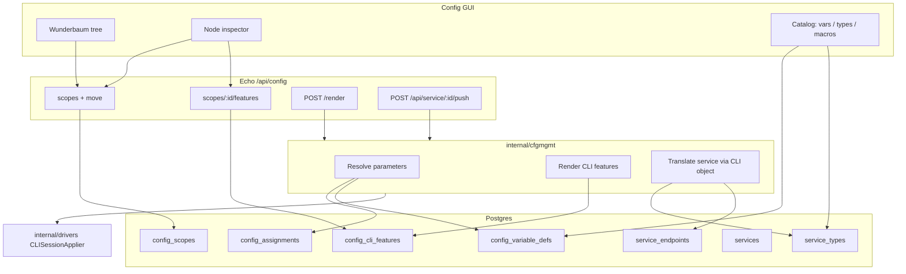
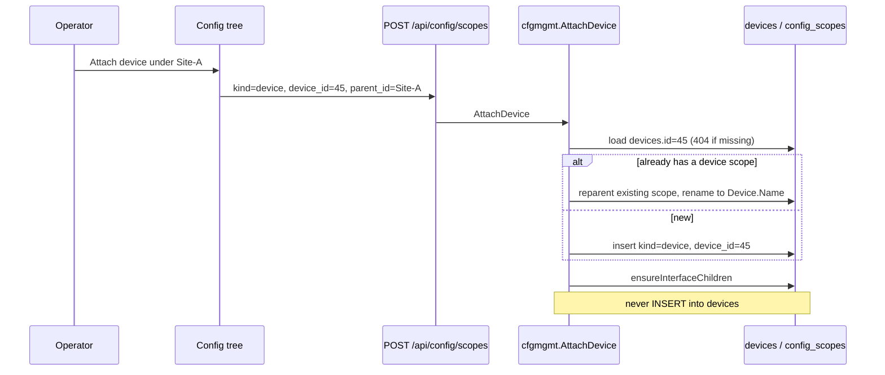
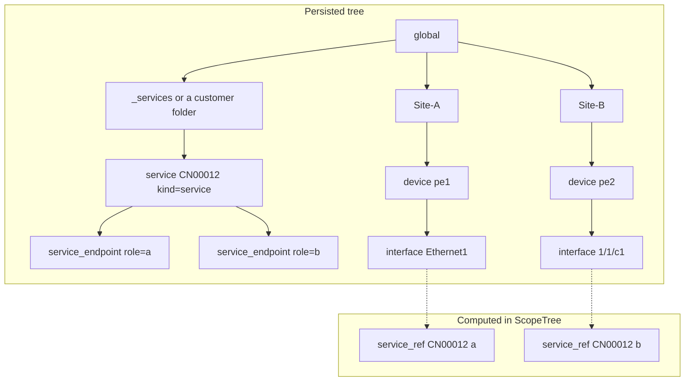

# Config tree: services and device CLI defined entirely in the web GUI

| Field | Value |
| ----- | ----- |
| Status | Implemented (merged as #16 + #26, 2026-09-06) |
| Author | Factum |
| Date | 2026-09-06 |
| Audience | Factum maintainers (cfgmgmt, web, GUI) |
| Related | `docs/cfgmgmt-service-design.md` (operator how-to), `docs/user/config.md`, `docs/user/services.md`, `AGENTS.md` (capacity service types) |

## Overview

Factum's configuration management (`internal/cfgmgmt`) already has a nested **scope tree**, typed variables assigned onto scopes, a **ServiceType** catalog, per-NOS **PlatformPack** Go templates, and baseline **ConfigTemplate** snippets. Operators still cannot define a service and the CLI that implements it *as tree objects*: types and packs live on separate Config tabs, commercial `models.Service` rows live on the Services page, and "assign variable" is a side panel on whatever scope happens to be selected.

This design redesigns cfgmgmt around one **configuration tree** whose nodes are folders, devices (and their auto-managed interfaces), **parameter objects**, **CLI objects**, and **service objects**. The operator adds, updates, removes, and **moves** those objects in the existing Config GUI (`web/frontend/src/views/config/ConfigPage.vue`). Vendor-agnostic service metadata is stored on a service object and **translated** by per-platform CLI objects into command lists that `internal/drivers` already applies (`CLISessionApplier.ApplyCLISession`, `payload_kind=cli` only).

`docs/cfgmgmt-service-design.md` is **kept and rewritten as the operator how-to** once this model lands. It is not replaced by this document and not split into multiple how-tos. This document is the architecture; that file remains "how to design a type in the GUI."

## Background & Motivation

### Current state

The tree is `models.ConfigScope` (`models/config.go`) with kinds `folder`, `site`, `location`, `device`, `interface`. Seed creates a `global` root folder (`cfgmgmt.Seed` → `seedRootScope`). The GUI can add child folders and **attach** an existing DCIM device (`cfgmgmt.AttachDevice`); attaching also creates interface-kind children. There is **no drag-and-drop move**. Delete refuses nodes with children (`cfgmgmt.DeleteScope`). Variable **definitions** live in `config_variable_defs`; **values** live in `config_assignments` keyed `(variable_def_id, scope_id)`. Resolve (`cfgmgmt.Resolve` / `WalkParents`) walks interface → device → ancestors → root and takes the first assignment, then the def's default. Required vars with no value fail that var; `ResolveMap` skips failures rather than aborting the device.

Capacity services are a **parallel** system:

- `ServiceType` + `EndpointRole` + `FieldSchema` — vendor-agnostic class (ELINE, ELAN, L3VPN, POLARIX), seeded builtin.
- `PlatformPack` — one Go `text/template` apply/cleanup per `(service_type_id, platform)`. Seeded ELINE packs from `internal/drivers/templates/{eos,iosxr,sros}_eline.tmpl` refresh on migrate only when `seed_checksum` still matches the stored body.
- `models.Service` — commercial CN/CI inventory (Lime or wizard). Wavelength (VL/VI) and dark fiber (LF/LI) have no `ServiceType`.
- `ServiceEndpoint` — role + device + interface + fields. Render (`cfgmgmt.RenderDevice` / `RenderService`) walks terminating endpoints, looks up the pack, renders cleanup once then each apply body, and pushes via `web.apiServiceGenericPush`.

Baseline golden config is a third system: `ConfigTemplate` attached to a `scope_id`, included in `RenderDevice` when the template's platform matches and the scope is on the device's ancestor chain.

The Config page tabs are Tree / Matrix / Variables / Service types / Platform packs / Macros / Templates / Preview. Context menu today: Add folder, Attach device, Delete.

### Pain points

1. **Types and packs are not in the tree.** Designing an ELINE (or a new type) means bouncing across three tabs plus the Services dialog. The tree cannot show "this PE runs these services with these knobs."
2. **Assignments are invisible as objects.** A site-wide MTU is a row in a side table, not a named, movable group of knobs. Operators cannot copy "BGP defaults" as a node.
3. **Whole-file templates hide add vs remove.** Packs encode cleanup as `{{define "cleanup"}}` plus a regex strip (`cleanupInvokeRe` in `internal/cfgmgmt/render.go`). There is no first-class *feature*, no CLI *context*, and no structured update path.
4. **Two "service" UIs.** Inventory is `models.Service`; cfgmgmt only consumes it. The operator's goal is to define a service *in the tree* without forking a second service table.
5. **No move.** Reparent exists on `PUT /api/config/scopes/:id` (`cfgmgmt.UpdateScope` + `WouldCycle`) but the GUI does not expose it, and kind-specific parent rules are incomplete.

### What stays

- Go + Echo + Gorm/Postgres + Vue 3 / Nuxt UI Config page. No new product.
- Drivers still execute; CLI objects are data. Huawei `vrp` can preview and cannot apply CLI sessions (`CLISessionApplier` is implemented for EOS / IOS-XR / SR OS only). `sros-md` continues to inherit `sros` translation when no dedicated object exists (`cfgmgmt.LookupPlatformPack` today).
- Lime-owned commercial fields stay Lime-owned (`Service.Source == "lime"`).
- Secrets remain `***` on **read** of variable defs and assignments (`cfgmgmt.RedactAssignmentSecrets`, `RedactVariableSecrets`). PUT-unchanged for `***` / omit / JSON null exists today **only** for variable-def defaults (`ApiConfigVariableUpdate`). Assignment upsert (`UpsertAssignment`) currently always saves `dto.Value` and will persist `"***"` if the GUI re-saves a redacted cell. Parameter objects must **implement** that contract on assignment write; it is not already there.
- Wavelength / dark fiber stay inventory-only. No CLI objects for them.

## Goals & Non-Goals

### Goals

- Operators define **parameter objects, CLI objects, and service objects** entirely in the Config GUI (API exists, GUI is the primary surface).
- Tree kinds: folder, device (plus auto-managed interface), parameter, CLI, service — with site/location kept as organizational folder variants.
- Add / update / remove **device** and **service** from the tree, with explicit attach-vs-create semantics so NetBox inventory is not destroyed.
- **Move any allowed node** (cycle-checked, kind-specific parent matrix). Inheritance and render order are defined after a move.
- Replace "assign variables onto a scope" with a **parameter object** that holds one or more assignments.
- **CLI object**: per platform; features with add / optional update / remove command sets; context pattern (regex) naming the CLI mode; missing update ⇒ remove then add.
- **Service object**: vendor-agnostic metadata (schema + endpoints) translated by CLI objects. Multi-device services have one canonical tree node plus **virtual references** under every involved device/interface.
- Incremental migration from current scopes, assignments, types, packs, templates, macros, and ELINE endpoints. Seeded ELINE packs keep the checksum-refresh contract.
- Config page becomes tree-first; catalog surfaces (variable defs, service types, macros) remain, but packs and templates cease to be primary tabs.

### Non-Goals

- A new config-management product, YANG compiler, or NETCONF/RESTCONF apply path. `payload_kind` other than `cli` remains preview-only, as today (`cfgmgmt.RequireCLIPack`).
- Parsing running-config / Oxidized to decide add vs update vs no-op in v1. Context regex is specified so that can land later without a model change.
- **Pushing baseline / golden CLI in v1.** Apply stays service-only (`POST /api/service/:id/push`), matching today (`ConfigTemplate` is preview-only; `ApplyCLISession` is only used from service push). A device-wide golden push is a later endpoint, not bundled into service push.
- Creating or deleting NetBox DCIM devices/interfaces from the config tree.
- Editing Lime-owned commercial fields from the tree.
- Inventing CLI for VL/VI/LF/LI.
- Per-subtree override of service-translation CLI (one translator per type+platform globally in v1).
- Changing hub/worker transport, device-sync's `sync_source` / `netbox_type` mapping, or NetBox L2VPN reconcile beyond pointing them at the same `Service` / `ServiceEndpoint` rows.
- Live-instance (`:8090` / real `factum2` DB) verification.

## Key Decisions

1. **One polymorphic tree table.** Extend `config_scopes.kind` rather than new parent tables. Kind-specific data is typed columns (`platform`, `payload_kind`, `service_type_id`, `service_id`, `enabled`, `seed_checksum`) plus a JSON `payload` (`description`, `platforms`, `context`) and a `config_cli_features` satellite. Rationale: `ScopeTree`, `WalkParents`, `WouldCycle`, `sort_order`, and unique device/interface indexes already exist; a second tree would duplicate them. `payload_kind` is a column because push/preview gating must not query JSONB.

2. **Parameter objects replace assignments-on-arbitrary-scopes — after a dual-read/write release.** `config_variable_defs` stay as the type catalog. Inheritance: a parameter object applies to its **parent and the parent's descendants** (closest ancestor wins; at one parent, higher `sort_order` wins). Until the MOVE PR, Resolve **prefers** parameter-child assignments, then falls back to an assignment on the walked scope itself (today’s `resolveDefAt`). PUT and DELETE on the folder **or** the reserved `parameters` child dual-write/dual-delete **both** rows. Rationale: COPY-only (child write, original stale) would lose edits on binary rollback; child-only delete would resurrect the original on GET.

3. **CLI objects replace PlatformPack and ConfigTemplate.** One object per platform (and, for service translation, per service type). Features are rows with add / update / remove **command blobs**. Each blob is **one** Go `text/template`, then `splitCLI` on the output — same as `cfgmgmt.Render` today. `{{if}}` / `{{range}}` / `{{define}}` are legal inside a blob. Whole-file packs as the operator’s composition unit go away; `text/template` **stays**, same FuncMap (`join`, `include`, `eq`, `ne`) and `missingkey=error`. Rationale: seeded ELINE files are not line-independent; per-line execute would break golden CLI.

4. **Service objects are views onto `models.Service` + `service_endpoints`, not a second inventory.** `ServiceType` remains the catalog (schema, roles, `sync_source`, `netbox_type`). A tree service node has `service_id` → `services.id`. Lime rows can be attached and have type/endpoints edited; company/delivery points/product/comment stay Lime-owned. Rationale: constraint 6 — do not fork two "service" concepts.

5. **Canonical service node + virtual refs, not "one side owns the service."** The canonical node is created under a folder/site/location (**not** the device node — that is the rejected owner-side model). Operators may still **move** a service under a device later as a grouping folder (parent matrix allows it). Endpoint bindings are children of that node (`kind=service_endpoint`), **projected from `service_endpoints` by `projectEndpointScopes`** — called from `ReplaceEndpoints` (same transaction; every table writer) **and** from attach-existing / migrate (no dummy table replace). The GUI **materializes** `service_ref` children from the **table** at tree-read time, keyed by `endpointIdentity` (not `service_endpoints.id` — replace-all allocates new IDs). Render/push continues to query `service_endpoints` by `device_id`. `ValidateEndpoints` stays on GUI/API writes only; NetBox import may write incomplete sets. Rationale: Lime/NetBox never hit the tree handler; HTTP-only dual-write would drift.

6. **Device in the tree is attach-only.** Add = `AttachDevice` (existing). Remove = `DetachDevice` (new): delete the device scope’s **config** descendants, reparent `kind=service` children, **never** `DELETE FROM devices`. Update = reparent, refresh interface children (v1 add-only, same as `ensureInterfaceChildren` today), display DCIM fields read-only. Rationale: NetBox is upstream for inventory. Today’s `DeleteScope` 409s because attach always created interface children.

7. **Render is additive for CLI, override for parameters. Push stays service-only.** After a move, resolve walks the new parent chain. Baseline CLI on the ancestor chain all **preview** (ancestor first, then device, then per-interface). Service-translation CLI is looked up **globally** by `(service_type, platform)`, ignoring tree location. **Apply** is still `POST /api/service/:id/push` (cleanup then apply for that service). Baseline CLI is **not** sent in a service push. `sros-md` → `sros` fallback and `vrp` preview-only stay.

8. **Migration copies, dual-reads **and dual-writes**, then drops.** Assignments on non-parameter scopes are **copied** onto a child parameter object named `parameters`; originals stay until a later MOVE PR. During that window, PUT (folder **or** reserved `parameters` child) and DELETE of a winner write/delete **both** the child and the original row so a binary rollback to pre-PR2 `resolveDefAt` still sees the latest values — and a delete actually removes the var. Null-`scope_id` templates become **direct children of `global`**. Packs become CLI objects under `_catalog/cli/...`. Seed checksum hashes CLI features **and** context / `RemoveAtRoot` / `UpdateCommands`. Pack and template tables remain readable until a drop PR. `docs/cfgmgmt-service-design.md` is rewritten in the GUI/docs PR, not deleted.

9. **Config page becomes tree + inspector + catalog drawers.** Primary surface: Tree (with Preview docked). Matrix stays as an audit view. Variables, Service types, and Macros become catalog panels. Platform packs and Templates tabs go away once CLI objects exist.

## Proposed Design

### Architecture



### Tree kinds

User-requested kinds, plus two that already exist and one that must stay for DCIM fidelity:

| Kind | In tree? | Source of truth | Notes |
| ---- | -------- | --------------- | ----- |
| `folder` | yes | `config_scopes` | Includes reserved `global` root and `_catalog` / `_services`. |
| `site` | yes | scope + optional `site_id` → `sites` | Organizational. Does **not** create a DCIM site. |
| `location` | yes | scope | Organizational folder variant (`Device.CfLocation` is unrelated). |
| `device` | yes | scope.`device_id` → `devices` | **Attach** existing DCIM device. Unique per `device_id`. |
| `interface` | yes, auto | scope.`interface_id` → `interfaces` | Not in the user's kind list; kept as managed children of device. Operators do not create/delete them. |
| `parameter` | yes | scope + `config_assignments` | Replaces "assign variables" on folders/devices/interfaces. |
| `cli` | yes | scope + `config_cli_features` | Baseline (no `service_type_id`) applies when its **parent** is on the device ancestor chain. Service translation (`service_type_id` set) is looked up globally. |
| `service` | yes | scope.`service_id` → `services` | Canonical node. Unique per `services.id`. |
| `service_endpoint` | yes, under service | scope + dual-write `service_endpoints` | Role + device + interface + fields. |
| `service_ref` | **virtual** | computed in `ScopeTree` | Shown under device/interface; not a row. |

Site and location stay because they already exist in `ValidScopeKind` and `ConfigScope.SiteID` is populated on attach from `Device.SiteID`. The GUI never offered "Add site"; this design adds them as folder variants with an optional DCIM site picker. They are **not** replaced by parameter/CLI/service kinds.

Reserved folders (seeded, not deletable, not renameable):

- `global` — existing root (`models.ConfigRootName`). **Global baseline CLI** (migrated `ConfigTemplate` with `scope_id IS NULL`, plus operator-wide NTP/banner objects) are **direct children of `global`**. `global` is on every device’s ancestor chain, so the collection rule below actually applies them. Today a nil-`ScopeID` template skips the ancestor check (`RenderDevice`); parenting at `global` is the tree equivalent.
- `global / _catalog` — **service-translation CLI only**. It is a child of `global`, not an ancestor of a PE under Site-A, so baseline objects placed here would never be collected. Do not put golden config here.
- `global / _catalog / cli / <ServiceType.Name> / <platform>` — one translation CLI object per seeded or operator pack (global lookup by type+platform, tree location ignored).
- `global / _services` — default parent for migrated / newly created canonical service nodes that have no better folder.

Leading underscore marks these as system folders in the GUI (not hidden; operators may add children). Test: a template with `scope_id=null` still appears in `RenderDevice` after migrate (as a `kind=cli` child of `global`).

### Parent matrix and moves

`PUT /api/config/scopes/:id` already reparents with `WouldCycle` (max depth 64). Add `POST /api/config/scopes/:id/move` as the GUI contract. **One body only** (no sibling list):

```json
{ "parent_id": 12, "sort_order": 3 }
```

`sort_order` omitted (`null`) means last sibling. The engine renormalizes contiguous integers for that parent. `PUT` with `parent_id` is the same as move: both call `cfgmgmt.MoveScope`.

Rules are enforced by one `assertParentKind(child, parent)` used by **Create, Update, and Move** (landed with the move PR). Today `CreateScope` / `UpdateScope` do not restrict parent kind; the GUI even offers “Attach device” on a device. **Existing illegal trees are grandfathered**: a write that does not change `parent_id` succeeds; a write that *changes* parent must satisfy the matrix.

| Child kind | Allowed parents | Extra |
| ---------- | --------------- | ----- |
| folder, site, location | folder, site, location | Not under device/interface/parameter/cli/service. Cannot reparent `global`. |
| device | folder, site, location | Unique `device_id`. Moving calls the same path as `AttachDevice` (refresh interface children). |
| interface | its device only | Move rejected (409). |
| parameter | folder, site, location, device, interface, service | Not under parameter/cli/endpoint. |
| cli | folder, site, location, device, interface | Service-translation CLI (`service_type_id` set) may live anywhere but lookup is global; GUI defaults to `_catalog/cli/<type>`. |
| service | folder, site, location, device | Not under interface (that is what refs are for). |
| service_endpoint | its service only | Changing parent rejected. Rebind is an update of `device_id` / `interface_id`. |
| service_ref | n/a | Drag onto another interface **rebinds** that endpoint; drag elsewhere rejected. |

Cycle: `WouldCycle` unchanged. A move that would parent a node under its descendant returns 400 `scope parent cycle`.

After a move, resolve and render use the **new** parent chain on the next read. There is no cached inheritance. Parameter uniqueness and CLI apply order are functions of the live tree (see Render).

Sort order among siblings: explicit `sort_order`, then `name` (same as `ScopeTree` today).

Delete:

| Kind | Delete from tree means |
| ---- | ---------------------- |
| folder / site / location | Reject if children (keep today's 409). Recursive folder delete is a follow-up (`?recursive=1`); not in v1. |
| device | **`DetachDevice`**, not `DeleteScope`. `DeleteScope` 409s because attach always created interface children. Detach (transaction): reparent `kind=service` children to the device’s former parent (or `_services` if that parent is gone); recursively delete remaining config descendants (interfaces, parameter, CLI) via `deleteScopeSubtree` (see below); delete the device scope. **Never** `DELETE FROM devices`. Endpoints on that device remain. GUI “Detach” calls `POST /api/config/scopes/:id/detach`, not `DELETE /scopes/:id`. |
| interface | 409 "managed by device". |
| parameter / cli | `deleteScopeSubtree`: `DELETE FROM config_assignments WHERE scope_id IN (…)` for every parameter scope removed (there is **no FK**; `DeleteScope` today would orphan rows, and COPY doubles them). If the node is the reserved migrated `parameters` child, also delete matching originals on the **parent** `(variable_def_id, parent.ID)` so dual-read does not resurrect values. Extra named objects (`ntp`) stay child-only. CLI features have `ON DELETE CASCADE` on `scope_id`. Then delete the scope row(s). |
| service | Default: **detach** (same helper: delete canonical node + endpoint child scopes + any parameter children and their assignments; leave `services` / `service_endpoints`). Explicit "Delete service…" calls existing `DELETE /api/service/:id` (Lime 403; optional NetBox/device teardown). |
| service_endpoint | Remove that termination via `ReplaceEndpoints` (validate remaining roles; ELINE A/B checks still apply). |
| service_ref | Inspector action "Remove this endpoint" — same as deleting the endpoint in the table. |

### Device in the tree vs DCIM



- **Add** = attach picker over `GET /api/devices`. Creating a router still happens on Devices / NetBox.
- **Update** = reparent (move), `sort_order`, and "Refresh interfaces" (`ensureInterfaceChildren`). **v1 refresh is add-only**, same as today: existing interface scopes are skipped; DCIM interfaces that disappeared are **not** pruned (stale nodes can hold parameter objects). Follow-up: prune interface scopes whose `interface_id` is missing, only if they have no parameter/CLI children (or recurse with confirm). Inspector shows platform, site, primary IP as **read-only** with a link to the device page. Tree `name` is kept in sync with `Device.Name` on attach/refresh; operators do not use the tree to rename inventory.
- **Remove** = `DetachDevice` as above. A device not in the tree still renders terminating services and globally-looked-up translation CLI; it only misses **baseline** CLI objects and parameter objects that lived on the detached subtree. Resolve then starts at `global` (`StartScope` already falls back to root).

Interface nodes remain unique per `interface_id` (`idx_config_scopes_one_interface`). They exist so per-port parameter objects and virtual service refs have a parent.

### Parameter objects

#### Catalog vs instance

- **Variable def** (`config_variable_defs`) — type, constraints, default, required, secret, platforms filter. Edited in the Variables catalog. Unchanged API.
- **Parameter object** — a named tree node whose children-of-payload are assignments. Example names: `ntp`, `qos-core`, `site-bgp`.

GUI: context menu **Add parameter object**. Inspector on a **parameter** node is a table of (variable, value). During the dual-read release, selecting a **folder/device/interface** still shows assignments.

`GET /api/config/assignments?scope_id=` for a non-parameter scope returns **winning rows only** — one per `variable_def_id`: the child copy if present, else the original on that scope. Do **not** union both. Handler test: COPY then GET folder → one row per var, `scope_id` of the winner (the child).

`PUT /api/config/assignments` **dual-writes** in the COPY window when the target is:

- a non-parameter folder/site/location/device/interface (create/reuse child named `parameters`, upsert child **and** original), or
- the reserved migrated child (`kind=parameter`, `name=parameters`, parent is folder/site/location/device/interface) — upsert that node **and** `(variable_def_id, parent.ID)`. Selecting the visible `parameters` node after COPY must not skip the original.

Extra named objects (`ntp`, `qos-core`) stay child-only. After MOVE (originals deleted), remap still writes the child and does **not** 400 until PR 9.

`DELETE /api/config/assignments/:id` in the COPY window is **dual-delete**: if the row is the winning child (or any assignment on the reserved `parameters` child), also delete the original `(variable_def_id, parent.ID)`. Otherwise the Assign UI removes the child, GET falls back to the original, and the value **reappears**. After MOVE, child-only delete is enough. Handler test: COPY, DELETE winner, GET folder has no row for that var, and `resolveDefAt` on the folder also sees nothing.

#### Schema

No new assignment table. After MOVE, new assignments live on parameter nodes; PUT to a folder/device/interface is still **remapped** to the `parameters` child (compatibility with the old Assign UI). There is **no** SQL check constraint `chk_assign_parameter_scope`.

`ConfigScope` for `kind=parameter`:

- `Name`, `ParentID`, `SortOrder`.
- `Enabled` — meaningful for `parameter` and `cli` only (default true). Other kinds ignore it on read and reject a write that sets `enabled=false` (400).
- `Payload` (`ConfigScopePayload`): `{ "description": "...", "platforms": ["eos"] }` — object-level platform filter, **in addition to** `ConfigVariableDef.Platforms`.

#### Inheritance

Dual-read (until MOVE PR):

```
start = interface scope if present, else device scope, else global
chain = WalkParents(start)          // closest first
for node in chain:
  params = enabled children of node where kind=parameter
           and platformAllowed(object.platforms, device.Platform)
           ordered by sort_order DESC, name DESC
  for p in params:
    if assignment(p, var): return value, source=p
  if assignment(node, var): return value, source=node   // today's row; kept until MOVE
fallback def.DefaultValue
if required and still empty: error on that var
```

After MOVE, the `assignment(node, var)` fallback is removed. New Resolve **prefers the child**, so copied rows win over stale originals if both exist.

`sros-md` matches an object-level platforms list that contains `sros-md` **or** `sros` (same spirit as pack fallback).

Same variable twice:

| Situation | Winner |
| --------- | ------ |
| Two assignments on **one** parameter object | Impossible: unique `(variable_def_id, scope_id)` stays. |
| Two parameter objects under the **same** parent | Higher `sort_order` wins. |
| Parameter objects on **different** ancestors | Closer to the leaf wins (interface before device before site before global). |
| Def default | Used only if no assignment on the path. |

This is today's closest-wins rule, with "assignment on scope S" becoming "assignment on a parameter child of S" after MOVE. During dual-read Resolve and GET both **prefer the child**; originals exist so a rolled-back binary still works.

Required vars with no value: `ResolveAll` still returns `Err`; `ResolveMap` / render still **skip** that key rather than aborting the whole device. Preview shows the error on that var. A **service push** that templates `{{index .Vars "foo"}}` fails that device if `foo` is missing (`missingkey=error` does not apply to map index — same as today). If a command line uses a required field from `.Fields` that is absent, render of that feature fails.

Parameter children of a **service** node are merged into `.Vars` for that service's translation only (service object overlays device-resolved vars; service wins on key conflict). They do not leak to other services on the same device.

#### Secrets

`RedactAssignmentSecrets` already redacts by variable def on **GET**. Parameter-object reads go through the same helper. **New in the parameter PR:** `UpsertAssignment` (or its handler) applies `SecretDefaultUnchanged`: PUT of `***` / JSON null / omitted value leaves the stored secret. Test: GET redacts, PUT `***` does not persist the placeholder. The GUI `saveAssign` path must send omit/`null` rather than the redacted string when the box is untouched. This is **not** current behavior (`UpsertAssignment` always `Save`s `dto.Value`).

### CLI objects, features, and context

#### What a CLI object is

One tree node, **one platform**, containing ordered **features**. Optional `service_type_id`:

- **Unset** — baseline / golden config for devices in the parent's subtree (replaces `ConfigTemplate`).
- **Set** — translator for that `ServiceType` (replaces `PlatformPack`). Unique globally per `(service_type_id, platform)`.

`sros-md` with no row falls back to `sros`. `payload_kind` defaults to `cli`; `netconf` / `restconf` may be stored and previewed; push still requires `cli` + `CLISessionApplier`.

#### Feature data model

Satellite table so features can be added, reordered, and deleted without rewriting a blob:

```go
// models.ConfigCLIFeature
type ConfigCLIFeature struct {
    FactumModel
    ScopeID         uint   `json:"scope_id" gorm:"uniqueIndex:idx_cfg_feat_scope_name;not null"`
    Name            string `json:"name" gorm:"uniqueIndex:idx_cfg_feat_scope_name;not null;type:varchar(128)"`
    SortOrder       int    `json:"sort_order"`
    AddCommands     string `json:"add_commands" gorm:"type:text"`
    UpdateCommands  string `json:"update_commands" gorm:"type:text"` // column exists; v1 GUI hides it
    RemoveCommands  string `json:"remove_commands" gorm:"type:text"`
    RemoveAtRoot    bool   `json:"remove_at_root"` // true: do not wrap remove in context enter/exit
}
```

**Execution unit:** each of `AddCommands` / `UpdateCommands` / `RemoveCommands` is **one** Go `text/template` parsed and executed as a whole (same as `cfgmgmt.Render` today: parse body, execute, then `splitCLI`). “One command per line” is an **output** convention after render, not a parse boundary. `{{if}}`, `{{range}}`, `{{define}}`, and `{{template}}` are legal inside a blob. Migrated ELINE is a **single** feature whose add blob is the current apply file (cleanup invoke stripped) and whose remove blob is the cleanup define — that is how golden output stays byte-equivalent.

v1 GUI **hides** the update editor (column stored, not shown). A visible field that is ignored would be treated as live. v2 running-config reconcile can show it.

#### Context pattern

Stored on the CLI object payload (all features share one context — the user's examples are object-level: "this object is valid for `interface <name>`"). `platform`, `payload_kind`, `service_type_id`, and `seed_checksum` are **columns**, not JSON (see Data Model). Payload context:

```json
{
  "context": {
    "pattern": "interface <name>",
    "enter": "interface {{.LocalIface}}",
    "exit": "exit",
    "captures": { "name": "{{.LocalIface}}" }
  }
}
```

**Pattern language** (not raw RE2 in the GUI):

- Literal tokens separated by whitespace.
- `<ident>` is a capture of `\S+`.
- Compiled internally to an anchored regex, e.g. `interface <name>` → `^interface\s+(?P<name>\S+)$`.
- `router bgp <as>` → `^router\s+bgp\s+(?P<as>\S+)$`.
- Empty pattern / `global` → the configure root: **no enter/exit, no derivation**.

**Wrapping is opt-in.** If `pattern` and `enter` are both empty, the engine emits feature blobs as-is. It does **not** derive `interface {{.LocalIface}}` from the parent kind. Migrated packs and templates **must** have empty context so ELINE/SR OS bodies (which already contain `interface {{.LocalIface}}` or `/configure service epipe … { }`) keep golden output.

Capture bindings are an explicit `captures` map on the object (placeholder name → template), not magic aliases (`as` is **not** hard-coded to `bgp_asn`). v1 uses `enter`/`exit` as written; `captures` exist so v2 running-config matching can bind regex groups.

Operators who want IOS-style wrapping set `enter`/`exit` themselves (SR OS MD-CLI typically stays global + block-paste inside the add blob).

#### Add / update / remove at render and push

User rule: **if update is empty, perform remove then add.** v1 always does remove then add (update column unused). `update_commands` is hidden in the GUI.

Wrap policy (PR 4 fixtures for both cases):

- `enter` empty → emit remove blob, then add blob, nothing else (migrated ELINE).
- `enter` set and `RemoveAtRoot` **false** → **one** enter, remove blob, add blob, one exit (same mode for both):

```
# per feature, in sort_order:
<context enter>
<remove_commands>
<add_commands>
<context exit>
```

  Example — interface MTU (`pattern` = `interface <name>`, `enter` = `interface {{.LocalIface}}`, remove = `no mtu`, add = `mtu {{index .Vars "mtu"}}`):

```
interface Ethernet1
no mtu
mtu 9100
exit
```

- `enter` set and `RemoveAtRoot` **true** → remove **unwrapped**, then enter + add + exit (ELINE-style teardown at root if someone later adds a context):

```
<remove_commands>
<context enter>
<add_commands>
<context exit>
```

Do **not** emit two enter/exit pairs when `RemoveAtRoot` is false. Migrated ELINE: context empty, so cleanup stays at root without `RemoveAtRoot`.

Remove commands must be idempotent if the object is absent (same as today's cleanup: `no pseudowire {{.Name}}`).

**v2 (not in this rollout):** parse running-config (or Oxidized) with the compiled context regex; if the feature block is absent → add; if present and differs → update if non-empty else remove+add; if equal → skip.

#### Go `text/template` — stay, shrink, do not replace

| Stays | Goes |
| ----- | ---- |
| One template execute per command **blob**, then `splitCLI`; `missingkey=error` | Whole-file `ApplyTemplate` as the unit operators edit (replaced by features) |
| FuncMap: `join`, `include` (macros, max depth 8), `eq`, `ne` | `{{define "cleanup"}}` + `cleanupInvokeRe` strip as the *engine* teardown protocol (cleanup becomes `RemoveCommands`) |
| `GenericRenderData` for service translation; `BaselineRenderData` for baseline CLI | Packs tab as a separate editor |
| `GoTemplateEditor.vue` + `cfgmgmtPackSchema` | — schema notes change from "cleanup define" to "feature remove blob" |

**Baseline render data** (extend today’s `RenderDevice` map so interface-parented CLI has a real interface):

```go
type BaselineRenderData struct {
    Name       string
    Device     DCIMDevice
    Interface  DCIMInterface // zero at device/folder level
    LocalIface string        // Interface.Name, else ""
    Vars       map[string]any
}
```

Service translation keeps `GenericRenderData`. Baseline objects must not reference `.Fields`, `.Remote`, or `.Endpoint`.

Macros (`config_macros`) stay. Blobs may `{{include "eline-defaults"}}`. Macros are **not** tree nodes.

#### Lookup

```go
func LookupCLIObject(db *gorm.DB, serviceTypeName, platform string) (*models.ConfigScope, error)
// kind=cli AND service_type_id = type AND platform = NormalizePlatform(platform)
// sros-md → sros fallback, same as LookupPlatformPack
```

Baseline CLI objects are **not** looked up by name; they are collected by walking the device's ancestor chain (see Render).

Uniqueness: one service-translation CLI per `(service_type_id, platform)`. Baseline CLI: many, distinguished by tree location.

### Service objects vs ServiceType vs Service vs ServiceEndpoint

#### Catalog

`ServiceType` remains the catalog: `Name`, `Description`, `Schema`, `EndpointRoles`, `Builtin`, `SyncSource`, `NetboxType`. Edited from the Service types catalog (form, not raw JSON — see GUI). Builtin types cannot be renamed or deleted. Wavelength/fiber never get a type.

The type is **not** a tree node. Instantiating a type creates a **service object** (and usually a `models.Service` row).

#### Canonical node

`kind=service` scope:

- `Name` — display; default `Service.ServiceID` (e.g. `CN00012`).
- `ServiceID` column → `services.id` (unique partial index).
- Payload copies nothing that Lime owns. Instance cfgmgmt fields live on `Service.Fields` / columns (`bandwidth_mbps`, `pseudowire_id`, …) as today.

Children: one `kind=service_endpoint` per termination (`Role` in payload, `DeviceID`, `InterfaceID`, fields JSON). These children are a **projection of `service_endpoints`**, not an independent write.

`cfgmgmt.ReplaceEndpoints` **replaces the table and projects tree children**. It does **not** call `ValidateEndpoints`. Today `applyL2VPNEndsToService` (`internal/netbox/service_eline_import.go`) builds a **partial** `want` list (skips unresolved ports, may emit one ELINE side) and calls `ReplaceEndpoints` with no validation. ELINE roles `a`/`b` are min=1 each — validating inside `ReplaceEndpoints` would 400 imports that succeed today.

Split:

1. **GUI/API writes** (`ApiServiceEndpointsPut`, tree rebind of a complete set): `ValidateEndpoints` (and `ValidateELINEShape` for ELINE) **then** `ReplaceEndpoints`. `createServiceFromTree` does **not** write endpoints.
2. **`ReplaceEndpoints`:** delete-all + insert (`ID = 0`, unchanged) **then** `projectEndpointScopes(serviceID)` in the same transaction. Import/device-sync keep calling this without validation.
3. **`projectEndpointScopes(serviceID)`:** if a canonical `kind=service` scope exists, upsert/delete `kind=service_endpoint` children to match the table using `endpointIdentity` (below); if none, no-op. Also called from attach-existing and migrate **without** a dummy table replace.

`endpointIdentity` is shared by projection upsert and virtual refs. `ValidateEndpoints` does **not** require `(device_id, interface_id)` uniqueness except ELINE’s extra shape check. Seeded ELAN is role `endpoint` min=1 max=0 with required `vlan` — two SAPs on one physical port (VLAN 100 and 200) are normal and must be two children / two refs:

```
endpointIdentity(ep) = service_id + ":" + role + ":" + device_id + ":" + interface_id + ":" + disc
disc = strconv.Itoa(VLANFromFields(ep.Fields)) if vlan present and != 0
     else sha256(canonicalJSON(ep.Fields)) hex (empty fields → "0")
```

Do **not** use `service_endpoints.id`.

Housekeeping (`Trim` deletes old jobs) is the wrong place to repair the tree.

Render, device-sync, and virtual `service_ref`s **read `service_endpoints`**, not the tree.

#### Multi-device placement



Rejected alternatives:

- **Service lives under interface A, shadow on B** — A becomes owner. Moving pe1 moves the ELINE out of pe2's site. Deleting pe1's tree node would have to decide whether to destroy the service. The "other" side is second-class.
- **Only a common-folder parent, no shadows** — the operator cannot see terminations when inspecting a device, which is the view they asked for.
- **Persist refs as real rows** — dual-write of three nodes per endpoint (canonical child + two refs) and move/delete fan-out. Virtual refs are cheaper and cannot diverge.

GUI:

- Under a device/interface, refs show as children with kind label `Service` and title `CN00012 (a)`. Clicking selects the **canonical** node (inspector is the full service).
- Drag a ref onto another interface of a (possibly different) device = rebind that role. Drag a ref to a folder = rejected.
- Moving the canonical node does not move devices; refs follow the endpoint table.
- Deleting one side's ref = remove that endpoint (role min/max may then fail until the operator adds a replacement).
- Creating a service from the **interface** context menu: parent the canonical node at `deviceScope.ParentID` **if that parent is folder, site, or location**, else `_services`. **Not** under the device node. Commit **zero endpoints**; pre-fill one unsaved row in the inspector. Do **not** `ReplaceEndpoints` with a one-sided ELINE (roles `a`/`b` each min=1 — `ValidateEndpoints` would 400). The later full-set PUT validates.

#### Add / update / remove service

| Action | Tree | Inventory |
| ------ | ---- | --------- |
| Add (new CN/CI) | `db.Transaction`: same logic as `ApiServiceCreate` (require `category`; row-lock next `<type><5-digit>` if `service_id` blank; copy `bandwidth_mbps` from fields), then insert canonical scope with **zero endpoints**. Do not call `ReplaceEndpoints` until a later PUT with a set that passes `ValidateEndpoints`. Inspector collects roles; interface-menu pre-fills one unsaved row. Lime create is not offered. | Yes |
| Add (attach existing) | Picker of CN/CI that have a `ServiceType` and no tree node yet. Lime rows allowed. Transaction: insert canonical node, then `projectEndpointScopes(serviceID)` so `service_endpoint` children exist without a dummy `ReplaceEndpoints`. | No new row |
| Add VL/VI/LF/LI | Not offered. | — |
| Update | Inspector calls the **same** APIs as `ServiceEditDialog`: `PUT /api/service/:id/type` (type/schema fields, works on Lime rows), `PUT /api/service/:id/endpoints` (goes through `ReplaceEndpoints`). Not a new mass-assignment payload. Lime-owned commercial fields stay disabled (`ApiServiceUpdate` 403s the whole Lime row). | Type/endpoints/fields only |
| Remove (detach) | Drops tree nodes. | Row remains; still on Services page; still pushable |
| Delete service | Confirm dialog reused from Services page (`remove_from_netbox` / `remove_from_device`). Lime delete 403s, same as today. | Existing delete API |

Operators tell the two surfaces apart:

- **Services page** — commercial inventory (customer, Lime, bandwidth list, create wizard including wavelength/fiber).
- **Config tree service object** — cfgmgmt placement and CLI translation of a **capacity** service. Same database row. The inspector shows `Service ID` and a link to the Services dialog.

### Render and push pipeline

```mermaid
sequenceDiagram
  participant GUI
  participant API as POST /api/config/render
  participant R as cfgmgmt.RenderDevice
  participant P as Resolve parameters
  participant C as CLI features
  participant S as service_endpoints
  participant D as CLISessionApplier

  GUI->>API: {device_id} or {service_id, endpoints?}
  API->>R: RenderDevice / RenderServiceEndpoints
  R->>P: ancestor chain + parameter children
  P-->>R: .Vars (real values into templates; resolve API still redacts)
  R->>C: baseline CLI on chain (platform match, enabled) — preview only
  loop each feature sort_order
    C-->>R: remove blob then add blob (wrap only if enter set)
  end
  R->>S: WHERE device_id = D
  loop each service
    R->>C: LookupCLIObject(type, platform)
    C-->>R: translation features with GenericRenderData
  end
  R-->>GUI: sources[] (kind=cli | service)
  Note over GUI,D: Apply is still POST /api/service/:id/push (service cmds only)
  GUI->>D: ApplyCLISession(serviceID, cmds)
```

#### Walk for device D

1. Load DCIM device. Platform = `NormalizePlatform`.
2. `deviceScope = scopeByDeviceID` or `global`.
3. **Parameters** — `ResolveMapForDevice` / per-interface `ResolveMap` using the new child-parameter walk. Failed required vars appear on a synthetic source `{kind:"parameter", error}` so preview is not silent.
4. **Baseline CLI (preview only)** — all enabled `kind=cli` with `service_type_id IS NULL` whose **parent** is in `{deviceScope} ∪ ancestors(deviceScope) ∪ interface-children-of-device`, platform match (`sros-md` accepts `sros` objects unless a dedicated `sros-md` object exists **on that same parent**). Children of `global` match every device. Children of `_catalog` do **not**. Data is `BaselineRenderData`.
   - Order: ancestors **root→leaf** (global before site before device), then device-parented CLI by `sort_order`, then each interface (name) and its CLI.
   - Within an object: features by `sort_order`; each feature: execute remove blob, then add blob; wrap in enter/exit only when `enter` is non-empty and not `RemoveAtRoot` for remove.
5. **Services** — `service_endpoints` for `device_id=D`, grouped by service. For each service, `LookupCLIObject(ServiceType, platform)`. Same cleanup-once-then-bodies rule as `renderGenericForDevice` today, implemented as: first endpoint on this device emits every feature's remove blob once, then each endpoint emits add. ELINE still fills `.Remote` / `.PeerLocal*` / `.SDPID` / `.StaleSubinterfaces` via `genericData`. Missing translator → source error `"no CLI object for ELINE/eos"` (same as missing pack).
6. **Preview drafts** — `POST /api/config/render` with `endpoints` + `fields` overlay remains for the service dialog (`RenderServiceEndpoints`). Tree inspector is save-then-preview in v1 (no unsaved tree draft overlay). **Matrix and Preview** start from the nearest folder/site/location/device ancestor when the selection is `parameter`, `cli`, `service`, `service_endpoint`, or `service_ref` (selecting a `parameters` child must not yield zero Matrix rows). A device node (or that ancestor) fills the Preview panel.

Push (`apiServiceGenericPush`):

- Unchanged entry point and credentials. **Does not include baseline CLI.**
- Command list built by the service-translation renderer instead of `RenderPackApplyBody`.
- `RequireCLIPack` becomes `RequireCLIObject` (must be `payload_kind=cli`, the **column**).
- `isSupportedDriverPlatform` still includes `vrp` for other device APIs, but VRP has no `CLISessionApplier` — push returns the existing error, wording → `"CLI object exists but this platform cannot apply CLI sessions yet"`.
- ELINE: `PrepareELINEApply`, `stampELINEApplied`, abandoned-device teardown unchanged.
- No automatic rollback of sibling devices (same as today).
- Idempotency: feature remove blobs must be safe no-ops; this is an operator/seed contract, not something the engine proves.

A later `POST /api/config/scopes/:id/push` for `kind=device` (golden config only) is out of v1.

### GUI

`ConfigPage.vue` + `ConfigScopeTree.vue` (Wunderbaum, already used for IPAM). Enable Wunderbaum **dnd** with a `drop` hook that calls `moveScope`. IPAM already uses **lazyLoad** (`IpamPrefixTree.vue`) but **not** dnd — copy lazy-load from IPAM if the tree is too large; dnd is new. Rejected drops show the API error toast.

First GUI-touching PR extracts `ConfigNodeInspector.vue` so later PRs do not all rewrite the 1.2k-line `ConfigPage.vue`. Kind labels in `ConfigScopeTree.kindLabel` include `parameter`, `cli`, `service`, `service_ref` as soon as those nodes can exist.

Context menu (write users):

- Folder/site/location: Add folder, Add site, Add location, Attach device, Add parameter object, Add CLI object, Add service, Delete.
- Device: Add parameter, Add CLI, Add service, Refresh interfaces, Detach (`POST .../detach`). No `DELETE /scopes/:id` on devices.
- Interface: Add parameter, Add CLI, Add service (pre-bound endpoint).
- Parameter / CLI / service: Edit (select), Duplicate (optional later), Delete.
- Service ref: Open service, Rebind, Remove endpoint.

Inspector by kind:

- Parameter — assignment table (typed inputs, not raw JSON, for scalar types; JSON for list/map).
- CLI — platform, payload kind, context pattern, service-type dropdown (empty = baseline), feature accordion (name, add/remove editors using `GoTemplateEditor`). **Update editor hidden in v1.**
- Service — embed or open `ServiceEditDialog` (same `PUT /type` and `PUT /endpoints` calls; Lime `readOnly` split unchanged).

Tabs after rollout:

| Tab / panel | Fate |
| ----------- | ---- |
| Tree | Primary. Wider, with inspector. |
| Preview | Docked right of tree (device from selection or picker). Keep as a tab until the dock exists. |
| Matrix | Keep. Walks interfaces under the selected **folder/device** (or nearest such ancestor if the selection is parameter/cli/service/ref). Source name is the parameter object when the winning assignment lives there. |
| Variables | Catalog drawer / secondary tab. Defs are not tree nodes. |
| Service types | Catalog drawer / secondary tab. Form editor for schema and roles (not a JSON textarea as the long-term UI; JSON acceptable in the first GUI PR). |
| Platform packs | **Removed** once CLI objects render. |
| Templates | **Removed** once baseline CLI objects render. |
| Macros | Catalog drawer. |

### Scale and performance

- Today's `ScopeTree` loads every `config_scopes` row in one query and builds the JSON tree in memory. A lab of 500 devices × 40 interfaces is ~20k nodes; adding parameter/CLI/service nodes and virtual refs might reach ~30–40k. That is acceptable for Wunderbaum if we keep row height ~28px and do not expand interfaces by default.
- If `GET /api/config/scopes/tree` exceeds ~2 s or ~5 MB JSON in production, follow-up: lazy-load interface children the way `IpamPrefixTree.vue` already does (`lazy: true`, `GET /api/config/scopes/:id/children`). Not required for v1.
- Render cost: one template execute per feature **blob** per matching object. ELINE stays one feature (current file as add blob); splitting later is optional. Target: preview a PE with 50 ELINEs in < 1 s on the web host (no device I/O).
- Storage: CLI feature text is the same order of magnitude as current packs (single-digit KB per platform). Assignments unchanged.

## API / Interface Changes

Same `RequireRead` / `RequireWrite` as today (cookie **or** `Settings.FactumApiToken` bearer — `requireAnyRole` accepts a service token). Do **not** add `/api/config` to `hub_allowlist.go` (hub RPC cannot write config). Service push stays `RequireWrite` on `/api/service/:id/push`.

### Scopes

Create/update use a **patch DTO** so omitted fields are not zeroed (`UpdateScope` today always writes `SortOrder`). Pointers mean “leave unchanged”:

```go
type ConfigScopeDTO struct {
    ID            uint               `json:"id"`
    ParentID      *uint              `json:"parent_id"`
    Name          *string            `json:"name"`
    Kind          *string            `json:"kind"`
    SiteID        *uint              `json:"site_id"`
    DeviceID      *uint              `json:"device_id"`
    InterfaceID   *uint              `json:"interface_id"`
    ServiceID     *uint              `json:"service_id"`       // kind=service
    ServiceTypeID *uint              `json:"service_type_id"`  // kind=cli translation
    Platform      *string            `json:"platform"`         // kind=cli
    PayloadKind   *string            `json:"payload_kind"`     // kind=cli; default "cli"
    Enabled       *bool              `json:"enabled"`          // parameter/cli only
    SortOrder     *int               `json:"sort_order"`
    Payload       *ConfigScopePayload `json:"payload"`
}

type ConfigScopePayload struct {
    Description string            `json:"description,omitempty"`
    Platforms   []string          `json:"platforms,omitempty"` // parameter object filter
    Context     *CLIContext       `json:"context,omitempty"`   // CLI object
}

type CLIContext struct {
    Pattern  string            `json:"pattern"`
    Enter    string            `json:"enter"`
    Exit     string            `json:"exit"`
    Captures map[string]string `json:"captures,omitempty"`
}

type MoveScopeRequest struct {
    ParentID  uint `json:"parent_id"`
    SortOrder *int `json:"sort_order"` // nil = last sibling
}
```

`payload` is Gorm `serializer:json` (same as `Service.Fields`), stored as Postgres JSONB by AutoMigrate — do not hand-write `UINT`/`JSONB` DDL. Model `Enabled` is `bool` default true; DTO is `*bool` so PUT omit does not disable the node.

Tree node `data` includes the same fields plus, for virtual refs:

```json
{
  "kind": "service_ref",
  "canonical_id": 88,
  "service_row_id": 120,
  "service_label": "CN00012",
  "role": "endpoint",
  "device_id": 10,
  "interface_id": 44,
  "disc": "100"
}
```

Virtual keys: `ref:` + `endpointIdentity` (includes `vlan` or fields hash). **Do not** use `service_endpoints.id` (replace-all allocates new IDs). Two ELAN endpoints on the same port with VLAN 100 and 200 → two refs. Test required in PR 8. The key changes when that termination is rebound or its discriminator fields change.

New routes:

| Method | Path | Purpose |
| ------ | ---- | ------- |
| POST | `/api/config/scopes/:id/move` | `MoveScopeRequest` |
| POST | `/api/config/scopes/:id/detach` | `kind=device` only: `DetachDevice` |
| GET/POST | `/api/config/scopes/:id/features` | List / create CLI features |
| PUT/DELETE | `/api/config/features/:id` | Update / delete a feature |
| POST | `/api/config/scopes/:id/refresh` | Device: `ensureInterfaceChildren` (add-only) |

`GET /api/config/assignments?scope_id=` for a non-parameter scope returns **one winning row per `variable_def_id`** (child copy if present, else original). `PUT` dual-writes child **and** original when the target is a folder/… **or** the reserved `parameters` child, until MOVE; then remaps to the child only (never 400 while the old Assign UI exists). `DELETE` dual-deletes the original when the deleted row is that winner.

`POST /api/config/scopes` with `kind=service` and existing inventory:

```json
{
  "parent_id": 3,
  "kind": "service",
  "name": "CN00012",
  "service_id": 120
}
```

Create inventory + node in one transaction (`createServiceFromTree`):

```json
{
  "parent_id": 3,
  "kind": "service",
  "attach": {
    "category": "CN",
    "service_type": "ELINE",
    "company": 9,
    "fields": { "bandwidth_mbps": 100 }
  }
}
```

`attach` runs the same validation and numbering as `ApiServiceCreate` inside `db.Transaction`, then inserts the canonical scope with **zero endpoints**. There is no “optional first endpoint” in this payload — that would fail `ValidateEndpoints` for ELINE (`a`/`b` each min=1). Lime create is not offered. Inspector updates never go through this payload.

### Render

`POST /api/config/render` body unchanged (`device_id` / `service_id` / optional `endpoints` + `fields`). `RenderedSource.Kind` values:

- `cli` — baseline CLI object (`source` = `"cli:<name>"`)
- `service` — translation (`source` still `"device / iface (role)"`)
- `template` / `service` from packs — **during dual-read**, still emitted if no CLI object exists yet

### Deprecated but kept until drop PR

`/api/config/platform-packs` and `/api/config/templates` remain writable during dual-write so old GUI tabs work. After the GUI drops those tabs, the routes 410 in a follow-up.

## Data Model Changes

### `config_scopes`

Gorm fields on `models.ConfigScope` (AutoMigrate emits Postgres `bigint` for `uint`, `boolean`, `varchar(64)`, `text`, JSONB via `serializer:json`). Partial unique indexes stay in `ensureScopeUniqueIndexes` (Postgres-only, same as today’s device/interface indexes):

```go
type ConfigScope struct {
    FactumModel
    ParentID      *uint
    Name          string
    Kind          string
    SiteID        *uint
    DeviceID      *uint
    InterfaceID   *uint
    ServiceID     *uint  // kind=service → services.id
    ServiceTypeID *uint  // kind=cli translation
    Platform      string `gorm:"type:varchar(64)"`
    PayloadKind   string `gorm:"type:varchar(32)"` // kind=cli; default cli
    Enabled       bool   `gorm:"not null;default:true"`
    SortOrder     int
    Payload       ConfigScopePayload `gorm:"serializer:json"`
    SeedChecksum  string             `gorm:"type:varchar(64)" json:"-"`
}
```

Indexes (in `ensureScopeUniqueIndexes`):

- `idx_config_scopes_one_service` on `(service_id) WHERE kind = 'service' AND service_id IS NOT NULL`
- `idx_config_scopes_cli_type_plat` on `(service_type_id, platform) WHERE kind = 'cli' AND service_type_id IS NOT NULL`
- existing `idx_config_scopes_one_device` / `idx_config_scopes_one_interface`

`payload_kind` is a **column** (same role as `PlatformPack.PayloadKind`) so `RequireCLIObject` does not query JSON. `ValidScopeKind` adds `parameter`, `cli`, `service`, `service_endpoint`. `service_ref` is not stored.

`internal/util/db.go` AutoMigrate already lists `ConfigScope`; add `ConfigCLIFeature`. `factum2-web migrate` only (start does not AutoMigrate).

### `config_cli_features`

New table as above. FK `scope_id` → `config_scopes(id)` ON DELETE CASCADE.

### Unchanged tables (read semantics change)

- `config_variable_defs`, `config_assignments` — after MOVE, writes only on parameter scopes; dual-read until then.
- `service_types`, `service_endpoints`, `services`, `config_macros`.
- `platform_packs`, `config_templates` — dual-read, then dropped.

### Migration strategy

Runs from `cfgmgmt.Seed` / a dedicated `cfgmgmt.MigrateTree` called by `MigrateDatabase` after AutoMigrate. Idempotent. Safe on empty DBs and on DBs that already have operator-edited packs.

1. **Kinds / columns** — AutoMigrate.
2. **Reserved folders** — ensure `_catalog`, `_catalog/cli`, `_services` under `global`.
3. **Assignments (COPY, not MOVE)** — for each scope with assignments and `kind != parameter`, create child `kind=parameter` `name=parameters` `sort_order=0` if missing; **INSERT copies** of those rows with `scope_id = child` (skip if the pair already exists). Leave originals. Subsequent PUTs **dual-write** child and original. A later MOVE PR deletes originals; PUT remap to the child **remains**. Rolling back the COPY binary without a DB restore sees **latest** values on the original rows (because dual-write). Rolling back **after MOVE** is not safe (restore Postgres).
4. **Templates** — for each `config_templates` row, upsert a `kind=cli` child of `scope_id` if set, else **direct child of `global`** (not `_catalog`): `platform`, `payload_kind`, `enabled`, **empty context** (no enter/exit), one feature `name=body` with `add_commands=body`. Skip if a CLI object with the same name+parent already exists. Do not delete the template row yet. Test: `scope_id=null` still appears in `RenderDevice`.
5. **Packs — CLI is the checksum writer.** For each `platform_packs` row, upsert CLI object under `_catalog/cli/<type.Name>/` named as the platform:
   - Columns: `service_type_id`, `platform`, `payload_kind`, `seed_checksum`.
   - **Empty context** (no wrap). Feature `apply`: `add_commands` = apply template with `cleanupInvokeRe` stripped; `remove_commands` = `cleanup_template` or the `cleanup` define extracted from apply; `RemoveAtRoot` unused (context empty); `update_commands` empty.
   - Canonical checksum (document in Seed, test lock):

     `sha256(platform + "\n" + payload_kind + "\n" + canonicalJSON(payload.Context) + "\n" + for each feature in sort_order: name + "\nremove_at_root=" + bool + "\nadd\n" + AddCommands + "\nupdate\n" + UpdateCommands + "\nremove\n" + RemoveCommands + "\n")`

     Empty `UpdateCommands` still contributes `\nupdate\n` so the concat is stable. `canonicalJSON` is deterministic key order for pattern/enter/exit/captures. Include context so setting `enter` on an otherwise-untouched ELINE body is an operator edit.

   - **One writer:** if a CLI object exists and `seed_checksum != hash(...)`, skip embed refresh for **both** pack and CLI. Else if the pack row is untouched (`seed_checksum` matches pack apply body, old rule) **or** no CLI object yet, copy embed (or current pack body) → CLI features, set CLI checksum, and mirror apply/cleanup onto the pack row for old readers. If only the pack was edited (old UI, CLI still matches previous pack hash), copy pack → CLI **once**, then CLI is source. Tests: (1) edit CLI feature text, run Seed, body unchanged; (2) set `enter` on a seeded ELINE CLI object, run Seed, context unchanged and features not reset to empty wrap.
6. **Services** — for each `services` row with a cfgmgmt `ServiceType`, if no `kind=service` scope: create under `_services` named `ServiceID`; call `projectEndpointScopes` (not a dummy `ReplaceEndpoints`). Skip VL/VI/LF/LI. New Lime rows after migrate are **not** auto-inserted; setting type/endpoints still projects children **if** a canonical node exists.
7. **Indexes** — `ensureScopeUniqueIndexes` extended.

Rollback: column adds are additive (old binary ignores them). **COPY + dual-write of assignments:** rolling back the new binary still sees latest values on original rows. MOVE of assignments, and DROP of pack/template tables, require a DB restore. Do not claim “redeploy the old binary” across MOVE/DROP. Edits made only on a parameter node that is **not** the dual-write `parameters` child of a folder (operator-created extra objects) would not be visible to pre-PR2 resolve — that is acceptable; the compatibility path is the migrated `parameters` child + original.

Seeded ELINE packs: embed files remain the default for **new** databases and for checksum-matching CLI objects. Operators who edited a pack in the old UI get a CLI object cloned from that body, not from embed.

## Alternatives Considered

### 1. Separate tables for parameter / CLI / service, parented into the tree

**Idea:** `config_parameter_objects`, `config_cli_objects`, `config_service_objects` each with `parent_scope_id`.

**Pros:** Narrower rows, fewer NULL columns, independent FKs.

**Cons:** `ScopeTree`, cycle detection, move, and sort must UNION three tables + scopes. Every new kind repeats that. Today's device/interface uniqueness is already kind-discriminated on one table.

**Decision:** Rejected. Polymorphic `kind` on `config_scopes` plus one satellite (`config_cli_features`) is enough.

### 2. Keep assignments on every scope; parameter object is only a GUI grouping

**Idea:** Don't constrain `config_assignments.scope_id`; the GUI fakes a node.

**Pros:** Smaller migration.

**Cons:** Move/copy of "NTP defaults" cannot be one reparent. The user asked to **replace** assign-variables with a node.

**Decision:** Rejected. Real nodes, real parent-child inheritance.

### 3. Replace Go templates with a structured command AST / YANG

**Idea:** Features as JSON command objects; no `text/template`.

**Pros:** Safer than templates; no `missingkey` surprises.

**Cons:** Cannot express current ELINE packs (conditionals on `.Remote`, ranges over `.StaleSubinterfaces`, macros) without inventing a new language and rewriting seed files. Operators already have `GoTemplateEditor`. NETCONF apply is explicitly out of scope.

**Decision:** Rejected for v1. Shrink composition to **feature blobs**, not a new language. Each blob is still one `text/template`.

### 4. Canonical service stored under one endpoint, shadows on the others

**Idea:** User-floated model.

**Pros:** Matches a mental model of "provision on this port."

**Cons:** Ownership is arbitrary for ELINE; move/delete of the canonical side is destructive; render already keys by `service_endpoints`, not tree parent.

**Decision:** Rejected as the stored model. Offered as a **create convenience** (start from an interface) that still parents the canonical node at the device's folder / `_services`.

### 5. Dual inventory: tree "service object" independent of `models.Service`

**Idea:** Config-only services that never appear on the Services page.

**Pros:** Pure cfgmgmt lab use without CN numbers.

**Cons:** Forks two service concepts; Lime, NetBox L2VPN import, device-sync, and the create wizard all target `models.Service`. Operators would not know which "ELINE" is real.

**Decision:** Rejected. Tree service **is** the capacity `models.Service`. Detach-from-tree exists for operators who want inventory without placement.

### 6. Drop site/location kinds

**Idea:** User list is folder/device/parameter/CLI/service.

**Cons:** `SiteID` is already set on device scopes; kinds are valid today; folders can be named anything, but a typed site node can later bind a DCIM site picker.

**Decision:** Keep as folder variants.

## Security & Privacy Considerations

| Threat | Severity | Mitigation |
| ------ | -------- | ---------- |
| Template execution reaching disk/network/shell | High | FuncMap stays allowlisted (`join`, `include`, `eq`, `ne`). No `file`/`http`/`env`. Macros are DB rows, not paths. Same as `cfgmgmt.Render` today. |
| Secret leakage in tree/preview | High | Assignment GET and `GET /api/config/resolve` redact `***`. **Preview = push:** `POST /api/config/render` executes templates against **real** stored values (same as today’s `RenderDevice` / `ResolveMap`). Do **not** run templates against `***` (preview would diverge from push). Interpolating a secret var therefore appears in RequireRead preview JSON — a pre-existing leak, not introduced by parameter objects. Follow-up (not v1): reject secret var names in CLI blobs at save, or require write to render when a secret is referenced. Assignment PUT-unchanged is **new** in the parameter PR. |
| Mass-assignment of Lime fields via service-object create | Medium | Tree create uses `ApiServiceCreate` logic inside a transaction. Inspector calls `PUT /api/service/:id/type` and `PUT /api/service/:id/endpoints`, not `ApiServiceUpdate` (which 403s a Lime row). Tree attach of a Lime row does not copy Lime-owned fields into `payload`. |
| Destroying NetBox inventory from the tree | High | Device add is attach-only; device delete is `DetachDevice`. Service default delete is detach. Explicit service delete reuses the existing confirm + `remove_from_netbox` flag. |
| Hub/service-token calling admin config writes | Low | Same `RequireRead`/`RequireWrite` as today (cookie **or** service bearer). Not on the hub allowlist. Do not add `/api/config` to `hub_allowlist.go`. |
| Cycle / infinite render | Medium | `WouldCycle` + `maxScopeDepth=64` + `maxIncludeDepth=8`. Feature count per CLI object capped (e.g. 64) on write. |
| Regex ReDoS on context patterns | Low | Patterns compile from the placeholder language (tokens + `<ident>`), not free-form RE2 from the operator. If a raw-regex override is added later, impose a length limit and `regexp.Copy` with timeout. |

AuthZ: same roles as Config today (`requireAnyRole`, cookie or service token). No per-subtree ACL in v1. No hub RPC.

## Observability

- **Preview errors** stay per `RenderedSource.Error` (unknown field, missing CLI object, template parse, required var). GUI already shows them in red.
- **Push** stays per-device `results[]` on `POST /api/service/:id/push` (service translation only). No new job type; operators who push from the tree still use that API (not hub sync jobs). Baseline CLI is preview-only.
- **Logs:** `cfgmgmt` write paths log move/detach at info (`scope id=%d kind=%s parent=%d`). Cycle rejections are 400s, not errors.
- **Metrics (optional follow-up):** count of scopes by kind, render duration histogram, push success/fail. Not required to ship the model.
- **Audit:** existing Gorm timestamps on scopes/features. No new audit table.

Alerting: none new. A missing ELINE CLI object after migration would show as preview/push errors on the first ELINE — Seed must create catalog objects before dropping pack lookup.

## Rollout Plan

Order matches the PR plan (engine cutovers before tree inventory UI):

1. Schema (additive columns/tables). Old render unchanged.
2. Parameter objects with **COPY** dual-read and **dual-write**. Old binary still resolves original rows **including post-upgrade edits**.
3. Move + `assertParentKind` + `DetachDevice`.
4. CLI CRUD; `RenderDevice` prefers baseline CLI objects, else templates.
5. Migrate templates → CLI children of `global` / attached scopes.
6. Service **translation** render/push from CLI objects (pack fallback) + seed ELINE CLI objects. Does **not** need service tree nodes.
7. **MOVE** assignments (delete originals). Unsafe to roll back without DB restore.
8. Service nodes + virtual refs; `ReplaceEndpoints` projects children.
9. Tree-first GUI; drop Packs/Templates tabs; rewrite how-to.
10. Drop `platform_packs` / `config_templates` after a released version that no longer reads them.

No feature flags. Rollback by binary is safe across steps 1–6 **if PUT dual-write ran** (originals hold latest folder assignments). Step 7 (MOVE assignments) and step 10 (DROP tables) need a Postgres restore. Do not claim “old binary ignores extra columns” for those two.

`factum2-web migrate` is required once per PR that adds tables. Untouched ELINE CLI checksums keep embed refresh throughout (CLI is the writer).

## Open Questions

These are remaining product forks, not design TBDs for the model above.

1. **Lazy-load interfaces** in the tree if a production DB is larger than expected (~50k+ nodes). Measure after service refs land.
2. **v2 running-config reconcile** (Oxidized or live `show running-config`) to honor `update_commands` as in-place edits. Context regex is designed for it; no schema change expected.
3. **Per-site translation overrides** (a second ELINE/eos CLI object under a site that shadows `_catalog`). v1 forbids via unique index. If operators need it, drop uniqueness and prefer closest ancestor with `service_type_id` set, then catalog.
4. **Auto-place new Lime-synced services** into `_services`. **Decision for v1:** migrate existing typed rows once; do **not** insert canonical nodes on later Lime/NetBox sync. `ReplaceEndpoints` still projects endpoint children **if** a canonical node already exists (so an attached Lime ELINE does not drift). Operators attach new Lime CN/CI when they want them in the tree.
5. **Duplicate parameter/CLI node** as a first-class command (copy assignments/features). Not required for v1; operators can recreate.
6. **Device golden-config push** (`POST /api/config/scopes/:id/push`). Out of v1; baseline remains preview-only.

## References

- `models/config.go` — `ConfigScope`, `ConfigVariableDef`, `ConfigAssignment`, `ServiceType`, `PlatformPack`, `ConfigTemplate`, `ConfigMacro`, `ServiceEndpoint`
- `models/organisation.go` — `Service` (Lime vs factum source, `Fields`, leftover ELINE columns, `AppliedEndpoint*`)
- `internal/cfgmgmt/` — `scope.go` (`AttachDevice`, `WouldCycle`, `DeleteScope`; new `DetachDevice`, `MoveScope`, `assertParentKind`), `resolve.go`, `render.go`, `device.go` (`RenderDevice`, `GenericRenderData`, `BaselineRenderData`), `pack.go` (`LookupPlatformPack`, sros-md fallback), `endpoints.go` (`ReplaceEndpoints` projection), `seed.go`, `validate.go`
- `web/handler_config.go` — scope/assignment/type/pack/template/render/push
- `web/handler_service.go`, `web/handler_service_eline.go` — create, Lime guards, ELINE NetBox persist, `PrepareELINEApply`
- `web/frontend/src/views/config/ConfigPage.vue`, `components/ConfigScopeTree.vue`, `components/ServiceEditDialog.vue`, `components/GoTemplateEditor.vue`
- `internal/drivers/eline_intent.go` — `CLISessionApplier`
- `internal/drivers/templates/*.tmpl` — seeded ELINE packs
- `docs/cfgmgmt-service-design.md` — current how-to (rewrite after GUI PR, keep as how-to)
- `docs/user/config.md`, `docs/user/services.md`
- `AGENTS.md` — capacity service types; do not use live `:8090`

## PR Plan

Each PR is independently reviewable and mergeable. Dual-**read** until a dedicated MOVE/DROP PR. GUI work is split: extract `ConfigNodeInspector.vue` in the first GUI-touching PR (PR 4); later PRs edit that component rather than fighting over `ConfigPage.vue`.

```
PR1 schema
  → PR2 parameter COPY dual-read/write/delete
  → PR3 move + parent matrix + DetachDevice
  → PR4 CLI CRUD + dual-read baseline + inspector split
  → PR5 migrate templates
  → PR6 translation render/push + seed CLI (no service tree nodes)
  → PR7 MOVE assignments
  → PR8 service nodes + ReplaceEndpoints projection + virtual refs
  → PR9 tree-first GUI + how-to
  → PR10 drop pack/template tables
```

### PR 1 — Schema: new kinds, columns, CLI features table

- **Title:** cfgmgmt: extend config_scopes for parameter/cli/service nodes
- **Files:** `models/config.go` (`ConfigScope` columns including `payload_kind`, `ConfigCLIFeature`, `ConfigScopePayload`), `internal/util/db.go` (AutoMigrate `ConfigCLIFeature`), `internal/cfgmgmt/validate.go` (`ValidScopeKind`), `internal/cfgmgmt/seed.go` (reserved folders `_catalog`, `_services`; unique indexes), `internal/cfgmgmt/cfgmgmt_test.go`
- **Depends on:** none
- **Changes:** Additive schema only. `CreateScope` still rejects unknown kinds until later PRs enable them. Old assignments/packs/templates continue to work.

### PR 2 — Parameter objects: dual-read COPY, ListAssignments remap, secret PUT-unchanged

- **Title:** cfgmgmt: parameter objects with dual-read assignments
- **Files:** `internal/cfgmgmt/scope.go` (create/update/delete `kind=parameter`; reserved `parameters` child dual-write/delete), `internal/cfgmgmt/resolve.go` (prefer parameter children, then scope assignment), `internal/cfgmgmt/seed.go` (COPY assignments onto `parameters` child), `web/handler_config.go` (`ListAssignments` winning rows; PUT dual-write including PUT to reserved child; DELETE dual-delete; `SecretDefaultUnchanged` in `UpsertAssignment`), `web/handler_config_test.go`, `internal/cfgmgmt/cfgmgmt_test.go`, `web/frontend/src/components/ConfigScopeTree.vue` (`kindLabel` for `parameter`)
- **Depends on:** PR 1
- **Changes:** **Do not MOVE original assignment rows.** Resolve prefers child then scope. GET `?scope_id=folder` returns **one winning row per variable**. PUT to a folder **or** the reserved `parameters` child dual-writes child and original. DELETE of the winner also deletes the original. Deleting the reserved `parameters` node deletes both assignment sets. Extra named objects stay child-only. Tests: COPY then GET is one row per var; PUT then `resolveDefAt` on the folder sees the new value; COPY, DELETE winner, GET and `resolveDefAt` empty for that var; PUT `***` leaves stored secret.

### PR 3 — Move API, parent-kind matrix, device detach

- **Title:** cfgmgmt: move scopes, parent-kind matrix, detach device
- **Files:** `internal/cfgmgmt/scope.go` (`MoveScope`, `assertParentKind`, `DetachDevice`), `web/handler_config.go` (`POST /scopes/:id/move`, `POST /scopes/:id/detach`; Update with `parent_id` calls `MoveScope`), `web/web.go`, `web/frontend/src/api/config.js`, `web/frontend/src/components/ConfigScopeTree.vue` (Wunderbaum dnd), `web/frontend/src/views/config/ConfigPage.vue` (Detach vs Delete; toast on reject), tests
- **Depends on:** PR 1; PR 2 so parameter nodes can be dragged
- **Changes:** One `assertParentKind` for Create, Update, and Move. Grandfather existing illegal trees. Interface not movable. Device move reuses `AttachDevice`. **`DetachDevice`:** reparent `kind=service` children, recursively `deleteScopeSubtree` (assignments for parameter scopes; features CASCADE), never `DELETE FROM devices`. GUI Detach does not call `DELETE /scopes/:id`. Recursive **folder** delete stays a follow-up. Patch DTO pointers so omitted `enabled`/`sort_order` are not zeroed.

### PR 4 — CLI objects and features CRUD; dual-read baseline render; inspector split

- **Title:** cfgmgmt: CLI objects with features and context patterns
- **Files:** `internal/cfgmgmt/cli.go` (new: compile context pattern, render feature blobs, wrap policy, `LookupCLIObject`, `BaselineRenderData`), `internal/cfgmgmt/render.go` (FuncMap unchanged; execute **per blob** then `splitCLI`), `internal/cfgmgmt/device.go` (`RenderDevice` baseline: CLI objects first, else `ConfigTemplate`), `web/handler_config.go` (feature routes), `web/web.go`, `web/frontend/src/api/config.js`, `web/frontend/src/components/ConfigNodeInspector.vue` (**new**, extracted from ConfigPage), `web/frontend/src/views/config/ConfigPage.vue` (context menu Add CLI; use inspector), `web/frontend/src/components/ConfigScopeTree.vue` (kind label), `web/frontend/src/utils/goTemplateSchemas.js`, tests
- **Depends on:** PR 1, PR 3
- **Changes:** Empty context = no wrap, no derivation. When `enter` is set and `RemoveAtRoot` is false, **one** enter/remove/add/exit (not two wraps). `RemoveAtRoot` true: remove unwrapped, then wrapped add. Fixtures for both. Update editor **hidden**. `payload_kind` column. `sros-md` fallback. `vrp` preview allowed. Packs still used for **services**. Matrix/preview walk nearest folder/device ancestor.

### PR 5 — Migrate ConfigTemplate rows into baseline CLI objects

- **Title:** cfgmgmt: migrate baseline templates to CLI objects
- **Files:** `internal/cfgmgmt/seed.go` (template → CLI upsert), `internal/cfgmgmt/device.go` (skip template if a migrated CLI object exists for that name/scope), tests
- **Depends on:** PR 4
- **Changes:** `scope_id=null` → **child of `global`**, empty context. Test: still in `RenderDevice`. Templates tab remains until PR 9. No drop.

### PR 6 — Service translation via CLI objects; seed ELINE; pack fallback

- **Title:** cfgmgmt: render and push services from CLI objects
- **Files:** `internal/cfgmgmt/pack.go` (`LookupCLIObject` then pack fallback), `internal/cfgmgmt/device.go` (`renderGenericForDevice`), `internal/cfgmgmt/seed.go` (ELINE CLI objects; checksum = hash of CLI features; one writer), `web/handler_config.go` (`apiServiceGenericPush` — **service cmds only**), `web/handler_service_eline.go`, `internal/drivers/templates/*.tmpl` (unchanged), `internal/cfgmgmt/cfgmgmt_test.go`, `web/handler_service_eline_test.go`
- **Depends on:** PR 4, PR 5
- **Changes:** **Does not depend on service tree nodes.** If a translation CLI object exists, use it; else pack. Migrated ELINE = one feature, empty context; golden command lists must match current embed output. Checksum includes context JSON, `RemoveAtRoot`, and `UpdateCommands` (`\nupdate\n` even if empty). Skip embed if hash mismatches; tests: edit feature text, and set `enter` on seeded ELINE — Seed leaves both alone. `RequireCLIObject` uses the `payload_kind` column.

### PR 7 — MOVE assignments off non-parameter scopes

- **Title:** cfgmgmt: assignments live only on parameter objects
- **Files:** `internal/cfgmgmt/seed.go` / migrate (delete originals that have a child copy), `internal/cfgmgmt/resolve.go` (drop scope-assignment fallback), `web/handler_config.go` (PUT to non-parameter `scope_id` **still remaps** to the `parameters` child; do not 400), tests
- **Depends on:** PR 2 in a **released** version (dual-read/write has run in production, or a documented migrate-only window)
- **Changes:** Data-shape break for **read** of originals (old binary would miss values). PUT remap stays so PR 7–8 with the old Assign UI can still save. 400 on non-parameter `scope_id` only after PR 9. Rollback of MOVE needs Postgres restore. Document in migrate notes.

### PR 8 — Service objects, virtual refs, ReplaceEndpoints projection

- **Title:** cfgmgmt: service objects and virtual device refs in the config tree
- **Files:** `internal/cfgmgmt/endpoints.go` (`projectEndpointScopes` after table replace; **no** `ValidateEndpoints` inside `ReplaceEndpoints`; `endpointIdentity` includes vlan/fields hash), `internal/cfgmgmt/scope.go` (`createServiceFromTree` with **zero endpoints**; attach inserts node then `projectEndpointScopes`; detach uses `deleteScopeSubtree`; `ScopeTree` injects `service_ref` keyed by `endpointIdentity`; interface-menu create parents at `deviceScope.ParentID` if folder/site/location else `_services` and pre-fills unsaved inspector row), `web/handler_config.go`, `web/handler_service.go` (`ValidateEndpoints` stays on the HTTP/tree write path that sends a **full** endpoint set), `web/handler_service_eline.go` / `internal/netbox/service_eline_import.go` (unchanged callers of `ReplaceEndpoints`), `web/frontend/src/components/ConfigNodeInspector.vue`, `web/frontend/src/components/ConfigScopeTree.vue`, tests
- **Depends on:** PR 3, PR 6 (translation already works without tree nodes)
- **Changes:** Lime attach-only for commercial fields. New CN/CI + canonical node have zero endpoints; later PUT validates the full set. Two ELAN endpoints on one port with different VLANs → two refs. Default tree delete = detach. VL/VI/LF/LI not offered. Migrate existing typed services under `_services` + `projectEndpointScopes`. NetBox import may still write incomplete endpoint sets.

### PR 9 — Config page: tree-first GUI; drop Packs/Templates tabs; rewrite how-to

- **Title:** gui: config tree is the editor for parameters, CLI, and services
- **Files:** `web/frontend/src/views/config/ConfigPage.vue` (tabs, preview dock; **thin** after inspector extract), `web/frontend/src/components/ConfigNodeInspector.vue`, `web/frontend/src/components/ConfigScopeTree.vue`, `web/frontend/src/api/config.js`, `web/frontend/src/utils/goTemplateSchemas.js`, `docs/user/config.md`, `docs/user/services.md`, `docs/cfgmgmt-service-design.md` (rewrite steps: catalog type, CLI objects under `_catalog/cli`, parameter objects, instantiate service in tree; keep API map and ELINE extras), `internal/cfgmgmt/README.md`, `AGENTS.md`
- **Depends on:** PR 4, PR 6, PR 8
- **Changes:** Remove Platform packs and Templates tabs. Variables / Service types / Macros as catalog panels. Matrix kept (nearest folder/device ancestor). `docs/cfgmgmt-service-design.md` **kept as the how-to**, not replaced or split. mkdocs still excludes it (`exclude_docs`).

### PR 10 — Remove PlatformPack and ConfigTemplate

- **Title:** cfgmgmt: drop platform_packs and config_templates
- **Files:** `models/config.go`, `internal/util/db.go`, `internal/cfgmgmt/pack.go`, `internal/cfgmgmt/device.go`, `internal/cfgmgmt/seed.go`, `web/handler_config.go`, `web/web.go`, `web/frontend/src/api/config.js`, tests
- **Depends on:** PR 9 in a **released** version that has been migrated in production (or a documented migrate-only window)
- **Changes:** `MigrateDatabase` refuses drop if a pack has no CLI twin. 410 on old pack/template routes. Embed templates remain the seed **source** for CLI features.

### Suggested follow-ups (not blocking)

- Form editor for `ServiceType` schema/roles (replace JSON textareas).
- Recursive folder delete.
- Duplicate node.
- Lazy-load interfaces (copy `IpamPrefixTree.vue`).
- v2 running-config add vs update (show `update_commands` editor).
- Tree preview of unsaved inspector drafts.
- Device golden-config push (`POST /api/config/scopes/:id/push`).
- Reject secret var interpolation in CLI blobs at save (or RequireWrite for render when secrets are referenced).
- Prune stale interface scopes on refresh when they have no parameter/CLI children.
