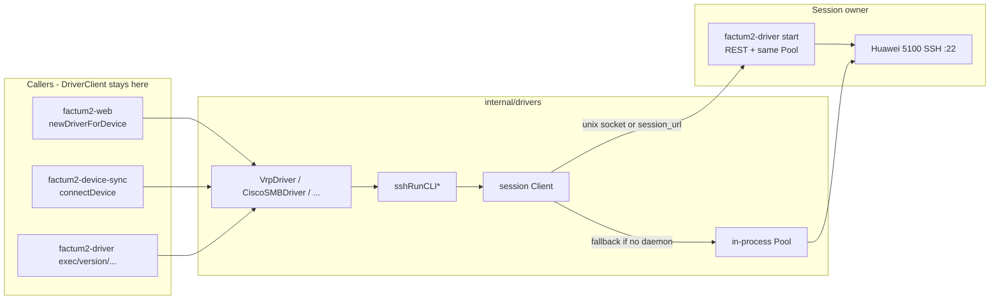
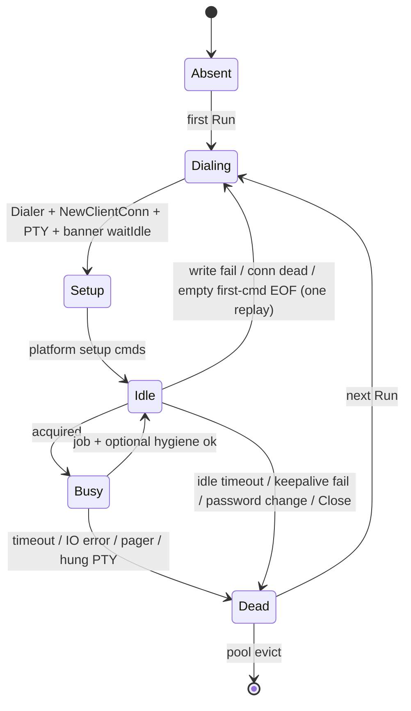

# Persistent SSH session service for slow device logins

| Field | Value |
| ----- | ----- |
| Status | Draft |
| Author | Factum |
| Date | 2026-09-19 |
| Audience | Factum maintainers (drivers, web, device-sync, factum2-driver) |
| Related | `internal/drivers/openconfig.go`, `internal/drivers/README-DRIVERS.md`, `AGENTS.md` (Device SSH policy), `docs/cfgmgmt-tree-objects.md` (CLI push path), `docs/install/workers.md` (hub is a different thing) |

## Overview

Every SSH CLI operation in Factum today opens a fresh interactive PTY, drains the login banner with a 5-second idle window, runs the command list, and throws the session away (`sshRunCLI` / `sshRunCLIBatch` / `sshRunCLIPipeline` in `internal/drivers/openconfig.go`). On a Huawei 5100-class VRP box the handshake plus MOTD plus that idle drain dominate wall time: a `display version` that takes a second of CLI work costs on the order of 20 seconds end-to-end, and a GUI click that issues two driver calls pays it twice. `AGENTS.md` already states the intended policy — *reuse one SSH connection per device for the process lifetime* — but the helpers violate it.

This design keeps platform drivers as they are (command construction, paging preambles, output parsing, `CLISessionApplier`) and moves **session ownership** behind a process-lifetime pool. Phase 1 is an in-process pool inside `internal/drivers`, which is enough for the web GUI and for `GetDeviceConfig`+`GetNeighbors` inside one `factum2-device-sync` run. Phase 2 exposes that same pool from a long-lived `factum2-driver start` daemon over loopback HTTP (REST JSON wrapping the SSH run primitives, not gNMI and not a second `DriverClient`). Web, device-sync, and the driver CLI then share one owner when a socket or URL is configured, which is the only way to honor the AGENTS.md policy **across processes** and the only way to keep a warm session for one-shot CLI invocations.

**Verified after PR 1:** there is still no `sshsession.go`, no `InitSSHPool`, no `util.ConfigDriver`, no `factum2-driver start`, and no `examples/factum2-driver.service`. `sshRunCLI*` take `(ctx context.Context, p DriverParam, ...)` — call sites pass `context.Background()` and `driver.p`. `dialSSHShell` still `ssh.Dial` + `defer Close()` on every call; SSH CLI always dials port 22 (`p.Port` is not passed — it is the NETCONF port on mixed-transport drivers). `waitIdle(ctx, endMarker) error` returns `errWaitTimeout` on `ctx` cancel/`overallTimeout`; the 100ms poll `select`s on `ctx.Done()`. Legacy `sshRunCLI*` ignore that error and return the buffer (silent partial capture). The architecture below is still the intended end state (alternative C daemon wrapping alternative A in-process pool). Call-site facts that have drifted (GUI now uses `DeviceSyncAuth`, not per-request JSON passwords) are corrected in this revision.

## Background & Motivation

### Current transport: connect-per-call

`dialSSHShell` in `internal/drivers/openconfig.go` (line 275) does `ssh.Dial("tcp", host+":"+port, config)` (line 280; not `net.JoinHostPort`), requests a vt100 PTY, starts a shell, and spawns a stdout reader. `ssh.ClientConfig.Timeout` is already **10s** (handshake, line 71). There is no custom `net.Dialer` and therefore no TCP keepalive. Both `sshRunCLIBatch` and `sshRunCLIPipeline` call `dialSSHShell` and `defer s.Close()`. There is no pool, no SSH keepalive, and no prompt parser. Completion is idle-based:

- `idleWindow = 5s` when the command has no end marker (`openconfig.go:246`).
- `configEndMarkerIdle = 200ms` after a platform-supplied marker (`^return$` on VRP `display current-config`, `^end$` on XR, `^}$` on SR OS).
- `overallTimeout = 30s` hard cap.
- Login banner/MOTD is drained with `waitIdle(ctx, nil)` — always a full 5s after the last banner byte.
- `waitIdle(ctx, endMarker) error` returns `errWaitTimeout` if `ctx` is cancelled/expired or `overallTimeout` elapses. The 100ms poll `select`s on `ctx.Done()`. **Legacy `sshRunCLI*` ignore `errWaitTimeout` and return the buffer** (silent partial capture, same as the pre-PR-1 error-less wait). A `--More--` prompt that then goes silent looks like a finished command after `idleWindow`.

Auth is password + keyboard-interactive (`sshPasswordAuthMethods`). `HostKeyCallback` is `ssh.InsecureIgnoreHostKey()`. Legacy KEX (`ssh.InsecureKeyExchangeDHGEXSHA1`, `ssh.InsecureKeyExchangeDH1SHA1` — `diffie-hellman-group-exchange-sha1` / `group1-sha1`) is already appended for old gear. Interactive PTY, not `ssh.Session.Run`.

A typical VRP `Exec` (`driver_vrp.go:50`) therefore does **three** idle waits on a cold connection:

1. Banner drain (`waitIdle(ctx, nil)`).
2. `screen-length 0 temporary` (no marker → 5s).
3. The actual command (no marker → 5s).

Those three 5s waits are **guaranteed by the code**. Handshake duration and long MOTD on top of the banner wait are **not measured** here (non-goal: live `:8090`).

`RunningConfigGet` / `GetDeviceConfig` at least get the 200ms fast path on the dump itself (`vrpConfigEndMarker` = `^return$` at `driver_vrp.go:43`), but still pay handshake + banner + paging-disable.

### Callers each dial independently

| Caller | Entry | Credentials | Process lifetime |
| ------ | ----- | ----------- | ---------------- |
| Web GUI | `web.Controller.newDriverForDevice` → `drivers.NewDriver` on every HTTP request (`web/handle_device_interfaces.go`, `web/handler_config.go` `apiServiceGenericPush`, `web/handler_service_eline.go`) | **`deviceSyncCredentials`**: `models.DeviceSyncAuth` exact device name, else `"default"` (`web/handle_device_interfaces.go:89–118`). Not per-request JSON. `deviceCredentialsRequest` is an internal DTO; handlers do not bind `{username,password}` from the GUI body. `factum2-driver` CLI still takes flags/env. | Long-lived `factum2-web` |
| `factum2-driver` CLI | `drivers.NewDriverName` (`cmd/driver/factum2-driver-cli.go`) | `--username`/`--password` / `FACTUM_DRIVER_USERNAME`/`FACTUM_DRIVER_PASSWORD` | One-shot per invocation. Cobra root is `boa.CmdT[boa.NoParams]`; each subcommand embeds `cmdbase.ParamsAgent` (default `-f /etc/factum2/factum2-worker.yaml`). **No `start` subcommand.** |
| `factum2-device-sync` | `drivers.NewDriver` in `connectDevice` (`internal/device-sync/device-sync.go:323`) | `ds.cfg.Auth[full.Name]` else `Auth["default"]`, populated by `GET /api/device-sync-config` (`internal/device-sync/remote_config.go:35`) from `models.DeviceSyncAuth` (`json:"-"` on `Password`) | One-shot job; up to `syncWorkers=8` devices in parallel; `GetDeviceConfig` then later `GetNeighbors` on the same `DriverClient` value (`devicePair.driver`, `device-sync.go:669`), but each method dials again |
| cfgmgmt / ELINE push | Same `newDriverForDevice` as the GUI, then `CLISessionApplier.ApplyCLISession` | Same `DeviceSyncAuth` as device-sync. Call sites: `handler_config.go:1037` and `:1121` (`apiServiceGenericPush`); `handler_service_eline.go:1031`. Comments at `handler_config.go:904` / `handler_service.go:382` describe the policy. | Inside `factum2-web` |

`DriverParam` is `{Name, Port, Username, Password, Platform}` (`driver.go:105–111`). `Name` is already the dial target (`drivers.DeviceFQDN`) at every production call site (`newDriverForDevice`, `connectDevice`, `NewDriverName`). `Port` is empty in every production caller and defaults to `"22"` in `dialSSHShell` (`sshDefaultPort`). Integration tests set `Port` for **NETCONF** (`FACTUM_TEST_*_PORT`, default `830`), not SSH CLI.

Because GUI and device-sync now use the **same** `DeviceSyncAuth` username for a given device, they would share a session key against a Phase 2 daemon. That is a stronger argument for the daemon than when the GUI still typed a separate password. An in-process pool in web alone still does **not** help `factum2-driver exec` (process exits) and still does **not** share a session with a concurrent device-sync job. AGENTS.md's "per process" wording is necessary but not sufficient; a session owner process is the cross-caller design.

### Platforms: pain is SSH-CLI, not eAPI/NETCONF

From `internal/drivers/README-DRIVERS.md` (transport table lines 29–36) and code:

| Platform | SSH CLI used for | Structured API |
| -------- | ---------------- | -------------- |
| Huawei VRP (5100 class) | **everything** | none |
| Cisco SMB | **everything** | none |
| Cisco IOS-XR (`ios-xr`) | Exec, running-config, ELINE/CLI session, LLDP | NETCONF for interfaces (`netconfGet` / candidate edit) |
| Nokia SR OS (`sros`, `sros-md` — same factory, `driver_nokia_sros.go:37–38`) | Exec, running-config, ELINE/CLI session | NETCONF for most reads/writes |
| Arista EOS | none (classic SSH) | NETCONF + eAPI. `eapiClient` in `eapi.go:44` is already a process-lifetime `http.Client` with a connection pool. **Zero** `sshRunCLI` call sites in `driver_arista_eos*.go` |
| Open ROADM | none | NETCONF read-only (`netconfDial`/`netconfGet`) |

Phase 1 reuses SSH CLI sessions only, and only on platforms that opt in (default: `vrp`, `ciscosmb`). EOS is not on this path at all. NETCONF (`netconfDial` closes every call, `openconfig.go:108–112`) is a later phase: candidate/lock state is a different hygiene problem.

### Worker hub is not this

`internal/worker` is a hub for **predefined named shell commands** with an allowlist (`worker.commands`, `ConfigWorkerCommand` at `internal/util/config.go:212–216`; HTTP subset `hubAPIPatterns` in `internal/worker/hub_allowlist.go`). The primary dials out to `/hub`. A forged envelope can at most select a named command, never build a shell line (`docs/install/workers.md:68–69`). It is not a device CLI proxy, not a session multiplexer, and not a supervisor for long-lived device SSH. Overloading it would couple device PTY lifetimes to hub reconnects and punch a generic "run CLI on box X" hole through a security boundary that was deliberately not that. This design does not use the hub transport.

### Pain points

1. **Login dominates.** On a 5100, handshake + banner + `idleWindow` dwarf `display version`.
2. **N logins per operator action.** Each GUI POST constructs a new `DriverClient` and every `sshRunCLI*` dials. Refresh then update is two full logins. Device-sync is two per VRP device (`GetDeviceConfig` + `GetNeighbors`).
3. **Preamble tax.** Paging-disable is a first-class `sshCmd` and pays `idleWindow` every call even after the session exists.
4. **Stateful PTY.** Leftover `system-view`, a pager, or `screen-length` on a reused session is unsafe unless we serialize and reset. Today we dodge this by discarding the session — the expensive correct answer. Reuse makes leftover `--More--` load-bearing: `waitIdle` will treat a silent pager prompt as success.
5. **Reachability.** `factum2-web` on the primary may not have a route to every device; `factum2-driver` already exists as the "run next to the devices" binary (`KNOWN_BINARIES` in `install.py:121`). Session ownership should be placeable on the host that can actually dial.

## Goals & Non-Goals

### Goals

- Honor `AGENTS.md`: one SSH CLI session per device (per session key) for the owner's lifetime, not per command.
- Cut subsequent VRP single-command `Exec` / `GetInterfacesStatus` to **skip handshake + banner drain + paging-disable**. Latency target below (VRP-shaped; SMB multi-`show` is N×`idleWindow`).
- Serialize CLI on a given session so two callers cannot interleave `system-view` with a `display`.
- Keep platform drivers owning commands and parsers. Only `sshRunCLI*` change from "dial and close" to "borrow from pool".
- Opt-in per platform (and later per device). Default `vrp`/`ciscosmb` because they are SSH-CLI-only and their hygiene profiles are designed in this doc. EOS is not on `sshRunCLI`. XR/SR OS wait for a follow-up that copies their real session trailers.
- Expose enough telemetry in the same merge as the pool to prove the 5100 login cost is gone (login vs command duration, reuse flag, queue wait, reconnects).
- Make the pool usable in-process **and** from a `factum2-driver start` daemon without two implementations.

### Non-Goals

- gNMI, YANG mapping, or a gRPC stack. `openconfig.go`'s package comment is explicit: Factum did not add one (lines 8–10).
- Wrapping `DriverClient` as an HTTP API in v1 (no remote `Version()` / `GetDeviceConfig()`). Drivers stay in the caller.
- A second credential store. GUI device I/O already uses Postgres `DeviceSyncAuth` (same as device-sync). This design does not persist additional secrets. The session owner holds passwords **in memory only** (process-lifetime RAM, bounded by idle-close). CLI flags/env stay per-invocation unless a daemon is running.
- Host-key verification overhaul. `InsecureIgnoreHostKey` is pre-existing; this design notes it and leaves a cheap `known_hosts` follow-up.
- Replacing the worker hub, Oxidized, or using OpenSSH `ControlMaster`.
- Prompt-accurate CLI parsing in v1. Idle-window detection stays; a prompt parser is an explicit follow-up because even a warm session still pays 5s per unmarked command.
- NETCONF / eAPI session reuse in v1.
- Changing cfgmgmt render/push semantics, ELINE templates, or `CLISessionApplier`.
- Live-instance (`:8090` / real `factum2` DB) verification.
- Enabling IOS-XR / SR OS pooling via YAML without a dedicated hygiene PR.
- A full `GUI()` graceful shutdown of `RemoteManager` / scheduler. The daemon closes PTYs on SIGTERM; `factum2-web` does not today (`web/web.go:110–112`, `e.Start` at line 557 blocks until the process exits).

## Key Decisions

1. **End state is alternative C: `factum2-driver start` as the long-lived session owner, with alternative A (in-process pool) as the library it wraps and as the zero-config fallback.** Rationale: AGENTS.md is per-process and is the right first merge; the user's cross-process problem is real (web + device-sync + one-shot CLI) and only a daemon solves it. One library, two embeddings. No new binary (`factum2-driver` is already in `KNOWN_BINARIES`).

2. **API is REST JSON wrapping SSH run primitives (`batch` / `pipeline`), not gNMI and not a `DriverClient` RPC.** Rationale: gNMI is a YANG telemetry/config protocol; VRP/SMB have no YANG mapping and wrapping screen-scraped CLI in gNMI Get/Set would be a lie. Factum has no gRPC stack (deliberate, see `openconfig.go`). Echo/HTTP is the house style for `factum2-web`, but the daemon should use `net/http` like `internal/worker/local_api.go` rather than pulling Echo into `factum2-driver`. Full `DriverClient` over HTTP would move command construction into the daemon and contradict "drivers keep parsing". Jump-host for NETCONF/eAPI is a later RPC if we ever need it.

3. **Connect-on-first-use, not eager connect to inventory.** Rationale: even though GUI and device-sync credentials now live in Postgres (`DeviceSyncAuth`), eager dial of every VRP in inventory would burn VTY lines. CLI credentials still arrive per invocation and are not in the DB. A jump-host daemon has no Postgres. Idle-close default **8 minutes** (≤ typical Huawei VTY `idle-timeout` of ~10 minutes of CLI input, which SSH-level keepalives do not reset) plus max sessions (default 64) bound VTY use. Device CLI idle still wins if an operator sets it lower. SSH `keepalive@openssh.com` with `ok=false` must **not** Dead the session (old VRP); TCP keepalive is the dead-peer backstop.

4. **Session identity is `platform/username@host:port` (port default 22; `sros-md` canonicalized to `sros`).** Rationale: `ssh.Dial` uses host:port and user (`DriverParam.Name` is already `DeviceFQDN`), but hygiene/setup is per platform. Keying without platform would let a mis-set `vrp` vs `ciscosmb` reuse a PTY and run the wrong Reset. Password change (constant-time compare against the in-memory secret) drops and redials. Two factum names that FQDN to the same host **and** share platform+user share a session — desirable. `sros` and `sros-md` are the same NOS and the same CLI (`registerDriver` twice, same factory); they share a key once pooling exists for them.

5. **Opt-in default platforms: `vrp` and `ciscosmb` only.** Rationale: those are SSH-CLI-only (README-DRIVERS.md) and include the 5100; their setup/reset profiles are specified below. EOS never calls `sshRunCLI` and must not be dragged onto SSH. IOS-XR / SR OS are **not** enabled via `driver.platforms` in v1 — their real session trailers (`commit`/`discard`/`exit all`/`quit-config` on SR OS; `commit`/`abort` on XR) are not the same as a generic Reset, and enabling them without a hygiene PR would be wrong. Queueing is already per session key; a modern VRP and a 5100 do not share a FIFO unless they collide on `platform/user@host:port`.

6. **Do not reuse the worker hub.** Rationale: allowlisted named commands vs generic device CLI is a security property (`AGENTS.md`, `docs/install/workers.md`). Hub reconnects must not tear device sessions. `factum2-driver start` is a systemd unit of its own, placeable on the primary or on a host that can reach devices. The unit is **opt-in** (not in `install.py` `PRIMARY_UNITS` at line 83, not enabled by default) because it holds device passwords in RAM. `install.py` today copies only `PRIMARY_UNITS` on the primary (`install.py:2161`) and only `WORKER_UNIT` in `install_worker()` (`install.py:2246`). PR 3 must `install_unit` the new file on **both** the primary and worker/jump hosts **without** adding it to `PRIMARY_UNITS` and without `systemd_reload_enable_restart`. ExecStart uses worker YAML: `/opt/factum2/factum2-driver -f /etc/factum2/factum2-worker.yaml start`. Process is root + `Group=factum` (same as the worker); passwords live in that process’s RAM.

7. **Paging-disable is session setup; view Reset runs only after jobs that entered config mode and did not already exit.** Rationale: `waitIdle(nil)` is always 5s. Always-Reset would make warm VRP Exec ~10–12s and miss the p95 < 7s target. Read paths (`display` / `show`) stay in user-view; skip Reset. Write paths that already end with the platform exit command (`return` / `end` / `quit`) skip Reset. Only leftover config-mode (Exec of `system-view`, a batch that entered and did not exit) pays one hygiene `idleWindow`. Preamble elision still strips setup cmds on a ready session.

8. **Credentials never hit disk on the session owner.** Rationale: `DeviceSyncAuth.Password` is already in Postgres (`json:"-"`). GUI and device-sync already load it for each job. After this, `factum2-web` or the daemon retains an in-memory copy until idle-close / process exit so it can redial — an expansion of today's request-lifetime RAM copy, not a new disk store. CLI secrets stay flags/env unless they hit a daemon. Do not add pprof/debug endpoints that heap-dump the pool. Never log passwords.

9. **Unix socket auth is filesystem ACL only (like `FactumHTTP`); TCP/HTTPS requires a bearer. Default daemon listen is unix-only.** Rationale: `internal/worker/local_api.go` (dir `0750`, socket `0660`) + `util.FactumHTTP` send no `Authorization` on unix (`the socket ACL is the auth`, `remoteconfig.go:70–71`). Matching that lets web probe `/run/factum2-driver/session.sock` with **zero YAML**, and lets `systemctl enable --now factum2-driver` start against existing `factum2-worker.yaml` with no `driver.token`. Loopback TCP is opt-in (`driver.listen: 127.0.0.1:8092`) and then requires a token. Residual: any process in group `factum` can POST CLI — same class as the worker socket.

## Proposed Design

### Process model



**Recommended deployment (primary can reach devices):**

- Optionally run `factum2-driver start` on the primary (`systemctl enable --now factum2-driver`; not started by `install.py` by default). Default bind is **unix only** (`/run/factum2-driver/session.sock`); no `driver.token` required. Existing `factum2-worker.yaml` is enough.
- `factum2-web`, `factum2-device-sync`, and `factum2-driver` CLI all probe that socket via a **dedicated** helper (`drivers.SessionSocketPath`), **not** `util.FactumHTTP` / `HubSocketPath`. Hit the daemon → one owner. Socket missing / connection refused → in-process pool for that `Run` (see getPool / connect-failure fallback). HTTP 502 after the daemon ran CLI is **not** replayed. CLI one-shots still do not reuse across invocations without a live daemon.
- `factum2-device-sync` continues to call `util.WithoutHubSocket` for Factum API traffic (`cmd/device-sync/factum2-device-sync-cli.go:55`) so it does not ride `/run/factum2-worker/api.sock`. That must not disable the **session** socket probe.

**Jump-host deployment (primary cannot reach some boxes):**

- Run `factum2-driver start` on a host that can dial the devices. Installer copies `factum2-driver.service` there (see PR 3) but does not enable it; operators `systemctl enable --now factum2-driver`.
- Point callers at `https://driver-host:8092` with TLS + bearer token (`driver.session_url` / `driver.session_token` in **each caller's** YAML). Client TLS **verifies** against system CAs by default; optional `driver.tls_ca` (or the same CA file the daemon’s cert was issued from). **Never** `InsecureSkipVerify` on the session client (unlike `eapi.go:48–49`). Handshake failure is connect-failure fallback — jump-host callers that cannot dial devices then fail at `ssh.Dial`, same as today without a daemon.
- Non-loopback listen requires TLS **and** a non-empty `driver.allow_cidrs` (fail closed). `allow_cidrs` is the set of **device IPs the daemon may `ssh.Dial`**, not an HTTP client-source ACL (token+TLS is client auth). HTTP peer `RemoteAddr` is not checked in v1.
- Only SSH-CLI operations ride this path. EOS eAPI and NETCONF still dial from the caller — same as today, those callers already needed reachability.

**Zero-config:** no daemon, no YAML. **PR 2** (in-process pool) never probes a session socket or `session_url`; `getPool` is enabled+profile → `memoryPool`, else legacy. **PR 3** inserts the remote probe. Empty YAML socket means “probe the default path”; `socket: none` disables unix probe. Missing socket is not an error — it is fallback to in-process. This is why Phase 1 ships first and stays the fallback.

How each caller reaches the owner:

| Caller | YAML file | Path |
| ------ | --------- | ---- |
| Web GUI / cfgmgmt push / ELINE | `/etc/factum2/factum2.yaml` (`ConfigRoot`, `cmdbase.Params` default `-f`) | Unchanged `newDriverForDevice` → `NewDriver` → platform driver → `sshRunCLI*`. `GUI()` calls `InitSSHPool` from `p.Config.Driver` before `e.Start`. |
| `factum2-device-sync` | `/etc/factum2/factum2-worker.yaml` (`ConfigAgentRoot`, `ParamsAgent`) | Unchanged `NewDriver` in `connectDevice`. `WithoutHubSocket` for Factum REST only. Session socket still probed. `InitSSHPool` in the `sync` subcommand `RunFuncE` before `devicesync.Sync()`. |
| `factum2-driver` CLI | `/etc/factum2/factum2-worker.yaml` | Unchanged `NewDriverName`. Cobra **root is `boa.NoParams`** (`factum2-driver-cli.go:269`), so `InitSSHPool` cannot run in `main` without loading YAML. One helper `initDriverSSHPool(p *cmdbase.ParamsAgent)` is called from every **dialing** subcommand `RunFuncE` and from `start` (PR 3). A later `optical-inventory` that forgets it panics with a message naming the helper. `ShowConfigAgent` must **not** init. With a daemon, a second `exec` skips login. |
| `factum2-driver start` | `/etc/factum2/factum2-worker.yaml` | Owns the pool; default unix-only. Subcommand embeds **`ParamsAgent` only** (not `DeviceNameParams` — username/password flags must not be required to start). **Listen** unix path = `SessionSocketPath(driver.socket)` — same helper clients probe (relocated socket / `FACTUM_DRIVER_SESSION_SOCKET` must match). TCP only if `driver.listen` is set (then token; TLS+CIDR if non-loopback). **`InitSSHPool` client remote forced off** (`Socket: "none"`, empty `session_url`) so `getPool()` cannot HTTP to this process; that does **not** change the listen path. ServeMux calls `memoryPool.Run` / `localRun` only. CLI subcommands (`exec`, …) are a different process and still probe. |
| `factum2-worker start` | `/etc/factum2/factum2-worker.yaml` | Ignores `driver.*` (all fields `optional:"true"`). |

Do **not** add a `factum2-driver` entry to `worker.commands` as a way to "start the daemon". Worker commands are finite jobs (`sync`, `--job`). The session daemon is `Type=simple` systemd, like `factum2-web`.

### Library shape (Phase 1, used by Phase 2)

New file `internal/drivers/sshsession.go` (same package, to keep `sshCmd` / `sshShellSession` unexported). Tests in `sshsession_test.go` against a fake SSH server built with `golang.org/x/crypto/ssh` (already in `go.mod`; no new module).

Signature change in **PR 1** (landed) — fold `context.Context` and `DriverParam` in one sweep so PR 2 does not invent a third:

```go
// before (openconfig.go:225, 409, 451 — verified 2026-09-19)
func sshRunCLI(username, password, host, port string, cmds []sshCmd) (string, error)
func sshRunCLIBatch(username, password, host, port string, cmds []sshCmd) ([]string, error)
func sshRunCLIPipeline(username, password, host, port string, cmds []string, endMarker *regexp.Regexp) (string, error)

// after (PR 1)
func sshRunCLI(ctx context.Context, p DriverParam, cmds []sshCmd) (string, error)
func sshRunCLIBatch(ctx context.Context, p DriverParam, cmds []sshCmd) ([]string, error)
func sshRunCLIPipeline(ctx context.Context, p DriverParam, cmds []string, endMarker *regexp.Regexp) (string, error)
```

PR 1 call sites pass `context.Background()` and `driver.p`:

- `driver_vrp.go` (Exec, Version, RunningConfigGet, RunningConfigSave, GetInterfacesStatus, SetInterfaceDescriptions, SetInterfaceVLANs, `vrpCLISession` / `ApplyCLISession`, GetDeviceConfig, GetNeighbors)
- `driver_ciscosmb.go` (`runCLI` / `runCLIBatch` helpers **and** `RunningConfigSave`, which calls `sshRunCLI` directly at line 159)
- `driver_iosxr.go` (Exec, RunningConfigGet, **`iosxrRunningConfig(ctx, p DriverParam)`**, GetNeighbors)
- `driver_iosxr_eline.go` (`iosxrELINESession`)
- `driver_nokia_sros.go` (four `sshRunCLI` sites including `srosConfig`)
- `driver_nokia_sros_eline.go` (`srosELINESession`)

No `*_test.go` currently calls `sshRunCLI` directly (verified).

Also in PR 1 (still behavior-neutral for callers):

```go
func (s *sshShellSession) waitIdle(ctx context.Context, endMarker *regexp.Regexp) error
```

- Idle-complete (quiet for `idleWindow` / marker idle) → `nil`.
- `ctx` cancelled/expired or `overallTimeout` → `errWaitTimeout`.
- The 100ms poll must `select` on `ctx.Done()` so a cancel aborts without waiting out `overallTimeout`.
- **Legacy (non-pooled) `sshRunCLI*`:** if `waitIdle` returns `errWaitTimeout`, **ignore it and return the buffer** — bit-identical to today (silent partial capture).
- **Pooled path (PR 2):** `errWaitTimeout` is a **hard error**; session Dead; do not return truncated output as success. Reusing a session after a truncated dump is how leftover pager/config-mode happens. This is a behavior change **only** for pooled platforms (`vrp`, `ciscosmb`). Impact: VRP `GetDeviceConfig` uses `vrpConfigEndMarker` and should still complete; SMB `show running-config` has **no** end marker (`driver_ciscosmb.go:148–149`) — a dump that dribbles past 30s will start **erroring** instead of writing a truncated config into NetBox. That is the correct trade. If a real SMB dump hits it, add a marker or raise that job's timeout; do not silently truncate.

```go
type sshRunMode int

const (
    sshRunBatch    sshRunMode = iota // write, waitIdle, next (save/y, per-cmd errors)
    sshRunPipeline                   // join lines, one waitIdle (ApplyCLISession, ELINE)
)

type sshRunRequest struct {
    Param   DriverParam
    Mode    sshRunMode
    Cmds    []sshCmd          // pipeline: Cmds[i].Cmd only; EndMarker on last
    Actor   string            // audit; empty ok
    Timeout time.Duration     // 0 → overallTimeout (30s); job+hygiene only, not login/setup
}

type sshRunResult struct {
    Outputs   []string      // pipeline: single combined capture
    Reused    bool
    Login     time.Duration // 0 if reused
    QueueWait time.Duration
    Command   time.Duration // command + optional hygiene, not login
}

type sshPool interface {
    Run(ctx context.Context, req sshRunRequest) (*sshRunResult, error)
    Stats() []sshSessionStat
    Close()
}
```

`sshRunCLIBatch` becomes `getPool().Run(...)` and keeps returning the last-command-only / all-outputs shapes the drivers already expect. **CRLF:** today `sshRunCLIBatch` / `sshRunCLIPipeline` replace `\r\n` → `\n` because every caller splits on `\n` alone (`openconfig.go:428–435`, `466`). `getPool().Run` (and the HTTP client mapping of `outputs`) **must** apply the same replacement before returning to drivers — once, in `sshRunCLI*` after `Run` (or inside the pool, once; not both). Fake-SSH test: server emits `\r\n`; callers see `\n` only.

`getPool()` is a small router. **Split across PRs** so PR 2 does not stub HTTP:

**PR 2 (in-process only):**

1. If `InitSSHPool` has not been called → **panic** (`drivers: InitSSHPool was not called; call initDriverSSHPool / web.GUI`). No lazy `sync.Once` defaults: that races YAML (`platforms: ["none"]`) applied later.
2. If `Param.Platform` is not in the enabled set **or has no v1 hygiene profile** → **legacy path** (`dialSSHShell`, `defer Close()`, `errWaitTimeout` ignored) and slog `ssh.legacy` with reason `not_enabled` / `no_profile`. YAML `platforms: [sros]` or `[ios-xr]` is a **no-op** until PR 6 adds profiles; do not run those platforms through `memoryPool` with empty setup/reset.
3. Else → process-lifetime `*memoryPool`. Ignore `socket` / `session_url` (store them on the config struct if parsed, do not probe).

**PR 3 inserts remote between 2 and memoryPool:**

3. Else if a remote owner is configured (`session_url` non-empty, **or** session socket not `"none"` — omitted YAML socket means probe the **default** path `/run/factum2-driver/session.sock`) → try the HTTP client, with **connect-failure fallback** below. **`factum2-driver start` must not take this branch** (see InitSSHPool for `start`).
4. Else → process-lifetime `*memoryPool`.

**Daemon must not HTTP to itself.** Default session socket is `/run/factum2-driver/session.sock`. The daemon **binds** that path; clients **probe** it. Those two uses of `driver.socket` must not be collapsed into “`start` ignores YAML socket.”

- **Listen** (bind): `listenPath := SessionSocketPath(yaml.Socket)` — same function as clients (`driver.socket` / `FACTUM_DRIVER_SESSION_SOCKET` / default `/run/factum2-driver/session.sock` / `"none"` disables unix). A relocated socket that clients probe but `start` does not bind would make every `Run` connect-fail into the in-process pool and leave the daemon unused.
- **Client remote** (getPool HTTP): `factum2-driver start` calls `InitSSHPool` with `Socket: "none"`, `SessionURL: ""` so step 3 never fires in this process. Pool knobs (`platforms`, idle, max, …) still apply. YAML `session_url` is for CLI/web/device-sync, not for `start`.
- ServeMux handlers invoke the local `memoryPool.Run` (unexported `localRun`) **only**. They do not go through the HTTP client. Test: start the daemon, `POST /v1/cli/run`, assert no outbound HTTP to its own socket.
- `factum2-driver exec` / other CLI subcommands are separate processes; they keep the socket probe (same `SessionSocketPath`).

**Connect-failure fallback (Phase 2 / PR 3 only; specified here so `InitSSHPool` does not cache “HTTP forever”):** unlike `FactumHTTP` (probe once at client construction, no fallback after a later 502 — `remoteconfig.go:67–71`, `AGENTS.md:174–176`), a long-lived `factum2-web` must not fail every GUI driver POST until restart because the opt-in daemon died. Replay of a `Run` that the daemon **already executed** is worse (double `ApplyCLISession`).

- `InitSSHPool` records whether a remote is *configured* (socket path not `"none"`, or `session_url`). It may Stat once to log `ssh.remote=up|down`; it does **not** freeze the transport.
- Fallback **only** when the HTTP request **never got a response from the daemon**: socket missing, Stat/Dial fail, connection refused, TLS handshake fail. Log `ssh.remote_fallback` at **Warn**, execute that `Run` on `memoryPool`, sticky `down`. Do **not** pay a 3s Dial on every subsequent click while down.
- After a failed **Stat**, do **not** Dial until the next re-probe (Stat-only is cheap; a 3s Dial timeout is what to avoid). Re-probe at most once per `remoteRetry` (default **5s**) on the next `Run`.
- **If any HTTP status is received — including 502/504 (device/SSH error after the daemon wrote CLI), 408, 429, 4xx — return it. Do not replay.** Device 502 is not “daemon unavailable.” Sticky state stays `up` (a 5100 pager leftover must not open a second in-process VTY and break single-flight).
- **Do not fallback on client timeout after the request was sent.** The daemon may already have accepted and applied the batch. Return the timeout to the caller.
- While sticky `down`, Runs go straight to `memoryPool`. Re-probe success → sticky `up` again: log `ssh.remote_up` at **Warn**, then **`memoryPool.Close()`** (drop in-process VTYs immediately) so a 5–8 VTY 5100 is not held by two owners. LRU/`max_sessions` are per owner, not global.
- `session_url` set and connect fails: same fallback to in-process (jump-host callers that cannot dial devices will then fail at `ssh.Dial` — same as today without a daemon).

`InitSSHPool(cfg)` must run once at process start, **before** any `sshRunCLI*` / `NewDriver` work:

- Returns **error** on invalid knobs (bad duration parse, negative `max_sessions`/`queue_depth`, unknown listen policy at `start` time). **Panic only** on double-init (without `ResetSSHPoolForTest`) or when `getPool`/`Run` is reached with no init.
- `web.GUI()`: after config is loaded (`GuiParams` embeds `cmdbase.Params` → `p.Config`), before `e.Start`.
- `factum2-device-sync` `sync`: `initDriverSSHPool` equivalent from `ParamsAgent` before `devicesync.Sync()`.
- `factum2-driver` **CLI** subcommands: `initDriverSSHPool(&p.ParamsAgent)` before dialing (YAML client knobs; socket probe on in PR 3).
- `factum2-driver start`: `initDriverSSHPool` with **client remote forced off** (above). Unix **listen** still uses `SessionSocketPath(yaml.Socket)`.
- Tests that dial: `ResetSSHPoolForTest()` (installs compiled defaults) in `TestMain` or per-test under a **package mutex**. The process-wide pool **cannot** `t.Parallel()` with other tests that also init; pool tests are sequential. Parser tests that never dial do not need it.

Actor (empty until PR 4): `DriverClient` methods take **no** `context` (`driver.go:54–74`) and must not grow one (too large). PR 1 call sites pass `context.Background()`. Threading rule for PR 4: unexported `actor` field on `DriverParam` (not JSON, not a constructor requirement) set by `drivers.WithActor(p, name) DriverParam`. Wrap **before** `NewDriver`. Web: `sessionUserLabel` already returns the GUI operator’s Name/Username (`handle_device_interfaces.go:121–133`). Prefer wrapping inside `newDriverForDevice` if the label is passed in (do not add `echo.Context` to that helper’s signature unless necessary); otherwise wrap at each HTTP handler with `WithActor(p, sessionUserLabel(c))` — cfgmgmt/ELINE already go through `newDriverForDevice`. Device-sync actor = `"device-sync"` in `connectDevice`. CLI = `$USER` inside `NewDriverName`. Every platform driver already stores `p DriverParam` and passes it to `sshRunCLI*`; those helpers copy `p.actor` onto ctx via `context.WithValue` (unexported `actorKey`). Do **not** add `ctx` to `DriverClient`. Public `DriverParam` fields stay Name/Port/Username/Password/Platform.

### Session lifecycle



| Event | Behavior |
| ----- | -------- |
| Dial | Not `ssh.Dial`. Use `net.Dialer{Timeout: 10s, KeepAlive: 30s}` then `ssh.NewClientConn(conn, addr, sshClientConfig(...))` then `ssh.NewClient`. Handshake timeout stays 10s (`ssh.ClientConfig.Timeout` already). `KeepAlive` is the TCP-level backstop; it is **not** a substitute for device VTY idle. |
| First use | Dial. Banner `waitIdle(ctx, nil)` **once**. Run platform **setup** (required cmds then best-effort cmds; see Session hygiene). Required-setup error or pager → Dead. Best-effort `% Unrecognized command` is ignored. Then run the job. **Login/setup timeouts are not the job timeout:** each banner/setup `waitIdle` keeps today’s per-call `overallTimeout` (30s). `req.Timeout` (job budget) **starts after setup reaches Idle/ready** (or immediately on reuse). A cold 5100 whose banner+setup+command idle waits exceed 30s **wall** still succeeds as long as no single waitIdle / the job itself exceeds 30s. Fake-SSH: banner+setup+command totaling >30s of idle waits still succeeds; only the **command** wait past 30s is `errWaitTimeout`. |
| Reuse | Skip dial, banner, setup. Job budget starts at acquire. |
| Stale Idle | Huawei VTY idle-timeout is commonly **10 minutes of CLI input**. SSH `keepalive@openssh.com` does not reset it. Replay **once** per `Run` iff the session was Idle at acquire **and** one of: (a) the connection is already dead before any command is written (`ssh.Client` wait / stdout goroutine exited); (b) the first `stdin.Write` of this job fails (broken pipe); (c) the **first** command’s `waitIdle` ends in EOF or `errWaitTimeout` **and** no bytes were captured after that write (Huawei often ACKs the write then drops the exec channel). Do **not** replay after any non-empty capture (double-apply). Residual of (c): a command that executed with **zero** output could be applied twice — accepted for v1 (VRP/SMB CLI almost always echoes or prints). Then Close, redial, setup, replay the job. This is how the first GUI click after a box-side VTY timeout succeeds. |
| Keepalive | SSH-level: `client.SendRequest("keepalive@openssh.com", true, nil)` every 30s while Idle (goroutine per session). **Failure is `err != nil` (connection/IO) → Dead.** `ok=false` with `err==nil` means the peer does not implement the request (common on old VRP): log once (`ssh.keepalive_unimplemented`), do **not** Dead, **stop** further SSH keepalives on that session. TCP `Dialer.KeepAlive` remains the dead-peer backstop. Fake-SSH: server replies false/unimplemented; next `Run` still `reused=true`. No CLI-level probe in v1 (a cheap `display clock` would pay `idleWindow`). |
| Idle timeout | Default **8 minutes** without a job → Close, drop creds, evict. Next Run dials. Bounds VTY on 5100-class (often 5–8 VTY). Operators with a longer device VTY idle may raise `driver.idle_timeout`; the pool cannot extend a box-side timer. |
| Box drops the TCP | stdout reader hits EOF → Dead. If this is the first command of a Run that was Idle at acquire and the capture after the write is empty, stale-Idle replay (c) applies. If any payload was captured, return error (no replay). Next `Run` on Dead redials. |
| Dial failure | Return error to caller. Do not cache a failed session. Optional single retry if the error looks like VTY exhaustion: evict LRU idle session and dial once more. |
| Password change | Constant-time compare of the request password to the stored secret. Mismatch → Close, store new secret, redial. |
| Platform mismatch | Different `sessionKey` (platform is in the key). No reuse across platforms. |
| Max sessions | Default **64**. New key when at cap: evict LRU **idle** session. If none idle → `errPoolFull` (HTTP 429). |
| Process shutdown | **Daemon:** SIGTERM → `Pool.Close()` (closes every SSH client) → exit. systemd `TimeoutStopSec` ≥ 10s (both existing units already set `TimeoutStopSec=10s`). **Web:** `GUI()` has no graceful shutdown today; SIGTERM kills the process and the kernel closes TCP. Do not pretend `Pool.Close()` runs in web without adding a shutdown path. Tests call `Pool.Close()` / `ResetSSHPoolForTest`. |

No eager connect to a configured device set. Device-sync should not "warm" 200 boxes at job start.

### Serialization, queue, timeouts

One session ⇒ one in-flight PTY job. A `chan struct{}` or `mutex` plus a FIFO of waiters.

```go
const (
    defaultQueueDepth     = 8
    defaultAcquireTimeout = 60 * time.Second
    defaultJobTimeout     = overallTimeout // 30s; command + optional Reset only — not login/setup
    defaultHTTPTimeout    = 180 * time.Second // acquire + login-budget + job + hygiene
)
```

- Waiters: FIFO. Fair enough; the real contention is "operator Exec vs device-sync dump on the same 5100".
- Acquire wait > `acquire_timeout` → error `errAcquireTimeout` (HTTP 408). The stuck `display current-config` keeps the slot; the waiter does **not** kill it.
- Queue length ≥ `queue_depth` → reject immediately `errQueueFull` (HTTP 429). Do not buffer unbounded GUI clicks.
- **Job timeout vs login:** `req.Timeout` (default 30s) **or** the caller’s `ctx`, whichever is sooner, applies to **command `waitIdle`s and hygiene Reset only**. It starts when the session is Idle/ready (setup done, or reuse). Banner drain and required/best-effort setup each keep a **separate** per-`waitIdle` `overallTimeout` (30s), matching today (`openconfig.go:353` — each wait has its own deadline). Do **not** attach one 30s context to the whole `Run` (cold VRP planning band is 17–32s of waits+KEX; that would flake the 5100 canary and never reach Idle). On job `errWaitTimeout` / `ctx.Err()`: Close the SSH client (kills the PTY), session Dead, return error. Next caller redials (or stale-Idle replay if applicable). This is how a wedged 5100 pager does not block the device forever.
- HTTP client/server timeouts (Phase 2) must be ≥ acquire + login-budget + job + hygiene: **180s** (60s acquire + ~30s banner + ~30s setup + 30s job + 5s hygiene + slack). Do not copy `util.FactumHTTP`'s `HubRPCTimeout = 60s` (`transport.go:15`). Do not use 120s — that is tight if acquire (60) + cold login (~32) + job (30) stack.
- `sshRunCLIPipeline` for ELINE/cfgmgmt can pass a longer **job** timeout via context from the web handler later; v1 job budget is 30s, which is already `overallTimeout` today for the command itself. Config dumps with end markers usually finish inside that; if a real 5100 dump exceeds 30s that is a **pre-existing** cap, now a hard error on the pooled path instead of silent truncation. Follow-up: `sshCmd` timeout override for marked dumps (60–120s).

`syncWorkers = 8` in device-sync is **across devices**, not eight jobs on one box. Per-device single-flight does not reduce that parallelism.

### Session hygiene

The PTY is stateful. Leftover `system-view`, `--More--`, or a partial line will corrupt the next job. Today we destroy the session instead.

v1 profiles (only platforms that may be enabled). Setup is split **required** vs **best-effort**; each command is sent and scanned separately:

| Platform | Required setup (fatal on CLI error / pager) | Best-effort setup (ignore unrecognized) | Config-mode entry | Exit cmds | Reset (only if needed) |
| -------- | ------------------------------------------- | --------------------------------------- | ----------------- | --------- | ---------------------- |
| `vrp` | `screen-length 0 temporary` | — | `system-view` | `return`, `quit` (last command) | `return` |
| `ciscosmb` | `terminal datadump` | `terminal width 0` | `configure` | `end` | `end` |

`smbPreamble` in `driver_ciscosmb.go:85–89` is explicit that `terminal width 0` is unrecognized on some trains (`% Unrecognized command`) and the driver **continues**. That string matches `smbCLIErrorMarkers` (`(?m)^%\s` at line 42). Treating the combined setup capture as fatal would Dead default-on `ciscosmb` sessions on those boxes. Preamble elision still strips **both** setup strings when present at the front of a job, including best-effort.

IOS-XR and SR OS have **no v1 profile**. Their real trailers are `commit`/`abort` (XR, `driver_iosxr_eline.go:54–56`) and `commit`/`discard`/`exit all`/`quit-config` (SR OS, `driver_nokia_sros_eline.go:145–147`; MD-CLI `quit-config` from a nested context fails — `/` alone does not clear exclusive-edit). Do not claim `driver.platforms: [sros]` works without a follow-up PR that copies those trailers.

**When to Reset** (after a successful or CLI-scanned-error job; never after IO failure):

```
entered := any cmd, trimmed, equals a platform Config-mode entry exactly
exited  := last non-empty trimmed cmd equals a platform Exit cmd exactly
if entered && !exited {
    write Reset; waitIdle(ctx, nil); scan pager/errors
} // else skip Reset — no extra idleWindow
```

Equality is on the **trimmed command string**, not `strings.Contains`. `Exec("system-view")` enters; `Exec("display | include system-view")` / `Exec("display system-view")` do not.

- VRP `Exec("display version")`: no `system-view` → skip Reset. Warm cost = one unmarked `idleWindow` (~5s) after preamble elision.
- VRP `SetInterfaceDescriptions` / `SetInterfaceVLANs`: start `system-view`, end `quit` (`driver_vrp.go:164–174`, `223–251`) → skip Reset.
- VRP `ApplyCLISession`: `vrpCLISessionCommands` ends with `return` (`driver_vrp.go:301–303`) → skip Reset.
- Cisco SMB `ApplyCLISession`: `smbCLISessionCommands` ends with `end` (`driver_ciscosmb.go:504–506`) → skip Reset.
- VRP `Exec("system-view")` (operator left config mode): entered, not exited → Reset `return` + 5s. Correct.

**Preamble elision:** when the session is Idle+ready and the incoming `sshCmd` list **starts with** the setup list (byte-for-byte command strings), strip that prefix before running. VRP `Exec` then sends only `display version`. If the session was just created, setup already ran; still strip. Non-pooled path unchanged.

**Pager leftover (required, not optional):** `waitIdle` returning successfully after 5s of silence does **not** mean the command finished — a `--More--` prompt that then goes quiet looks identical. After **every** capture (setup, each batch command, pipeline, Reset):

- If output matches a per-platform more-prompt, mark Dead, Close, return `errPagerLeftover`. Do not type `return`/`q` at the pager in v1.
- v1 regex, **line-anchored**, case-insensitive, applied to the **whole** capture: `(?im)^\\s*-{0,4}\\s*More\\s*-{2,}\\s*$` covering `--More--` and `---- More ----` (optional surrounding dashes/spaces). **Do not** use a substring `More:` — that matches English in MOTD, comments, and interface descriptions (`Need More: fiber`) and would Dead `GetDeviceConfig` on a healthy dump.
- Fake-SSH tests in PR 2 **must** cover: pager leftover kills the session; a dump whose description contains the word “more” / `More:` does **not**.

**Setup failure:** scan **required** setup commands only. If a required paging-disable output matches the platform CLI error markers already used by the drivers (`vrpCLIErrorMarkers` `Error:` at `driver_vrp.go:279`, `smbCLIErrorMarkers` `^%\s`) or the pager regex, Dead, Close, return error. A session whose required setup failed must not elide preambles on the next job. **Best-effort** setup (`ciscosmb` `terminal width 0`): ignore `% Unrecognized command` (and other `%` errors); still Dead on pager. Fake-SSH test: width 0 returns `% Unrecognized command` and the session still becomes Idle/ready.

**Hung PTY:** `waitIdle` `errWaitTimeout` with no pager match → Dead (pooled path). Do not send Ctrl-C in v1.

**When to kill rather than reset:** IO error, job timeout, pager, setup error, password change, keepalive fail, hygiene timeout. Never reuse a session that failed hygiene.

Drivers must not assume a fresh user-view **during** a batch they themselves put into config mode (`SetInterfaceDescriptions` still sends `system-view` … `quit`). The pool only guarantees user-view **between** `Run` calls.

### Identity, FQDN, port

```go
func sessionKey(p DriverParam) string {
    host := p.Name // already DeviceFQDN at every production call site
    port := p.Port
    if port == "" {
        port = sshDefaultPort // "22"
    }
    // Raw IPv6 literals in Name are ambiguous with :port unless bracketed.
    // JoinHostPort wraps any host containing ":" — including already-bracketed
    // "[2001:db8::1]" → "[[2001:db8::1]]:22". Strip a matched [] pair only
    // (TrimPrefix/TrimSuffix would drop a trailing ']' from a non-bracketed name).
    if strings.HasPrefix(host, "[") && strings.HasSuffix(host, "]") {
        host = host[1 : len(host)-1]
    }
    hostPort := net.JoinHostPort(host, port)
    platform := strings.ToLower(p.Platform)
    if platform == "sros-md" {
        platform = "sros"
    }
    return platform + "/" + p.Username + "@" + hostPort
}
```

IPv6 example: `vrp/admin@[2001:db8::1]:22`. Do not concatenate `host + ":" + port` as-is (today's `dialSSHShell` does exactly that — a pre-existing IPv6 footgun the pool must not copy). Production callers use `DeviceFQDN` (hostnames); this is for `Name` that is a literal address.

Do not key on `models.Device.ID` or short name: the pool may run in `factum2-driver` with no Postgres, and `NewDriverName` already resolved FQDN via `GET /api/common-config`.

HTTP session eviction: **do not put the key in the URL path.** Keys contain a literal `/` (`platform/username@host:port`). Go’s `ServeMux` matches the **decoded** path, so `DELETE /v1/sessions/{url.PathEscape(key)}` splits on `%2F` and never hits one `{key}` segment. Use `DELETE /v1/sessions?key=` (query is escaped safely) or `POST /v1/sessions/close` with JSON `{"key":"..."}`. Prefer **`DELETE /v1/sessions?key=`**. `GET /v1/sessions` remains a JSON list (slashes in JSON are fine).

### Opt-in

`util.ConfigDriver` is a new optional struct on both `ConfigRoot` and `ConfigAgentRoot`. **Every field** is `boa:"configonly" yaml:"..." optional:"true"` so existing configs keep loading. Top-level `ConfigRoot` / `ConfigAgentRoot` fields today use only `yaml:` tags (`config.go:289–304`); put `optional:"true"` on the new `Driver` field itself so boa does not require a `driver:` key (same reason `ConfigWorker.Roles` is `optional:"true"`).

```yaml
# factum2.yaml (web) and/or factum2-worker.yaml (driver/device-sync)
driver:
  # omitted key → default [vrp, ciscosmb]
  # platforms: [] or platforms: [none] → pooling off (legacy dial-and-close)
  platforms: [vrp, ciscosmb]
  idle_timeout: 8m
  max_sessions: 64
  queue_depth: 8
  acquire_timeout: 60s
  keepalive: 30s
  # socket: shared unix **listen** (start) and **probe** (web/device-sync/CLI) path
  #   SessionSocketPath(yaml) on both sides; default /run/factum2-driver/session.sock
  #   "none" disables unix listen AND client probe
  # session_url: https://jump.example:8092     # TCP/TLS client; unix probe skipped if set
  # session_token: <shared secret>             # required for session_url; unused on unix
  # Daemon (factum2-driver start only):
  # listen:                                    # omitted / empty / "none" = unix only (default)
  # listen: 127.0.0.1:8092                     # opt-in loopback TCP; requires token
  # token: <shared secret>                     # required if listen is set
  # tls_cert: /etc/factum2/driver.crt          # required if listen is non-loopback
  # tls_key: /etc/factum2/driver.key
  # tls_ca: /etc/factum2/driver-ca.crt         # client: optional CA for session_url
  # allow_cidrs: ["10.0.0.0/8"]                # device IPs the daemon may ssh.Dial (not HTTP peers)
```

`platforms` decoding: a pointer `*[]string` (or custom `UnmarshalYAML`) so we can tell omitted vs present-and-empty.

| YAML | Meaning |
| ---- | ------- |
| key omitted / `null` | default `vrp`, `ciscosmb` |
| `platforms: []` | pooling **off** |
| `platforms: [none]` | pooling **off** (documented in `examples/factum2.yaml` **and** `examples/factum2-worker.yaml`) |
| `platforms: [vrp]` | only VRP |
| `platforms: [none, vrp]` | pooling **off** (`none` in the list wins; siblings ignored) |

**Zero / empty knobs:** omitted keys and explicit `0` / `""` mean **use the compiled default** (`idle_timeout` 8m, `max_sessions` 64, `queue_depth` 8, `acquire_timeout` 60s, `keepalive` 30s). Do not treat YAML `0` as “disable the pool / disable keepalives” — that would `errPoolFull` on the first `Run`. Reject **negative** ints and unparseable durations at `InitSSHPool` (return error). `keepalive: 0` → default 30s (SSH keepalive still subject to `ok=false` handling above).

Neither example YAML currently has a `driver:` section (verified). Per-device enablement is **not** a DB column in v1. Open question.

### How existing `DriverClient` code changes

- **Platform drivers:** keep every command string, regexp, `ApplyCLISession` wrapper, and parser. `sshRunCLI*` gain `ctx` + `DriverParam`. `iosxrRunningConfig` takes `DriverParam`.
- **`NewDriver` / `NewDriverName` / `newDriverForDevice`:** still construct in-process drivers (not an HTTP `DriverClient` RPC). PR 4: `WithActor` on `DriverParam` before `NewDriver`; `DriverClient` method set unchanged (no `ctx`).
- **`web.GUI()`, device-sync CLI, driver CLI:** `InitSSHPool` from YAML in the **same PR as the pool** (PR 2). Without that, `driver.platforms: []` in `factum2.yaml` does nothing. Driver CLI: per-subcommand, because root is `boa.NoParams`.
- **EOS / Open ROADM / NETCONF helpers:** untouched.
- **Tests:** VRP/SMB unit tests that never dial stay green. Pool tests use a fake SSH server (reuse, serialize, password change, skip-Reset on reads, Reset on leftover config-mode, pager leftover kills session, dump containing “more” does not, `terminal width 0` `% Unrecognized command` still ready, queue full, idle eviction, stale-Idle replay on first write fail **and** on empty first-cmd EOF, keepalive `ok=false` still reuses, cold Run with banner+setup+command idle waits >30s still succeeds, `\r\n` capture normalized to `\n`). Pool tests are **sequential** (`ResetSSHPoolForTest` in `TestMain` or per-test with a package mutex; no `t.Parallel()` with other inits). There is **no** `FACTUM_TEST_VRP_*` in the repo (unlike `FACTUM_TEST_EOS_*` / `FACTUM_TEST_SROS_*` / `FACTUM_TEST_OPENROADM_*`); do not cite a VRP integration gate that does not exist. Canary is a real 5100 + `login_ms` logs.

### Phase 2 REST API

Daemon: `factum2-driver start` in `cmd/driver/factum2-driver-cli.go` (new subcommand; does not exist today). `net/http` ServeMux, not Echo.

**Bind policy:**

- Default **unix only**: listen path = `SessionSocketPath(driver.socket)` (default `/run/factum2-driver/session.sock`). Dir `0750`, socket `0660`, group `factum` — filesystem ACL **copied** from `internal/worker/local_api.go:23–57`. systemd unit copies `examples/factum2-worker.service` (`Group=factum`, `RuntimeDirectory=factum2-driver`, `RuntimeDirectoryMode=0750`, `TimeoutStopSec=10s`), **not** `factum2-web.service` (no `Group=` / `RuntimeDirectory=` — copying web would leave `/run/factum2-driver` `root:root`). ExecStart: `/opt/factum2/factum2-driver -f /etc/factum2/factum2-worker.yaml start`. Process runs as **root + `Group=factum`** (same as the worker); device passwords are in that process’s RAM. Auth on unix is ACL **only** (no bearer), matching `FactumHTTP`. `systemctl enable --now factum2-driver` starts with existing worker YAML and no `driver.token`. `InitSSHPool` on `start` still forces **client** `Socket: "none"`; that does not relocate or skip this listen path.
- **`factum2-web` is not in group `factum`.** `examples/factum2-web.service` has no `Group=` / `User=` and today runs as root, which can open a `0660` `factum` socket. Assumption: web stays root **or** is given supplementary group `factum`. Do **not** add `Group=factum` to the web unit as a side effect of this design (that would change the web process’s group for every file it creates). If web is later dropped from root without the group, the probe fails closed into the in-process pool and the daemon is silently unused.
- TCP is **opt-in**. `driver.listen` omitted, empty, or `none` → do not bind TCP. `listen: 127.0.0.1:8092` (or any address) **requires** `driver.token` (fail start if empty). Loopback HTTP without TLS is acceptable once a token is set: device passwords never leave the host. Loopback TCP without a token is easy to hit from other local uids — do not allow it.
- Non-loopback `listen` **requires** `tls_cert`/`tls_key`, `token`, and non-empty `allow_cidrs` (fail closed at start). TLS 1.2+.
- `socket: none` disables unix. At least one of unix or TCP must be on; if both disabled, `start` errors. If a **requested** bind fails (EADDRINUSE / EPERM), **fail start** — do not half-listen. Unix-only default does not attempt TCP, so EADDRINUSE on `:8092` cannot block the unit.

**Auth:**

| Listener | Auth |
| -------- | ---- |
| unix socket | filesystem ACL only; clients send **no** `Authorization`. `/health` unauthenticated. |
| TCP loopback | `Authorization: Bearer <driver.token>` on `/v1/*` (token required to start TCP). `/health` **unauthenticated** (systemd checks). |
| TCP non-loopback | TLS + bearer on **all** routes including `/health` (or do not register `/health` on that listener). No unauthenticated “daemon is up” oracle on a reachable interface. |

Constant-time compare. Do not accept the Factum GUI JWT; this is not a user-facing API. Not on `hubAPIPatterns`.

**Timeouts and limits:**

- Client `http.Client.Timeout` = **180s**. Server: `ReadHeaderTimeout` 10s; per-request context 180s (covers 60s acquire + login-budget + 30s job + hygiene + slack).
- POST body: `http.MaxBytesReader` **32 MiB** (same cap as `hubMaxMessageSize` at `internal/worker/hub.go:143`). Oversize → 413.
- Response capture cap: same 32 MiB; larger device output is truncated with error, not streamed (no NDJSON in v1).

**`end_marker` is not a client-supplied regexp** (ReDoS). HTTP JSON sends a **named token** the daemon maps to the same compiled regexps the drivers already own:

| Token | Regexp |
| ----- | ------ |
| omitted / `""` | nil (idleWindow) |
| `vrp_config` | `vrpConfigEndMarker` (`^return$`) |
| `iosxr_config` | `iosxrConfigEndMarker` (`^end$`) |
| `sros_config` | `srosConfigEndMarker` (`^}$`) |

Unknown token → 400. In-process pool still uses `*regexp.Regexp` on `sshCmd`; only the HTTP boundary is named.

**Client mapping** (`*regexp.Regexp` → token): pointer equality against the three package vars (`vrpConfigEndMarker`, `iosxrConfigEndMarker`, `srosConfigEndMarker`). Anything else, including a locally `MustCompile`d copy of the same pattern → empty token (nil marker, idleWindow), never 400. Drivers **must** keep passing those package vars (`iosxrRunningConfig` already uses `iosxrConfigEndMarker`). Optional extra: if pointer miss, compare `Regexp.String()` to those three patterns and still emit the token — nice-to-have, not required; the rule implementers must not break is pointer equality to the package vars. XR/SR OS tokens on the wire are valid for jump-host **legacy** runs of those platforms if a caller somehow sent them; the daemon maps tokens to regexps regardless of whether the server pools that platform.

**Routes:**

```
GET    /health
GET    /v1/sessions              # stats, no secrets; keys may contain /
DELETE /v1/sessions?key=...      # query-escaped sessionKey; not a path param
POST   /v1/cli/run
```

`POST /v1/cli/run` body:

```json
{
  "host": "sw1.example.com",
  "port": "22",
  "username": "admin",
  "password": "...",
  "platform": "vrp",
  "mode": "batch",
  "actor": "alice",
  "timeout_ms": 30000,
  "cmds": [
    {"cmd": "display version", "end_marker": ""}
  ]
}
```

`mode` is `batch` or `pipeline`. Response:

```json
{
  "outputs": ["..."],
  "reused": true,
  "login_ms": 0,
  "queue_wait_ms": 12,
  "command_ms": 5120
}
```

Errors: 400 validation, 401/403 auth, 408 acquire timeout, 413 body too large, 429 queue full / pool full, 502 device/SSH error **after the daemon has run (or tried) CLI** (body `{"error":"..."}`). Do not put the password in logs or error strings. Clients that receive any HTTP status **must not** replay the job in-process (see connect-failure fallback). 502 is not “daemon down.”

**Inventory allowlist / `allow_cidrs`:** this list is the set of **device IPs the daemon may `ssh.Dial`**, not an HTTP client-source ACL. Token+TLS authenticate the HTTP peer; `RemoteAddr` is not filtered in v1 (follow-up if needed). Unix and loopback TCP accept any `host` the process can route to (wider than `newDriverForDevice`, which looks up a device row first) — accepted residual; every run logs `host`/`actor`/`platform`. Non-loopback: resolve `host` and require **every** A/AAAA that the resolver returns to lie in `allow_cidrs` before dial (fail 403 if any address is outside, or if DNS fails). Do not dial the first matching address and ignore the rest (that would let a dual-homed name escape the CIDR). No "must be in Factum inventory" check in v1 (the daemon may have no Postgres).

The in-process HTTP client maps `sshRunRequest` onto this JSON (end markers as above). Callers never see it. Session socket resolution is `drivers.SessionSocketPath` (`driver.socket` / `FACTUM_DRIVER_SESSION_SOCKET` / default `/run/factum2-driver/session.sock` / `"none"`). Independent of `HubSocketPath` / `FACTUM_WORKER_API_SOCKET`. **Same helper for daemon listen and client probe.** Connect-failure fallback (no HTTP response) is in the getPool router; **`factum2-driver start` disables that client path** without changing listen.

**Unix HTTP client (must copy `unixFactumClient`):** do **not** clone `http.DefaultTransport` (it inherits `ProxyFromEnvironment` and `HTTP_PROXY` steals the dial — `remoteconfig.go:117–129`). Use a **fresh** `http.Transport` with `Proxy: nil` and unix `DialContext`. Dummy request URL host like `http://factum2-driver/v1/cli/run`. Timeout 180s. Test: `HTTP_PROXY=http://127.0.0.1:1` still hits the unix socket.

**TLS client for `session_url`:** verify the server cert (system CAs, or `driver.tls_ca` if set). Never `InsecureSkipVerify`. Missing/untrusted CA → handshake error → connect-failure fallback (jump-host then fails at `ssh.Dial` if the primary cannot reach the box).

**Not in v1:** streaming NDJSON, websocket PTY, file upload, NETCONF XML, eAPI proxy, `DriverClient` methods.

### Sequence: GUI Exec on a warm 5100

```mermaid
sequenceDiagram
  participant U as Operator
  participant W as factum2-web
  participant D as VrpDriver
  participant P as SSH pool (daemon or in-process)
  participant S as 5100 PTY

  U->>W: POST /api/device/:id/interfaces/refresh
  Note over W: deviceSyncCredentials(DeviceSyncAuth)
  W->>D: GetInterfacesStatus()
  D->>P: Run(ctx, batch, screen-length + display interface description)
  alt cold
    P->>S: Dialer+NewClientConn + PTY + banner drain + setup
    Note over P,S: login_ms planning-only; canary validates
  else warm
    P->>P: acquire mutex (queue_wait)
  end
  P->>P: strip setup prefix
  P->>S: display interface description
  S-->>P: table + idleWindow
  P->>P: scan pager; skip Reset (no system-view)
  P-->>D: output, reused=true, login_ms=0, command_ms≈5000
  D-->>W: []NBInterface
  W-->>U: 200
```

### Quantified cost

**Planning-only.** Handshake 2–8s and banner 5–12s are **not measured** on the live instance (non-goal). Canary `login_ms` is what validates them. What the code **does** guarantee:

| Delta | Source |
| ----- | ------ |
| Each unmarked command = **+5s** (`idleWindow`) | `openconfig.go:246` |
| Marked dump after the marker line = **+0.2s** (`configEndMarkerIdle`) | `openconfig.go:251` |
| Banner drain on a new dial = **+5s** after last MOTD byte | `waitIdle(nil)` |
| Warm reuse `login_ms` = **0** | pool skips dial |
| Preamble elision = **−5s** vs sending `screen-length` every job | this design |
| Skip-Reset on user-view jobs = **−5s** vs always-Reset | this design |

Cold VRP `Exec` **code-guaranteed waits** = 5+5+5 = **15s** plus unmeasured KEX/MOTD (planning band ~17–32s if KEX is 2–8s and MOTD is short-to-long). Treat 17–32s as a planning band, not an SLA.

| Step | Cold (today, code) | Warm pool, setup done, preamble stripped, Reset skipped | Warm + prompt parser (follow-up) |
| ---- | ------------------ | ------------------------------------------------------- | -------------------------------- |
| TCP + SSH KEX | unmeasured (plan 2–8 s) | 0 | 0 |
| Banner/MOTD + `waitIdle(nil)` | 5 s after last byte (+ unmeasured MOTD) | 0 | 0 |
| `screen-length 0 temporary` + idleWindow | +5 s | 0 (setup once, then elided) | 0 |
| `display version` output | unmeasured (~0.3–2 s) | same | same |
| Trailing idleWindow (no end marker) | +5 s | +5 s | ~0 (prompt) |
| Hygiene Reset | n/a (session discarded) | **0** (read path) | 0 |
| **Total Exec (code waits)** | **15 s + KEX/MOTD/output** | **5 s + output** | **~output** |
| `display current-config` (`^return$`) | login+setup+dump+0.2 s | dump+0.2 s | dump+prompt |

**Latency targets after Phase 1/2 (no prompt parser):**

- Subsequent **VRP single-command** `Exec` / `GetInterfacesStatus` on a warm session: **p95 < 7s** (one `idleWindow` + output). Acceptance: `reused=true login_ms=0 command_ms≈5000`.
- **Cisco SMB `GetInterfacesStatus` / `Version`:** three unmarked `show` commands via `runCLIBatch` after a two-command preamble (`driver_ciscosmb.go:119–123`, `166–171`). Preamble elision leaves **three** `waitIdle`s → **~15s** plus output, not 7s. SMB multi-show stays N×`idleWindow` until **PR 5 (prompt parser)** or until those calls are rewritten as one pipeline. Do not lump SMB into the 7s target.
- Login count per GUI click: **0** if a session for that key is Idle; **1** on first use, after idle-close, or after a successful stale-Idle replay (replay's `login_ms` is non-zero; `reused` should be false or a separate `replayed=true` log field).
- `login_ms` on a clean reuse: **0**. That time series is the acceptance test for "the 5100 login cost is gone".

**Honesty about `idleWindow`:** a warm session does **not** make unmarked commands fast. VRP `display version` still sits ~5s after the last byte. Config dumps with end markers already avoid this. Write paths that skip Reset do not add a second 5s. The prompt-parser follow-up is what attacks the remainder; it is out of v1 because it is a behavior change in completion detection (risk of truncating slow renders — the original reason `idleWindow` went from 1s to 5s, `openconfig.go:237–245`).

**Concurrency / scale:**

- GUI: a handful of operators; rarely more than one in-flight CLI job per device.
- Device-sync: 8 devices in parallel (`syncWorkers`). 8 extra sessions during a run, then they idle-close (8m).
- Session RAM: on the order of 100 KiB per PTY + capture buffer. 64 sessions is noise next to `factum2-web`.
- VTY: 64 max sessions **per owner**, idle 8m, LRU eviction. A site with 200 VRPs will **not** hold 200 VTYs; only recently touched boxes will. Device-side 10m VTY idle still wins. After connect-failure fallback, sticky `up` **closes** the in-process pool so a 5–8 VTY 5100 is not held by web *and* the daemon.

**Storage:** none. No schema migration.

## API / Interface Changes

### Go (Phase 1)

```go
// internal/drivers/sshsession.go
func InitSSHPool(cfg SSHPoolConfig) error // error on bad knobs; panic on double-init
func ResetSSHPoolForTest()                // tests only; Close + allow re-init; sequential
func SessionSocketPath(yamlOverride string) string

type SSHPoolConfig struct {
    Platforms      *[]string      // nil → default vrp,ciscosmb; empty → off
    IdleTimeout    time.Duration  // 0 → 8m
    MaxSessions    int            // 0 → 64; negative → InitSSHPool error
    QueueDepth     int            // 0 → 8; negative → error
    AcquireTimeout time.Duration  // 0 → 60s
    Keepalive      time.Duration  // 0 → 30s (not “disable”)
    SessionURL     string         // Phase 2 client
    SessionToken   string
    TLSCA          string         // Phase 2 client optional CA PEM path
    Socket         string         // default /run/factum2-driver/session.sock
}

type sshSessionStat struct {
    Key           string  `json:"key"`
    Platform      string  `json:"platform"`
    State         string  `json:"state"` // idle|busy|dialing
    AgeSeconds    float64 `json:"age_seconds"`
    IdleSeconds   float64 `json:"idle_seconds"`
    Reused        uint64  `json:"reuse_count"`
    Reconnects    uint64  `json:"reconnects"`
    LastLoginMs   int64   `json:"last_login_ms"`
    LastCommandMs int64   `json:"last_command_ms"`
    LastQueueMs   int64   `json:"last_queue_wait_ms"`
    LastError     string  `json:"last_error,omitempty"`
    LastActor     string  `json:"last_actor,omitempty"`
    LastCmd       string  `json:"last_cmd,omitempty"` // first command, truncated, never password
    LastHost      string  `json:"last_host,omitempty"`
}
```

### YAML two-file matrix

| Binary | File | Struct | `driver` fields used |
| ------ | ---- | ------ | -------------------- |
| `factum2-web` | `/etc/factum2/factum2.yaml` | `ConfigRoot` | client: `platforms`, pool knobs, `socket`, `session_url`, `session_token`, `tls_ca` |
| `factum2-device-sync` | `/etc/factum2/factum2-worker.yaml` | `ConfigAgentRoot` | same client fields |
| `factum2-driver` CLI | `/etc/factum2/factum2-worker.yaml` | `ConfigAgentRoot` | same client fields |
| `factum2-driver start` | `/etc/factum2/factum2-worker.yaml` | `ConfigAgentRoot` | pool knobs + `listen`, `token`, `tls_cert`/`tls_key`, `socket`, `allow_cidrs` |
| `factum2-worker start` | `/etc/factum2/factum2-worker.yaml` | `ConfigAgentRoot` | none (ignore) |

There is **no** shared secret required for the recommended unix-socket deployment. TCP/jump-host: put the same value in daemon `driver.token` and caller `driver.session_token`. Web does not read worker YAML; if you use TCP from web you must duplicate the token into `factum2.yaml`. Prefer unix on the primary so web needs no token.

`ConfigDriver` on both roots (new; does not exist today):

```go
type ConfigDriver struct {
    Platforms      *[]string `boa:"configonly" yaml:"platforms" optional:"true"`
    IdleTimeout    string    `boa:"configonly" yaml:"idle_timeout" optional:"true"`
    MaxSessions    int       `boa:"configonly" yaml:"max_sessions" optional:"true"`
    QueueDepth     int       `boa:"configonly" yaml:"queue_depth" optional:"true"`
    AcquireTimeout string    `boa:"configonly" yaml:"acquire_timeout" optional:"true"`
    Keepalive      string    `boa:"configonly" yaml:"keepalive" optional:"true"`
    SessionURL     string    `boa:"configonly" yaml:"session_url" optional:"true"`
    SessionToken   string    `boa:"configonly" yaml:"session_token" optional:"true"`
    Socket         string    `boa:"configonly" yaml:"socket" optional:"true"`
    Listen         string    `boa:"configonly" yaml:"listen" optional:"true"`
    Token          string    `boa:"configonly" yaml:"token" optional:"true"`
    TLSCert        string    `boa:"configonly" yaml:"tls_cert" optional:"true"`
    TLSKey         string    `boa:"configonly" yaml:"tls_key" optional:"true"`
    TLSCA          string    `boa:"configonly" yaml:"tls_ca" optional:"true"`
    AllowCIDRs     []string  `boa:"configonly" yaml:"allow_cidrs" optional:"true"`
}

type ConfigRoot struct {
    // existing: DB, Factum, Web, Worker, LdapWriteback — yaml tags only
    Driver ConfigDriver `yaml:"driver" optional:"true"`
}
type ConfigAgentRoot struct {
    Factum ConfigFactum `yaml:"factum"`
    Worker ConfigWorker `yaml:"worker"`
    Driver ConfigDriver `yaml:"driver" optional:"true"`
}
```

### HTTP (Phase 2 only)

See routes above. Not registered on `factum2-web`. Not added to `hubAPIPatterns`.

### Callers

No public REST change on `factum2-web` for the pool. GUI device I/O already loads `DeviceSyncAuth` server-side (`POST /api/device/:id/interfaces/refresh` does not take `{username,password}` — `handle_device_interfaces.go:198`). That stays.

## Data Model Changes

None in Postgres. No `DeviceSyncAuth` change. No new Settings columns in v1 (YAML is host-local like `worker.listen`).

If we later want per-device opt-in from the admin UI, that would be a `devices` column or a tag — listed under Open Questions.

## Alternatives Considered

### A. In-process pool only (`openconfig.go`, honor AGENTS.md literally)

**Pros:** Smallest change; no new process, YAML, or auth story; web GUI clicks on a 5100 get the full win; device-sync `GetDeviceConfig`+`GetNeighbors` share a session within the job; independently testable.

**Cons:** Three processes still mean three logins (web, device-sync job, CLI) unless they happen to share a daemon. CLI never reuses across invocations. Jump-host still cannot help web. Idle sessions die when device-sync exits. GUI and device-sync now share `DeviceSyncAuth` usernames, so without a daemon they still open **two** VTYs for the same TACACS user.

**Verdict:** **Ship this first** as the library. Not sufficient as the end state.

### B. Brand-new internal HTTP/gRPC session proxy binary

**Pros:** Matches the user's "internal service" wording; clear process boundary.

**Cons:** A seventh `cmd/*` binary for something `factum2-driver` already is: the tool that runs next to devices with Factum API access and no Postgres. Operators would have to learn a new unit. gRPC adds a stack Factum explicitly avoided.

**Verdict:** Reject a new binary. Put the server on `factum2-driver start`.

### C. `factum2-driver start` daemon exposing the pool over REST (recommended end state)

**Pros:** One owner across web, device-sync, CLI; placeable on a jump host; same binary operators already install; REST matches house style; unix-socket **filesystem ACL** copies `local_api.go`; unix-without-bearer copies `FactumHTTP` so web needs zero extra YAML.

**Cons:** Another systemd unit on the primary (hence **opt-in**, not `PRIMARY_UNITS`); token/TLS/CIDR ops for jump-host; failure mode if the daemon process is gone (mitigation: in-process fallback on **connect failure only**, sticky until re-probe — not `FactumHTTP`, and **not** replay on HTTP 502). Default unix-only matches the worker local API; loopback TCP is opt-in. `start` must disable the HTTP client so it cannot POST to its own socket.

**Verdict:** **Recommend.** Phase 1 library + Phase 2 this daemon.

### D. gNMI gateway / gNMI-to-CLI translator

**Pros:** Industry protocol; streaming; would look like "real" device mgmt.

**Cons:** No YANG for VRP/SMB CLI. Factum has no gNMI/gRPC client stack (`openconfig.go` comment). Wrapping `display version` as a gNMI path is a category error. OpenConfig NETCONF already covers the platforms that actually have YANG.

**Verdict:** Reject.

### E. OpenSSH `ControlMaster` / multiplexing at the OS level

**Pros:** Zero Go pool code; `ControlPersist` is a known hammer.

**Cons:** Drivers use `golang.org/x/crypto/ssh` PTY, not the OpenSSH client. Switching to `exec.Command("ssh")` throws away idle detection, end markers, keyboard-interactive handling, and legacy KEX already tuned in `sshClientConfig`. ControlMaster still does not serialize two Go callers writing to the same muxed session. Host keys / `known_hosts` become a new operational surface. Does not help if we are not spawning `ssh(1)`.

**Verdict:** Reject.

### F. Overload `factum2-worker` as a sidecar SSH multiplexer

**Pros:** Process already runs on remote hosts; primary already dials it.

**Cons:** Wrong security model (allowlisted named commands). Hub writer goroutine would block on large CLI captures (`hubRPCWriteWait` 60s, 32 MiB cap). Device session lifetime would follow hub reconnects. `worker.commands` cannot express "hold 64 PTYs". Would require new envelope types and allowlist holes.

**Verdict:** Reject.

### G. Remote `DriverClient` HTTP (full method-for-method proxy)

**Pros:** Web without device reachability would get EOS/NETCONF too; CLI could be a thin client.

**Cons:** Duplicates every driver method and DTO; version skew between web and daemon builds (worker already has a version-gate for this class of problem); moves parsing out of the caller, against the stated preference. SSH-CLI is the 5100 bug. Revisit only if jump-host-for-all-platforms becomes a product requirement.

**Verdict:** Not v1.

## Security & Privacy Considerations

| Threat | Severity | Mitigation |
| ------ | -------- | ---------- |
| Device passwords in the session owner's RAM | Medium | Never log; never persist on the owner; drop on idle-close / process exit. GUI/device-sync secrets are **already** in Postgres (`DeviceSyncAuth.Password`, `json:"-"`). The pool holds an in-memory copy for redial (was request-lifetime RAM in the handler). No pprof/debug heap dump of the pool. CLI flags remain process-local unless a daemon is used. |
| Session daemon binds on a reachable interface without TLS | High | Default listen is **unix only**. TCP is opt-in; non-loopback requires TLS cert/key + token + `allow_cidrs` at start. |
| Unauthenticated `POST /v1/cli/run` is arbitrary CLI on any dialable host | High | Unix: group `factum` ACL. TCP: bearer fail-closed if empty. Not on the hub allowlist; not on `factum2-web`. |
| Authenticated generic CLI proxy (any `host`, not just inventory) | Medium (accepted on loopback) | Log `host`/`actor`/`platform` every run. Non-loopback: `allow_cidrs` is **device dial targets** (every resolved A/AAAA must match) before `ssh.Dial`; 403 otherwise. Token+TLS is HTTP client auth; no source-IP ACL in v1. No Factum inventory check. Wider than `newDriverForDevice` on unix/loopback. |
| Audit gap: who ran what | Medium | `actor` field (PR 4: `sessionUserLabel` / `device-sync` / CLI `$USER`); slog `cmd` truncated; do not log full cfgmgmt blobs. |
| Leftover config mode / pager from a reused session | High (correctness) | Skip-Reset only when the job never entered or already exited; line-anchored pager regex → Dead (not substring `More:`); **required** setup-error → Dead (`terminal width 0` `%` is best-effort); pooled `errWaitTimeout` → Dead; serialization. |
| First click after device VTY idle fails | Medium | 8m pool idle-close; one stale-Idle Close+redial+replay (write fail, conn dead, or empty first-cmd EOF). |
| VTY exhaustion on a 5100 knocking out human operators | Medium | `max_sessions`, 8m idle-close, LRU, no eager dial; sticky `up` after fallback `memoryPool.Close()`. |
| MITM (pre-existing `InsecureIgnoreHostKey`) | Medium (existing) | Out of scope. Cheap follow-up: optional `driver.known_hosts`. Do not silently keep ignoring keys if a file is configured. |
| Token theft on loopback TCP | Low | Token required to enable TCP. Prefer unix for local. Same class as `factum.token`. |
| Queue DoS (many 429/408 on one box) | Low | Depth 8; acquire 60s; does not amplify to other devices. |
| ReDoS via HTTP `end_marker` | High if raw regexp | Named tokens only. |
| Second always-on process holding device passwords | Medium | `factum2-driver.service` **opt-in**, not `PRIMARY_UNITS`, not enabled by `install.py` by default. |

The daemon does **not** accept GUI JWTs and does **not** speak the worker hub protocol. Compromising `factum2-web` already implies the attacker can use `DeviceSyncAuth` against **inventory** driver endpoints; a jump-host daemon without `allow_cidrs` would additionally allow scanning arbitrary addresses — that is why non-loopback fail-closes without CIDRs. `allow_cidrs` constrains **what the daemon dials**, not who may POST (that is the token).

## Observability

No Prometheus client in the Factum binaries today (`go.mod` has no prometheus client; Prometheus is a **downstream sync target** via `factum2-prometheus`, not a self-scrape). Do not add a new metrics stack in v1. Use structured `slog` plus `GET /v1/sessions` (and `Pool.Stats()` in-process). **Slog/stats ship in the same PR as the pool** so a canary has `login_ms` on day one. There is no `FACTUM_TEST_VRP_*`.

**Logs** (`slog.Info`, one line per `Run`):

```
msg=ssh.run key=vrp/admin@sw1.example.com:22 host=sw1.example.com platform=vrp reused=true replayed=false login_ms=0 queue_wait_ms=12 command_ms=5120 cmds=1 actor=alice cmd="display interface description"
msg=ssh.dial key=... login_ms=14320 err=
msg=ssh.replay key=... reason=stale_idle
msg=ssh.reconnect key=... reason=keepalive
msg=ssh.keepalive_unimplemented key=...
msg=ssh.remote_fallback key=...
msg=ssh.remote_up key=...
msg=ssh.evict key=... reason=idle_timeout
msg=ssh.pager key=... err=pager leftover
```

Never log passwords. Truncate `cmd` to 80 bytes.

**Session stats** (JSON, ops/debug): as `sshSessionStat` above.

**How we prove the 5100 win:** after a warm-up refresh, a second refresh's log line has `reused=true login_ms=0 command_ms≈5000`. If `login_ms` is still 10k+, the pool is not hitting. If `command_ms` is 5–7s, that is idleWindow, not login — prompt-parser follow-up. If `command_ms` is ~10s on a VRP read, Reset is not being skipped (bug).

**Alerting (ops, not code in v1):** `journalctl`. Watch reconnect/replay rate, `errQueueFull`, sessions at `max_sessions`, pager kills, hygiene failures.

## Rollout Plan

1. **Phase 1 library, default-on for `vrp`/`ciscosmb`, slog included.** Kill switch: `driver.platforms: []` or `[none]` in the YAML that binary actually reads (`factum2.yaml` for web, `factum2-worker.yaml` for device-sync/driver). Document in `examples/factum2.yaml` **and** `examples/factum2-worker.yaml` comments **and** the PR/release notes. Release notes **must** list: pooling on by default for vrp/ciscosmb; kill-switch snippets for **both** YAML files; SMB/VRP dumps that previously **silently truncated** at 30s now **error** (502 / pooled `errWaitTimeout`) and skip NetBox writes. Fake-SSH tests for hygiene/pager/replay. Canary a real 5100; there is no in-repo VRP integration tag. (Optionally ship PR 2 with empty default platforms and flip default-on after canary — not required if product accepts the risk; this design keeps default-on.)
2. **Canary:** one 5100, watch `login_ms` / `reused` / VTY (`display users`). Confirm a second GUI refresh is `login_ms=0` and `command_ms≈5s`, not 10s. Confirm a cold first click still succeeds (job timeout must not swallow login+setup).
3. **Phase 2 daemon** opt-in on the primary (`systemctl enable --now factum2-driver`). Unix-only default; no web YAML and no `driver.token` required. If the daemon process is gone, the next `Run` fails Stat (no Dial while down), falls back to the in-process pool for that call, and stays on it until a 5s-throttled Stat re-probe succeeds — `factum2-web` does **not** need a restart. On `up`, close in-process VTYs. HTTP 502/4xx/timeout after the request was sent are **not** fallback (no double apply).
4. **Jump-host** only when a site needs it (TLS + token + `allow_cidrs` + `session_url` + optional `tls_ca` in each caller file). Installer has already copied `factum2-driver.service` onto worker hosts; enable it there.
5. **Rollback:** `platforms: []` in the relevant YAML, or stop the daemon. No DB migration. In-flight PTYs close on process stop.
6. **Feature flag:** YAML platforms list. No Settings UI in v1.

Do not add `ios-xr` / `sros` to `platforms` until a hygiene follow-up copies their real trailers. EOS stays off `sshRunCLI`.

## Open Questions

1. **Per-device opt-in in the GUI?** v1 is platform-wide. A 5100 vs a modern CE switch both as `vrp` may want different behavior. Candidate: tag or `devices.ssh_pool` column. Needs a product call; not required to ship the 5100 fix.
2. **~~Device-sync auth vs GUI auth on the same box.~~ Resolved (code, 2026-09-19).** GUI device I/O uses `DeviceSyncAuth` (exact name else `"default"`), the same table device-sync fetches via `GET /api/device-sync-config`. Same username → same session key against a daemon. Remaining nuance (not a product blocker): `factum2-driver` CLI still takes `--username`/`--password`; a different CLI user is a second session, which is correct.
3. **Job timeout for huge `display current-config` / SMB `show running-config`.** Pooled path now hard-errors at 30s instead of silent truncate. Raise only if a real dump exceeds it; SMB may need a marker.
4. **Self-scrape Prometheus later?** Only if we add a general Factum metrics story. Do not special-case this service.
5. **`known_hosts` follow-up owner.** Separate small PR; not a blocker.
6. **Should `GUI()` gain SIGTERM → `e.Shutdown` + `Pool.Close()`?** Out of v1; `GUI()` has no shutdown for `RemoteManager` either (`web/web.go:110–112`). Daemon does close PTYs.

## References

- `internal/drivers/openconfig.go` — `dialSSHShell` (`ssh.Dial`, no Dialer keepalive; SSH CLI always port 22, not `p.Port`), `sshRunCLI*(ctx, p DriverParam, ...)`, `waitIdle(ctx, endMarker) error` (`errWaitTimeout`; legacy `sshRunCLI*` ignore it; `idleWindow=5s` / `configEndMarkerIdle=200ms` / `overallTimeout=30s`, 100ms poll selects on `ctx.Done()`), `sshClientConfig` (`Timeout: 10s`, `InsecureIgnoreHostKey`, legacy KEX)
- `internal/drivers/driver.go` — `DriverClient` (no `context`), `DriverParam` `{Name,Port,Username,Password,Platform}`, `NewDriver`, `NewDriverName`, `DeviceFQDN`
- `internal/drivers/driver_vrp.go` — `Exec`/`ApplyCLISession`/`vrpCLISessionCommands` (ends `return`), `SetInterfaceDescriptions` (ends `quit`), `vrpCLIErrorMarkers`, `vrpConfigEndMarker`
- `internal/drivers/driver_ciscosmb.go` — `smbPreamble`, `GetInterfacesStatus` (3× `show`), `runCLIBatch`, `RunningConfigSave` calls `sshRunCLI` directly, `smbCLISessionCommands` ends `end`
- `internal/drivers/driver_iosxr.go` — `iosxrRunningConfig(ctx, p DriverParam)`
- `internal/drivers/driver_iosxr_eline.go` — `commit`/`abort` trailer
- `internal/drivers/driver_nokia_sros.go` — `registerDriver("sros")` + `registerDriver("sros-md")`, `srosConfigEndMarker`
- `internal/drivers/driver_nokia_sros_eline.go` — `commit`/`discard`/`exit all`/`quit-config` trailer
- `internal/drivers/eapi.go` — existing HTTP client pool (EOS, do not SSH-queue)
- `internal/drivers/README-DRIVERS.md` — per-platform transport table
- `web/handle_device_interfaces.go` — `newDriverForDevice`, `deviceSyncCredentials` (DeviceSyncAuth, not request body; calls at `:198`, `:383`, `:496`), `sessionUserLabel` (`:121–133`)
- `web/handler_config.go` — `apiServiceGenericPush` (`:1077`); `deviceSyncCredentials` calls at `:1037` and `:1121` (policy comments at `:904`)
- `web/handler_service.go` — policy comment at `:382`; ELINE push creds at `handler_service_eline.go:1031`
- `web/web.go` — `GUI()` has no graceful shutdown; `e.Start` at line 557
- `internal/device-sync/device-sync.go` — `connectDevice`, `syncWorkers=8`, `GetNeighbors` on `pair.driver`
- `cmd/device-sync/factum2-device-sync-cli.go` — `util.WithoutHubSocket` for Factum API only
- `cmd/driver/factum2-driver-cli.go` — one-shot CLI, `ParamsAgent`, root `boa.NoParams`, no `start`
- `cmd/cmd_base.go` — `Params` default `/etc/factum2/factum2.yaml`; `ParamsAgent` default `/etc/factum2/factum2-worker.yaml`
- `internal/util/config.go` — `ConfigRoot` / `ConfigAgentRoot` have no `Driver` field today
- `internal/util/remoteconfig.go` / `transport.go` — `FactumHTTP` unix sends no bearer; `unixFactumClient` fresh Transport `Proxy: nil`; `HubRPCTimeout=60s`; `WithoutHubSocket`; `HubSocketPath` / `FACTUM_WORKER_API_SOCKET`
- `internal/worker/local_api.go` — dir `0750` / socket `0660`, no bearer
- `internal/worker/hub.go` — `hubMaxMessageSize` 32 MiB
- `install.py` — `PRIMARY_UNITS = ("factum2-web.service", "factum2-worker.service")` (line 83); primary install copies only that tuple (line 2161); `install_worker()` copies only `WORKER_UNIT` (line 2246); `factum2-driver` is already a known binary
- `go.mod` — `golang.org/x/crypto v0.55.0` (import `golang.org/x/crypto/ssh`; no separate `/ssh` module line)
- `internal/worker/hub_allowlist.go`, `docs/install/workers.md` — why not the hub
- `AGENTS.md` — "Device SSH: reuse one SSH connection per device for the process lifetime"
- `docs/cfgmgmt-tree-objects.md` — CLI objects still execute via `CLISessionApplier`
- `models/models.go` — `DeviceSyncAuth.Password` `json:"-"`
- `examples/factum2-worker.service` — `Group=factum`, `RuntimeDirectory=factum2-worker`, `TimeoutStopSec=10s`
- `examples/factum2-web.service` — no `Group=` / `RuntimeDirectory=`

## PR Plan

Incremental, each PR independently reviewable and mergeable. No schema migrations. **PR 1 is in tree;** pool / daemon / `InitSSHPool` are not.

### PR 1 — Refactor `sshRunCLI*` onto `ctx` + `DriverParam`; make `waitIdle` cancelable

- **Title:** `drivers: pass context and DriverParam into sshRunCLI helpers`
- **Files:** `internal/drivers/openconfig.go`, `driver_vrp.go`, `driver_ciscosmb.go`, `driver_iosxr.go` (including **`iosxrRunningConfig`**), `driver_iosxr_eline.go`, `driver_nokia_sros.go`, `driver_nokia_sros_eline.go`
- **Depends on:** none
- **Description:** Change `sshRunCLI` / `sshRunCLIBatch` / `sshRunCLIPipeline` to `sshRunCLI(ctx, p DriverParam, cmds)`. Call sites pass `context.Background()` and `driver.p`. `iosxrRunningConfig(ctx, p)`. `waitIdle(ctx, endMarker) error` with `errWaitTimeout`; **legacy callers ignore timeout and return the buffer** (today's silent partial). Needed so the pool can see `Platform` and so PR 2 can actually cancel the 100ms poll. Pure refactor for production behavior; no pool yet.

### PR 2 — In-process SSH session pool + slog + `InitSSHPool` from config

- **Title:** `drivers: reuse one SSH CLI session per device`
- **Files:** `internal/drivers/sshsession.go`, `sshsession_test.go`, `openconfig.go` (route pooled platforms through the pool; legacy path unchanged; CRLF still applied after `Run`), `internal/util/config.go` (`ConfigDriver` fully optional on `ConfigRoot` and `ConfigAgentRoot`; 0/`""` → defaults), `web/web.go` (`InitSSHPool` from `p.Config.Driver` in `GUI()` before `e.Start`), `cmd/device-sync/factum2-device-sync-cli.go` (in the `sync` `RunFuncE` before `Sync()`), `cmd/driver/factum2-driver-cli.go` (`initDriverSSHPool(*ParamsAgent)` from every dialing subcommand — root is `boa.NoParams`, so not `main`; `ShowConfigAgent` does not init), `examples/factum2.yaml` **and** `examples/factum2-worker.yaml` (platforms default + kill switch `[]` / `[none]`), `AGENTS.md` (point at the pool)
- **Depends on:** PR 1
- **Description:** `memoryPool` only — **do not probe** `socket`/`session_url`. Connect-on-first-use, per-key mutex/FIFO, **vrp and ciscosmb profiles only** (YAML `sros`/`ios-xr` → legacy + slog until PR 6; `[none, vrp]` → off), preamble elision, **Reset only if entered config mode and did not exit**, required-setup-error → Dead, best-effort `terminal width 0` `% Unrecognized command` → still ready, line-anchored pager leftover → Dead (`More:` substring does not), pooled `errWaitTimeout` → hard error + Dead, **job timeout starts after setup Idle/ready** (banner/setup keep per-waitIdle 30s), 8m idle-close, max 64 (0 → default), keepalive via `net.Dialer{KeepAlive}` + `ssh.NewClientConn` + SSH keepalive (`err!=nil` → Dead; `ok=false` → log, stop SSH keepalives, still reuse), one stale-Idle redial+replay on first stdin write fail, conn already dead, **or empty first-cmd EOF** (never after payload), password-change redial, platform in `sessionKey` via `net.JoinHostPort` after stripping `[]`, `InitSSHPool` required (error on bad knobs; panic if missing or double). Structured `ssh.run` / `ssh.dial` / `ssh.replay` / `ssh.pager` logs with `login_ms`, `command_ms`, `queue_wait_ms`, `reused`, `host`, truncated `cmd`. `Pool.Stats()`. Default-on for `vrp`/`ciscosmb`; kill switch in **both** example YAML files + release notes (SMB/VRP dumps that truncated now error). Fake SSH tests as in “How existing DriverClient code changes,” sequential (no `t.Parallel()`). No `FACTUM_TEST_VRP_*`.

### PR 3 — `factum2-driver start` REST session daemon (Phase 2)

- **Title:** `factum2-driver: start command serving the SSH session pool`
- **Files:** `cmd/driver/factum2-driver-cli.go` (`start` embeds `ParamsAgent` only; `initDriverSSHPool`), `internal/drivers/sshsession_http.go` (server + client), `internal/drivers/sshsession.go` (`SessionSocketPath` / `session_url` / remote failover; must not use `HubSocketPath`), `examples/factum2-driver.service` (new), `examples/factum2-worker.yaml` (listen/token comments; platforms comment already in PR 2), `install.py` (`install_unit` on the **primary and in `install_worker`**, **do not** add to `PRIMARY_UNITS` or `systemd_reload_enable_restart`), `docs/install/` (opt-in enable steps, including jump-host)
- **Depends on:** PR 2
- **Description:** Insert remote probe into `getPool` (empty YAML socket → probe default path; `socket: none` disables; missing socket is fallback, Stat-only while sticky down). `factum2-driver start` binds **unix only** by default (no token). Unix **listen** path = `SessionSocketPath(driver.socket)` (shared with clients). TCP only if `driver.listen` is set, then token required; non-loopback TLS + token + `allow_cidrs` (**device dial IPs**, every A/AAAA). Fail start if a requested bind fails; at least one listener required. Unix ACL-only (no bearer). Unit file templates **`examples/factum2-worker.service`**: `Group=factum`, `RuntimeDirectory=factum2-driver`, `RuntimeDirectoryMode=0750`, `TimeoutStopSec=10s`, ExecStart `-f /etc/factum2/factum2-worker.yaml start` (not `factum2-web.service`). Do not add `Group=factum` to the web unit. **`InitSSHPool` client remote off** (`Socket: "none"`, empty `session_url`) — does not ignore YAML socket for listen; handlers call `localRun`/`memoryPool.Run` only — no HTTP to the process’s own socket. Unix client copies `unixFactumClient` (`Proxy: nil`, no DefaultTransport). `session_url` verifies TLS (`tls_ca` optional; never skip verify). `POST /v1/cli/run` with named `end_marker` tokens (**client maps `*regexp.Regexp` by pointer equality** to the three package vars; else empty token), 32 MiB body cap, **180s** client/server timeout. `GET /v1/sessions`, `DELETE /v1/sessions?key=`, `GET /health` (unauthenticated on unix+loopback only; bearer on non-loopback). SIGTERM → `Pool.Close()`. Client (web/CLI/device-sync): probe session socket even when `WithoutHubSocket` disabled the hub socket; **fallback only on connect failure** (no HTTP response); sticky `up` → `memoryPool.Close()`; any status including 502 is returned, not replayed; client timeout after send is not fallback. Tests: httptest round-trip; `HTTP_PROXY` still hits unix; start succeeds with empty `driver.token` when listen unset; TCP listen without token fails start; TLS+CIDR required for non-loopback; 401 on TCP without token; unix without Authorization succeeds; 429 on full queue; 413 oversize; unknown end_marker 400; DELETE with a key containing `/` evicts; **POST /v1/cli/run against a started daemon makes no outbound HTTP to its own socket**; unlinking the socket / connection refused → in-process Run succeeds; HTTP 502 from daemon is returned without a second local apply. Installer copies `factum2-driver.service` on primary **and** worker hosts but does not enable it (`systemctl enable --now factum2-driver` works with stock worker YAML).

### PR 4 — Pass actor from web / device-sync / CLI

- **Title:** `drivers: record SSH session actor from callers`
- **Files:** `internal/drivers/driver.go` (`WithActor` on unexported `DriverParam.actor`), `internal/drivers/sshsession.go` (`sshRunCLI*` copies `p.actor` onto ctx), `web/handle_device_interfaces.go` (`newDriverForDevice` + existing `sessionUserLabel`), `internal/device-sync/device-sync.go` (`connectDevice`), `cmd/driver/factum2-driver-cli.go` (`NewDriverName`)
- **Depends on:** PR 2
- **Description:** Thread actor without adding `ctx` to `DriverClient`. `drivers.WithActor(p, name) DriverParam` sets an unexported field. Wrap inside `newDriverForDevice` if the label is passed in (cfgmgmt/ELINE already use that helper — do not list every handler unless the signature cannot take the string). Use `sessionUserLabel(c)` (`handle_device_interfaces.go:121–133`) at the HTTP edge. `connectDevice` uses `"device-sync"`. `NewDriverName` applies `WithActor` with `$USER`. Empty actor until this PR remains fine. No GUI/API contract change. Independent of the daemon.

### PR 5 (follow-up, not required for the 5100 login win) — Prompt-based idle detection

- **Title:** `drivers: detect CLI prompt to cut idleWindow on warm sessions`
- **Files:** `internal/drivers/openconfig.go`, `sshsession.go`, fake-SSH tests
- **Depends on:** PR 2 (ideally after a real 5100 canary)
- **Description:** Optional prompt regexp per platform (`<[-A-Za-z0-9_.]+>` style for VRP user-view). When matched, use `configEndMarkerIdle` instead of `idleWindow`. Keep `idleWindow` as fallback. Path from ~5s VRP Exec / ~15s SMB status to ~1s. Separate because a wrong prompt regexp truncates output (historical 1s idleWindow bug). Also the path to make SMB multi-`show` acceptable.

### PR 6 (follow-up) — XR / SR OS SSH pool profiles

- **Title:** `drivers: SSH session hygiene for IOS-XR and SR OS`
- **Files:** `internal/drivers/sshsession.go`, `driver_iosxr_eline.go` / `driver_nokia_sros_eline.go` (reference trailers only)
- **Depends on:** PR 2
- **Description:** Copy real session teardown (`commit`/`abort`; `commit`/`discard`/`exit all`/`quit-config`) into pool profiles before anyone sets `platforms: [ios-xr, sros]`. Until this PR, those platforms stay on dial-and-close even if listed in YAML (unknown profile → refuse to pool, log, legacy path).

### PR 7 (follow-up, optional) — NETCONF session reuse

- **Title:** `drivers: reuse NETCONF sessions for XR/SR OS/EOS/Open ROADM`
- **Files:** `internal/drivers/openconfig.go` (`netconfDial`/`netconfGet`/`netconfEditConfig*`)
- **Depends on:** PR 2 conceptually; do **not** block on it
- **Description:** Only if login-to-port-830 shows up in ops. Must drop sessions after candidate lock/edit failures. Independent of the SSH CLI pool (different port, different state machine).
