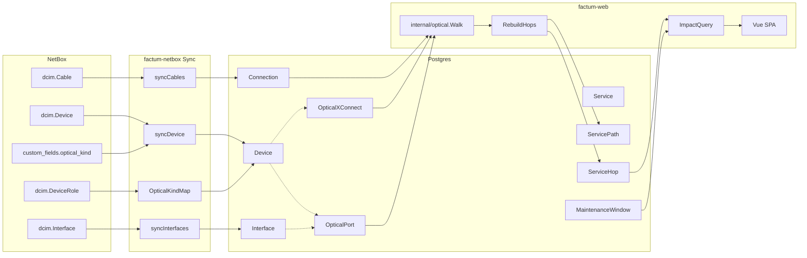
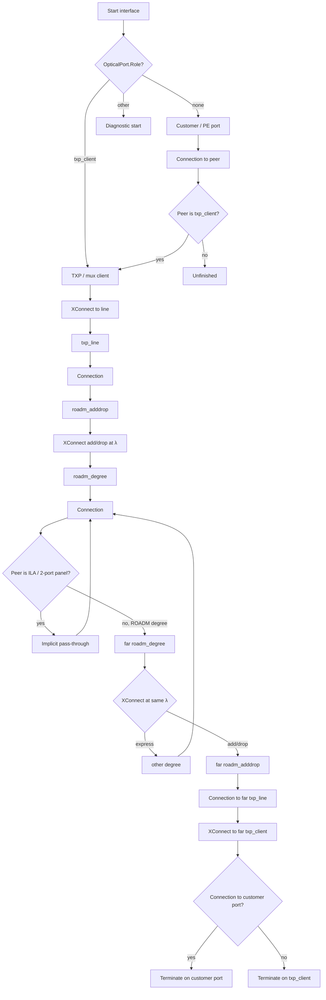
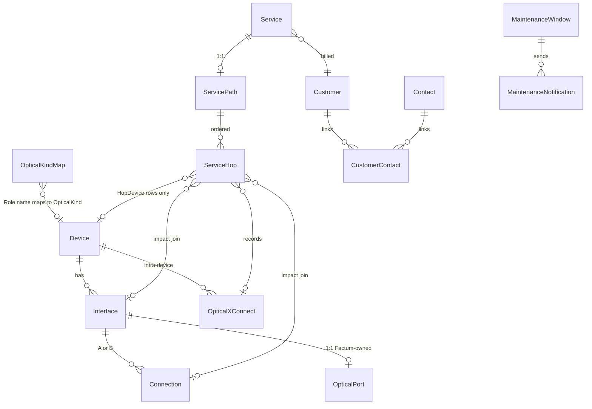

# Factum2 WDM / ROADM Optical Model, Service Tracing, and Maintenance Impact

| Field        | Value                                                                              |
| ------------ | ---------------------------------------------------------------------------------- |
| **Author**   | Factum2 engineering                                                                |
| **Date**     | 2026-08-13                                                                         |
| **Status**   | Draft (revised; LLDP cable ownership)                                              |
| **Codebase** | `/home/anders/code/factum2`                                                        |
| **Related**  | `itnportal` (CN customer portal — out of impact set), `netboxtool` (NetBox client) |

---

## Overview

NetBox cannot represent a ROADM: a degree trunk carries many independently switched wavelengths, add/drop ports are fixed-λ, and transponder/muxponder tributaries are intra-device, not cables. Factum already syncs chassis, interfaces, and cables (`models.Device`, `models.Interface`, `models.Connection`) and already has VL/VI (wavelength) and LF/LI (dark fiber) service categories, but those rows have no path, no ports, and no hops.

This design keeps every chassis and every physical **interface-to-interface** cable in NetBox (synced exactly as today). Factum owns the optical _semantics_ NetBox cannot express: device optical kind, per-port optical roles and fixed wavelengths, intra-device cross-connects (txp 1:1, mux N:1, ROADM add/drop, ROADM express, passive pass-through), a constrained Go walk, materialized `service_hops`, and maintenance windows whose impact is a join — not a live walk.

**NetBox modeling constraint (v1, hard):** `netboxtool.GetCables` only imports cables whose both ends are exactly one `dcim.interface` (`isInterfaceToInterface`; front/rear/console/circuit terminations are silently skipped). Optical and dark-fiber hops Factum must walk **must** be interface↔interface. Native Front Port / Rear Port patch panels are not in `models.Connection` and are not extended in v1. Patch panels and ILAs that should appear on a path are NetBox devices with `dcim.interface` ports; the walker crosses them via a pass-through rule (below), not via a second cable on the arrival port.

Operational payoff: when a fiber or device is taken down, Factum lists exactly the affected VL/VI and LF/LI services and the customers to notify. Capacity services (CN/CI) are not in that set.

---

## Background & Motivation

### Current state

Factum is the hub: NetBox and Lime are upstream; DNS/Icinga/LibreNMS/Oxidized are downstream. Relevant facts:

- `models.Device` / `Interface` / `Connection` / `Site` are NetBox-synced (`internal/netbox.Sync`, `syncDevice`, `syncInterfaces`, `syncCables`, `syncSites`).
- `syncDevice` and `syncInterfaces` upsert with GORM `OnConflict{UpdateAll: true}` keyed on `(netbox_id, vm)` and `(device_id, netbox_id)` respectively. **Any column on those structs that sync does not explicitly set is wiped on the next run.**
- `Device.Role` / `RoleID` are copied from NetBox every sync. Hanging Factum-only meaning on them is unsafe.
- Full sync deletes devices with `cf_source == "netbox"` that disappeared (`deleteMissingDevices`). `deleteInterface` also deletes addresses, tags, and `Connection`s touching the interface (needed because single-device webhook sync does not run `syncCables`).
- `syncCables` calls `nb.GetCables()`, which **silently skips** any cable that is not exactly one `dcim.interface` on each end (`netboxtool.isInterfaceToInterface`). Front/rear-port patching used by native NetBox patch-panel types never becomes a `models.Connection`.
- `models.Service` (`models/organisation.go`) already distinguishes:
    - **CN/CI** — capacity (ELINE/ELAN/L3VPN/POLARIX), with `EndpointA/B*` used for NetBox L2VPN provisioning (`web/handler_service_eline.go`).
    - **VL/VI** — wavelength, no `ServiceType`, no path.
    - **LF/LI** — dark fiber, no `ServiceType`, no path.
- The create wizard already offers Wavelength and Fiber (`web/frontend/src/views/service/ServiceCreateWizard.vue`). After create, there is nothing to attach.
- Topology (`web/handle_topology.go`, `NetworkMap.vue`) plots GPS-positioned devices and `Connection` edges, filterable by NetBox role.
- Customers come from Lime (`internal/lime`). `Contact` exists but has only `Name`/`Source`/`SourceID` — no email, no customer link. The Contacts UI is still `PlaceholderPage.vue`.
- Outbound mail already exists (`internal/mail.Send`, `Settings.Smtp*`, `EmailSender`).
- Auth: `RequireAPIAuth` + `RequireRead` (admin/operator/viewer) / `RequireWrite` (admin/operator) / `RequireAdmin`. Follow that split.
- Schema is GORM `AutoMigrate` in `internal/util/db.go`. Postgres is the only database.

### Pain points

1. A national WDM net cannot be drawn or reasoned about: ROADM express is not a cable, and a degree trunk is not one λ.
2. VL/VI/LF/LI services cannot be attached to the topology they ride, so scheduled fiber work cannot produce a customer list.
3. Putting optical state on `Interface` or `Device` columns that `UpdateAll` rewrites would be silently destroyed by the next NetBox sync.
4. Reusing `Service.EndpointA/B*` as “the path” is wrong: those two fields are ELINE A/Z ports + VLAN + NetBox L2VPN IDs, not a hop list.

### Locked product decisions (not reopened)

1. **VL termination is both.** A VL/VI may terminate on the customer router/CPE port patched into the transponder/muxponder client, **or** on the txp/mux client port itself. Both are legal; wizard and tracer must treat them explicitly.
2. **No service stacking.** A customer buys either a CN/CI capacity service **or** a VL/VI wavelength. A CN does not ride a VL in the model. Fiber-repair impact notifies VL/VI (and LF/LI if that fiber is sold dark), **not** CN customers. Internal VI wavelengths used as packet-network underlay are still first-class VL/VI (customer = internal) and appear in impact that way.
3. **All devices live in NetBox if possible.** ROADMs, transponders, muxponders, ILAs, interface-mode patch panels, and customer/PE devices are NetBox devices. Physical cables that Factum walks (degree↔degree including intra-site WSS interconnect, txp line↔ROADM add/drop, customer port↔txp client, panel/ILA hops) are NetBox **interface↔interface** cables, synced to `models.Connection`. Front/rear-port cables are out of the sync set (see constraint above). Factum owns optical semantics.

itnportal (`/home/anders/code/itnportal`) is the customer-facing portal for Lime CN deliveries. Because of decision 2 it is **not** on the fiber-maintenance notification path in v1. Do not push VL/LF into the portal as a side effect of this work.

---

## Goals & Non-Goals

### Goals (v1)

- Gate the whole optical feature on `Settings.OpticalEnabled` (Admin → Settings → Factum), off by default. Packet-only deployments never see optical UI or APIs.
- Recognize NetBox chassis as ROADM / WDM shelf / ILA / passive via a Factum-owned `optical_kind` that survives sync. Transponder vs muxponder is **not** a device kind — it is derived from tributary xconnects on a line port.
- On any device (optical or packet), show how many services and distinct customers are affected if that chassis is down.
- Let operators mark interface optical roles and fixed wavelengths on NetBox-synced ports without the next `syncInterfaces` wiping them.
- Model intra-device cross-connects: txp 1:1, muxponder N:1, ROADM add/drop at fixed λ, ROADM express degree↔degree at λ.
- Trace end-to-end from a VL start (`customer_port` or `txp_client`) or an LF start (`fiber_port`), walking `Connection`s, optical xconnects, and pass-through chassis (ILA / 2-port panel / explicit `passthrough` xconnect), wavelength-constrained on ROADMs.
- Materialize the path as `service_hops` on VL/VI and as connection + pass-through hops on LF/LI.
- Create a maintenance window on a connection / device / interface and list affected VL/VI and LF/LI services + customers; send mail via existing SMTP.
- Operator UI following existing Vue 3 + Echo patterns.
- Keep `device-sync` LLDP auto-cabling from creating, retargeting, or deleting cables that belong to the optical/fiber plant (manual interface↔ODF, PE↔transponder, degree↔degree).

### Non-goals (v1)

- Colorless / directionless / contentionless ROADMs.
- Regeneration, 3R, or back-to-back transponders as an automatic splice (an operator can still model two VL halves as two services).
- OTN switching, ODU k-mapping, or FlexO.
- Power, OSNR, or design-tool physics.
- A second database (Neo4j, Apache AGE, RedisGraph).
- Faking WSS switching with extra NetBox cables.
- Reusing `Service.EndpointA/B*` as the only path representation.
- Pushing optical config to ROADMs/transponders (no optical driver).
- Showing VL/LF in itnportal, or notifying CN customers because their packet service “rides” a wavelength.
- Auto-discovering xconnects from NMS/telemetry.
- Syncing NetBox `dcim.Module` / `ModuleBay` into Factum. Cards stay NetBox inventory; Factum v1 sees the chassis + interfaces + xconnects.
- Rate-based muxponder admission control (no client/line bit-rate fields yet).
- **Protection / dual path (OMSP, Y-cable, working+protect).** v1 stores one `ServicePath` per service. Maintenance on the protect fiber will not list the VL unless the operator attaches a **second** VL/VI whose hops include that protect route. See Key Decisions.
- Syncing NetBox Front Port / Rear Port / console / circuit-termination cables, or inventing Factum rows for those object types.
- Colorless/CDC ROADMs remain out (already listed).

---

## Proposed Design

### Feature flag (`Settings.OpticalEnabled`)

Not every Factum deployment models WDM. Optical UI, optical API routes, and kind-map admin are **off by default**.

```go
// models.Settings, next to the other feature flags
OpticalEnabled *bool `gorm:"column:optical_enabled" form:"optical_enabled" json:"optical_enabled"`
```

Same `*bool` convention as `BecsEnabled` / `NetboxEnabled` (`nil` or `false` = off).

**Toggle location:** Admin → Settings → **Factum** (`SettingsFactumPage.vue`), a `USwitch` labeled “Optical / WDM modeling”, with a one-line hint: “ROADM, transponder/muxponder, wavelength and dark-fiber paths, maintenance impact.” Kind-map CRUD stays on Admin → Settings → Optical, which is **hidden** until this is on.

**Who sees the flag:** `GET /api/me` (already loaded by `authStore`) gains `optical_enabled bool` so operators/viewers can hide menu items without calling `/admin/settings`. Admin save still goes through `PUT /admin/settings`.

**When off:**

| Surface                            | Behavior                                                                                                                                                                            |
| ---------------------------------- | ----------------------------------------------------------------------------------------------------------------------------------------------------------------------------------- |
| Menu                               | No Maintenance, no Settings → Optical, no optical-kind map filter chip                                                                                                              |
| Device dialog                      | No Role / λ columns, no Cross-connects                                                                                                                                              |
| Service edit / wizard              | No Path step for VL/VI/LF/LI (those products still exist as Lime/IDs)                                                                                                               |
| Optical HTTP routes                | `404` `{ "error": "optical modeling is disabled" }` from a single middleware (`RequireOpticalEnabled`) registered on `/api/optical/*`, `/api/service/:id/path`, `/api/maintenance*` |
| NetBox sync                        | Still writes `OpticalKind` / `OpticalKindCF` (cheap, keeps data warm). Does **not** call `RebuildStale`.                                                                            |
| device-sync LLDP ownership (PR 1b) | **Always on** — it protects manual cables whether or not WDM is used                                                                                                                |
| Device-down impact counts          | **Always on** for ELINE endpoints; hop-based VL/LF rows are simply empty                                                                                                            |

Turning the flag **on** does not require a migration. Turning it **off** hides UI and rejects new writes; existing `optical_*` / `service_paths` rows stay in Postgres (no wipe).

### High-level architecture



NetBox remains the inventory of boxes and patch cords. The optical graph is the union of `Connection` (physical) and `OpticalXConnect` (logical, intra-device). The walker lives in Go. Maintenance never walks; it joins `service_hops`.

### Device kinds

**Problem.** `Device.Role` is overwritten every `syncDevice` (`internal/netbox/factum-netbox.go`, fields copied from `nb_device.Role` / `RoleID`). A renamed NetBox role, or a role reused for a non-optical device, must not silently break Factum.

**Decision.** Add a Factum-owned `Device.OpticalKind` that sync _computes and writes_ on every run, from a NetBox-side signal plus an admin-editable mapping. It is not a free-form operator field that sync would clobber to `""`.

Allowed values:

| `optical_kind` | Meaning                                                                | Typical ports                                                                            |
| -------------- | ---------------------------------------------------------------------- | ---------------------------------------------------------------------------------------- |
| `""`           | Not an optical transport box (router, switch, CPE, …)                  | none required                                                                            |
| `roadm`        | Whole chassis is a ROADM / WSS                                         | `roadm_adddrop`, `roadm_degree` (may also host `txp_*` if the box has transponder slots) |
| `wdm_shelf`    | Carrier chassis for TXP/MXP cards (DCP/2, pizza-box, mixed-slot shelf) | `txp_client`, `txp_line` — one line per card                                             |
| `ila`          | In-line amplifier / EDFA (pass-through chassis)                        | no optical roles; 2 cabled interfaces                                                    |
| `passive`      | Interface-mode patch panel / ODF / splice (pass-through)               | no optical roles; 2+ interfaces                                                          |

**Transponder vs muxponder is not a device kind.** A transponder is one `txp_line` with one tributary xconnect; a muxponder is one `txp_line` with N tributaries. A DCP/2 with a TXP in slot 1 and an MXP in slot 2 is one `wdm_shelf` with two line ports. Putting `transponder` or `muxponder` on the chassis is actively wrong for mixed-slot hardware.

**Modules stay in NetBox.** Factum and `netboxtool` do not sync `dcim.Module` / `ModuleBay` today, and v1 does not add that. Use NetBox modules for slot/serial/model inventory if you want; Factum’s optical graph does not need them. The “card” is the set of clients xconnected to one line. A later follow-up can copy `interface.module` onto Factum for UI grouping (“Slot 2”) without changing the graph.

**Xconnect validation is port-role-based, not kind-based** (except `passthrough`, which still requires `ila`/`passive`). A `roadm` chassis may also have `txp_*` ports (combo box). A `wdm_shelf` may not have ROADM ports.

`ila` and `passive` exist so the walker can cross a chassis that is not a ROADM or transponder. **Implicit pass-through applies only to `ila` and `passive`.** An unclassified `""` device is never an implicit pass-through, even if it has exactly two cabled interfaces (a PE, CPE, or core router with two `Connection`s must not become a dark-fiber wormhole). A multi-port `passive` needs explicit `passthrough` xconnects. A 2-port `ila`/`passive` does not require an xconnect row.

**`OpticalKindMap` (missing from the first draft):**

```go
// models/optical.go

type OpticalKindMap struct {
    FactumModel
    // NetboxRoleName is Device.Role — NetBox's display name, not the slug
    // (netboxtool copies device.Role.Name). Stored lowercased so the
    // unique index is case-insensitive without citext (SQLite tests have
    // no citext). Writers lowercase before insert/update; lookup uses
    // strings.ToLower(device.Role).
    NetboxRoleName string `json:"netbox_role_name" gorm:"uniqueIndex;type:varchar(255);not null"`
    OpticalKind    string `json:"optical_kind" gorm:"type:varchar(32);not null"`
}

type OpticalKindMapDTO struct {
    ID             uint   `json:"id"`
    NetboxRoleName string `json:"netbox_role_name"`
    OpticalKind    string `json:"optical_kind"`
}
```

`OpticalKind` on the DTO is checked against the allowed set (`roadm`, `wdm_shelf`, `ila`, `passive`). Empty is rejected on a mapping row (use “delete the row” to unmap). Legacy CF/map values `transponder` and `muxponder` normalize to `wdm_shelf` so an older NetBox extra still classifies.

**Resolution order in `syncDevice`** (first hit wins):

1. NetBox device custom field `optical_kind` (`nb_device.CustomFields["optical_kind"]`). `netboxtool.NBDevice` already carries the raw `CustomFields` map. **Normalize the value:** accept a bare string (`"roadm"`), or a map/struct with a `value` key (`{"value":"roadm","label":"ROADM"}`) — NetBox **selection** extras arrive as either shape depending on REST vs GraphQL. Valid values: `roadm`, `wdm_shelf`, `ila`, `passive` (and aliases `transponder`/`muxponder` → `wdm_shelf`). Empty / missing → step 2. Invalid / unknown / unrecognized shape → log a warning and fall through (do not fail the whole sync). Unit-test both shapes.
2. `optical_kind_maps` row whose stored (lowercased) `netbox_role_name` equals `strings.ToLower(Device.Role)`.
3. Else `""`.

Because `OpticalKind` **and** `OpticalKindCF` are set on the struct _before_ the `UpdateAll` upsert, they survive sync.

Add a Factum-owned column next to the computed kind (same `UpdateAll` rule — always assign, including `""`):

```go
// on models.Device
OpticalKind   string `json:"optical_kind" gorm:"type:varchar(32);index"`
// OpticalKindCF is the normalized NetBox custom-field value from the last
// sync ("" if missing/invalid). Persisted so mapping CRUD can re-resolve
// with the same CF-then-map order without calling NetBox.
OpticalKindCF string `json:"optical_kind_cf" gorm:"type:varchar(32)"`
```

```go
// syncDevice, before the upsert:
device.OpticalKindCF = normalizeOpticalKindCF(nb_device.CustomFields) // "" if unset/invalid
device.OpticalKind   = resolveOpticalKind(device.OpticalKindCF, device.Role, maps)
```

`resolveOpticalKind(cf, role, maps)` is the **only** classifier: CF if valid, else map lookup on `role`, else `""`. Both sync and mapping CRUD call it.

**Mapping CRUD re-resolves immediately.** `SecureCRUDHandler` has no after-write hook (`web/handle_crud.go`). Kind-map routes are **thin wrappers** that, on success, call `optical.ReresolveAllKinds(db)`: one `SELECT` of maps + one `SELECT` of devices, then for **every** device `OpticalKind = resolveOpticalKind(device.OpticalKindCF, device.Role, maps)`. No NetBox call. CF-then-map is preserved: a chassis with `OpticalKindCF=wdm_shelf` (or alias `transponder`) and Role `ROADM` (mapped to `roadm`) **stays `wdm_shelf`**. A chassis with empty CF follows the new map. Required PR 1 test: CF=wdm_shelf, Role mapped to roadm, mapping CRUD, kind stays `wdm_shelf`.

A role rename is handled by editing the mapping row (or setting the CF); the next sync (or the immediate remapping pass) rewrites `OpticalKind`. No Factum-side lock/override in v1 — NetBox CF + mapping are the signal, matching locked decision 3.

**NetBox-side setup (operator runbook, not code):**

- Preferred: add a `optical_kind` extra on `dcim.device` (selection: `roadm` / `wdm_shelf` / `ila` / `passive`). Set it on every optical or pass-through chassis. This is rename-proof.
- Also populate `optical_kind_maps` so a freshly synced box is classified even before the CF is filled. Suggested starter rows (not auto-seeded):

| `netbox_role_name`                                        | `optical_kind` |
| --------------------------------------------------------- | -------------- |
| `ROADM`                                                   | `roadm`        |
| `WDM Chassis` / `WDM Shelf` / `Transponder` / `Muxponder` | `wdm_shelf`    |
| `ILA`                                                     | `ila`          |
| `Patch Panel`                                             | `passive`      |

One NetBox role on the **chassis** is enough. Do not create per-slot device roles. If the DCP/2 already has role `DCP/2` or a vendor name, map that string to `wdm_shelf`. Optional NetBox modules (Slot 1 / Slot 2) are inventory only.

Exact strings must match whatever this NetBox actually uses (`Device.Role` is the display name, not the slug — see `netboxtool.NBDevice.Role`).

- **Cables:** every hop Factum must walk is `dcim.interface` ↔ `dcim.interface`. Do not use Front Port / Rear Port for WDM or sold dark fiber; those cables never sync.
- **Long-haul ILAs (operator choice):** (a) omit them from the cable path — one degree↔degree interface cable that skips the ILA chassis; or (b) cable degree→ILA→degree, set `optical_kind=ila`, and let implicit pass-through carry the λ. (a) is simpler if ILA maintenance is not notified via this tool; (b) is required if taking down the ILA should list VLs.

**What happens if a NetBox role is renamed.** Mapping no longer matches and CF is empty → `OpticalKind` becomes `""` on the next sync or remapping pass → xconnect validation starts rejecting new writes; a renamed `ila`/`passive` **stops** implicit-passing (the walk goes `incomplete` at that chassis). Existing hops remain until retrace. Mitigation: set the CF (survives role rename) _or_ update the mapping in the same change window as the NetBox rename. Admin UI shows devices whose `Role` is unmapped but that still have `OpticalPort`s / xconnects, **or** that used to be `ila`/`passive` and just became `""` (orphan warning). Do **not** treat 2-cabled `""` as pass-through — that would walk through packet boxes.

### Port roles (Factum-owned, sync-proof)

**Do not add optical columns to `models.Interface`.** `syncInterfaces` builds a fresh `Interface` and `UpdateAll`s it. A new column that sync does not copy from NetBox would be zeroed every run. `Interface.CfRole` is already a NetBox custom field (`cf_role`) used by LibreNMS alerting filters (`Settings.LibrenmsRolesEnabled`) — do not overload it.

New 1:1 table, keyed by Factum `interfaces.id`:

```go
// models/optical.go

const (
    PortTXPClient    = "txp_client"
    PortTXPLine      = "txp_line"
    PortROADMAddDrop = "roadm_adddrop"
    PortROADMDegree  = "roadm_degree"
)

// OpticalPort is Factum-owned optical metadata for a NetBox-synced interface.
// Lives in its own table so internal/netbox.syncInterfaces' UpdateAll cannot
// wipe it. Deleted from deleteInterface (same place Connections are removed).
type OpticalPort struct {
    FactumModel
    InterfaceID uint   `json:"interface_id" gorm:"uniqueIndex;not null"`
    Role        string `json:"role" gorm:"type:varchar(32);not null;index"`
    // FreqHz is the centre frequency in Hertz (e.g. 193100000000000 = 193.1 THz).
    // uint64: frequency is never negative; ITU C-band fits with room
    // (193.1 THz = 1.931e14 < 2^53, so JSON/JS Number is exact).
    // 0 means unset. Required (>0) for roadm_adddrop. Recommended for
    // txp_line. 0 on roadm_degree (many λs) and typically on txp_client (grey).
    FreqHz uint64 `json:"freq_hz"`
    // ITUChannel is an optional operator-facing channel number (G.694.1).
    // Not the source of truth — FreqHz is. Stored so a typed "Ch 34"
    // survives a round-trip without forcing a grid assumption.
    ITUChannel *int   `json:"itu_channel"`
    Notes      string `json:"notes" gorm:"type:varchar(255)"`
}
```

Customer-facing ports on routers/switches **have no `OpticalPort` row**. They are ordinary interfaces connected by a `Connection` to a `txp_client`.

Role vs device-kind checks (enforced on write, not by DB constraint):

| Role                            | Allowed `Device.OpticalKind`         |
| ------------------------------- | ------------------------------------ |
| `txp_client`, `txp_line`        | `wdm_shelf`, `roadm` (combo chassis) |
| `roadm_adddrop`, `roadm_degree` | `roadm`                              |

`roadm_adddrop` requires `FreqHz != 0`.

#### Wavelength representation

**Primary: `uint64` Hertz.** Frequency is never negative, so a signed `int64` / pointer is the wrong type. Hertz (not MHz) keeps ITU frequencies exact integers with no implied scale. 193.1 THz = `193100000000000`. That value is well under 2^53 (`9.007e15`), so JSON and JavaScript `Number` round-trip exactly. GORM maps `uint64` to Postgres `bigint`; C-band values fit signed bigint.

`0` means unset (no pointer). Required `> 0` on `roadm_adddrop` and on add/drop / express xconnects.

Display conversions (pure functions in `internal/optical/freq.go`):

| Helper       | Formula                                                                         |
| ------------ | ------------------------------------------------------------------------------- |
| `THz(hz)`    | `float64(hz) / 1e12`                                                            |
| `Nm(hz)`     | `299792458.0e9 / float64(hz)` → nm (`c = 299792458 m/s`; `λ_nm = c / hz · 1e9`) |
| `Format(hz)` | `"193.100000 THz / 1552.52 nm"` plus `" / Ch 34"` if `ITUChannel` set           |

Table-driven test (required): `Nm(193100000000000) == 1552.52` (1e-2 tolerance). Inverse when the operator types nm: `hz = uint64(math.Round(299792458.0e9 / nm))`. Do **not** use the old MHz helper `299792.458e6 / mhz` against a Hz value (off by 1e6).

ITU-T G.694.1 50 GHz and 100 GHz grids are _display helpers_ (`FreqFromITU(channel, gridGHz)`, `NearestITU(hz, gridGHz)`), not storage. Default grid for the “type a channel number” UI is **50 GHz** (modern C-band), overridable later via Settings if needed. Operators who think in nm or THz type those; the UI converts to Hz on save.

Why not store nm or THz as the primary: both are floats or rounded strings; equality and unique constraints become fuzzy. Why not ITU channel alone: channel numbers are grid-relative and C/L-band-relative; two operators can mean different frequencies by “channel 20”. Why not `*int64` MHz: unused-vs-zero needs a pointer; frequency cannot be negative; Hz avoids a scale convention in every caller.

### Intra-device cross-connects

New table. These are the edges NetBox cannot grow:

```go
const (
    XCTributary   = "tributary"     // client ↔ line; N rows sharing a line = one muxponder card
    XCAddDrop     = "roadm_adddrop" // add/drop ↔ one degree at the port's fixed λ
    XCExpress     = "roadm_express" // degree A ↔ degree B at λ (no local drop)
    XCPassthrough = "passthrough"   // 1:1 intra-device, no λ (multi-port panel)
)

// OpticalXConnect is one intra-device optical adjacency.
// A transponder card is 1 tributary on a line; a muxponder card is N
// tributaries sharing that line. Two lines on one device = two cards
// (DCP/2). Do not require all tributaries on the device to share one line.
type OpticalXConnect struct {
    FactumModel
    DeviceID     uint   `json:"device_id" gorm:"index;not null"`
    Kind         string `json:"kind" gorm:"type:varchar(32);not null;index"`
    InterfaceAID uint   `json:"interface_a_id" gorm:"index;not null"` // client | adddrop | degree A
    InterfaceBID uint   `json:"interface_b_id" gorm:"index;not null"` // line   | degree  | degree B
    FreqHz       uint64 `json:"freq_hz"` // 0 unset; required >0 for XCAddDrop, XCExpress
}
```

Indexes (AutoMigrate + one explicit unique index):

- `(device_id)`
- `(interface_a_id)`, `(interface_b_id)`
- Unique `(device_id, interface_a_id, interface_b_id, freq_hz)` — AutoMigrate can express this now that `freq_hz` is a non-null `uint64` (`0` = unset / N/A).

**A given λ on a given degree is used at most once** (add/drop _or_ express, not both, and not two expresses). This is validated in Go on write by loading every xconnect on the device whose `FreqHz` matches and whose A or B is that degree. Not a DB unique index, because the degree can sit on either side of the row.

#### Validation rules (`internal/optical/validate.go`)

Evaluated in the write transaction, before commit.

1. **Same device.** Both interfaces exist and `DeviceID` matches both. Tributary / add-drop / express kinds are allowed based on **port roles**, not on a 1:1 match between `Device.OpticalKind` and `Kind`. `passthrough` still requires device kind `ila`/`passive`.
2. **`tributary`.** A is `txp_client`, B is `txp_line`. Each client appears in at most one tributary. A line may have one or many tributaries (1 = transponder card, N = muxponder card). Two lines on the same device are two cards — tributaries are grouped **by line**, never “all mux rows on the device share one line”.
3. **`roadm_adddrop`.** A is `roadm_adddrop`, B is `roadm_degree`. `FreqHz` is required and **must equal** the add/drop port’s `OpticalPort.FreqHz`. That λ on that degree is unused.
4. **`roadm_express`.** A and B are distinct `roadm_degree` ports on the same device. `FreqHz` required. That λ unused on both degrees.
5. **Physical cable wavelength match.** When a `Connection` joins a `txp_line` to a `roadm_adddrop` and both ports have `FreqHz` set, they must be equal. Checked on xconnect write, on port-freq write, and as a warning during trace. Does not block cable sync (NetBox is allowed to be temporarily inconsistent; Factum refuses to _provision a path_ across a mismatch).
6. **`passthrough`.** Device kind is `passive` or `ila` (not `""`). Both interfaces are on that device, have no ROADM/txp optical role, `FreqHz == 0`. Each interface appears in at most one `passthrough` xconnect. Used for multi-port panels; 2-port `ila`/`passive` does not require a row (implicit pass-through). An unclassified device must be given `optical_kind=passive` (or `ila`) before a pass-through xconnect can be drawn.
7. **No self-loop.** `InterfaceAID != InterfaceBID`.

Muxponder oversubscription (bit-rate) is **not** checked in v1 — we have no client/line rate fields. Structural N:1 is enforced; a 4×100G-on-100G misbuild is an operational risk, called out below.

### Physical links stay `Connection`

No second cable table. Degree↔degree (including intra-site WSS interconnect), txp line↔ROADM add/drop, customer port↔txp client, and (when modeled) degree↔ILA↔degree or panel hops are NetBox **interface↔interface** cables, synced by `syncCables` into `models.Connection` (`netbox_id` unique, `device_a/b_id`, `interface_a/b_id`, `label`).

`Connection` remains read-only from the Factum side.

**What is _not_ a `Connection` today and will not be in v1.** `netboxtool.GetCables` (`isInterfaceToInterface`) skips cables terminating on `dcim.frontport`, `dcim.rearport`, console ports, or circuit terminations. Native NetBox patch-panel Front+Rear wiring therefore never appears in Factum. v1 does **not** extend `GetCables` or invent Factum port rows for those types — that is a different inventory project. Operator constraint: model every walked hop as `dcim.interface`. A patch panel that must sit on an LF/LI path is a NetBox device with two (or more) interfaces, not a Front/Rear panel.

A degree↔degree trunk with **no** intermediate chassis in the cable path is a legal and preferred model for long-haul when ILAs should not appear in impact. The walker does not require an ILA hop.

### LLDP auto-cabling must not own optical or fiber hops

`factum-device-sync` (`internal/device-sync/device-sync.go` `syncConnections` / `syncConnection`) currently treats every LLDP neighbor pair as _the_ cable for those two interfaces. If either side already has a `CableID`, it **loads that cable and retargets the other termination** to the LLDP neighbor; if the two sides have _different_ cables it **deletes** the remote one. It does not distinguish a human-drawn cable from one it created. `CreateCable` writes no label (`netboxtool.CreateCable` posts only the two `dcim.interface` terminations).

That is correct for grey packet meshes. It is fatal for WDM and dark fiber.

**Why LLDP lies on these ports.** A transponder/muxponder client is ethernet. LLDP on the PE does **not** see the transponder; it sees the far PE through the wavelength (the optical path is transparent at L2). Same for a dark-fiber handoff: LLDP reports CPE-A ↔ CPE-B, not CPE-A ↔ ODF. `syncConnection` will then either:

1. Create a PE↔PE / CPE↔CPE cable that occupies both `CableID`s and makes a later PE→txp or PE→ODF cable impossible, or
2. Take an existing manual PE→txp (or PE→ODF) cable and **retarget** the far end to the far PE, and delete the far PE’s manual cable.

NetBox roles (`ROADM`, `Transponder`, `Muxponder`) do **not** stop this by themselves. The devices that speak LLDP and run device-sync are the packet boxes (`optical_kind=""`). The optical chassis usually have no EOS/SR OS/IOS-XR/VRP driver, so they never run `syncConnections`. The damage is done from the PE side.

**What is _not_ a NetBox cable.**

| Operator phrase                                   | What it is in this design                                                                                                                                                                                 |
| ------------------------------------------------- | --------------------------------------------------------------------------------------------------------------------------------------------------------------------------------------------------------- |
| “this interface → wavelength”                     | A VL/VI **service path**. Never a `dcim.Cable`. The physical hop is still a grey patch PE↔`txp_client` (or the service starts on the `txp_client`). The λ lives on `optical_ports` + `optical_xconnects`. |
| “this interface → fiber”                          | An LF/LI **service path** whose hops are one or more interface↔interface `Connection`s (PE↔ODF↔… or a single long-haul cable). The fiber is not a third termination type.                                 |
| “this interface → that interface” (patch / trunk) | A NetBox cable. Drawn **manually** for anything optical or fiber. LLDP may still draw grey packet↔packet cables it owns.                                                                                  |

**Ownership rule.** device-sync may only create, retarget, or delete cables **it owns**. Ownership is `dcim.Cable.label == "lldp"` (exact, case-sensitive). `CreateCable` is extended to set that label. Manual cables (empty label, or any other label) are never mutated.

`syncConnection` becomes:

1. If `shouldSkipLLDPCabling(localIf, remoteIf)` → log at info (“LLDP neighbor ignored: optical/fiber handoff”) and return. No create, no retarget, no delete.
2. If either interface already has a `CableID` whose cable is **not** owned (`label != "lldp"`): leave it. If that cable already joins local↔remote, fine. If it joins something else, warn (LLDP disagrees with a manual cable) and do not retarget.
3. If an existing cable **is** owned and already joins local↔remote: leave it (today’s “both sides correct”).
4. If an existing owned cable joins one of the ports to a _different_ interface: retarget/delete only that owned cable — never a manual one on the other side.
5. If neither side has a cable: `CreateCable` with `label=lldp`.

`shouldSkipLLDPCabling` is true when **any** of:

- Local or remote device `OpticalKind` ∈ {`roadm`, `wdm_shelf`, `ila`, `passive`}.
- Local or remote interface has an `optical_ports` row (any role, including `fiber_port`).
- Local or remote interface’s existing cable (if any) terminates on a device whose `OpticalKind` is in that set — even if the local PE has no `optical_ports` row yet.

Step 3 of the skip list is what protects a PE Ethernet that the operator cabled to a muxponder client _without_ marking the PE port. Marking the PE port `fiber_port` (LF) or cabling it to a `txp_client` (VL) is the two legal handoffs; LLDP must not create a PE↔PE shortcut on top.

**Operator workflow (manual plant):**

1. Create NetBox device roles `ROADM`, `Transponder`, `Muxponder`, and (if used) `ILA` / `Passive`. Map them in Factum (PR 1). This is the primary kind signal.
2. Draw **only** the physical patches in NetBox: customer/PE ↔ txp client, txp line ↔ ROADM add/drop, degree ↔ degree (or degree ↔ ILA). Do not draw a PE↔PE cable “because they are on the same wavelength”.
3. Attach the VL/VI or LF/LI service in Factum (path walk). That _is_ the “interface → wavelength / fiber” step.
4. device-sync keeps drawing LLDP cables on ordinary packet ports. It will not touch the plant in (2).

**Pre-existing PE↔PE LLDP cables on ports that should be optical handoffs** must be deleted once by an operator (or a one-shot cleanup listing `label=lldp` cables whose endpoints later gained an `optical_ports` row / far-end optical kind). v1 does not auto-delete historical LLDP cables — that could drop a real grey mesh link. The skip rule only prevents _new_ damage.

### End-to-end trace

Package `internal/optical`. Graph conceptually, walk in Go. No recursive CTE in v1 (optional later for “all services through this fiber” reporting; maintenance impact does not need it).



The walker is a **constrained unique-path walk** with a visited set — not a BFS. Under valid inventory there is at most one legal successor at each step (mux-line diagnostic is the only branch set, and it is not stored as a service path). Callers and PR titles must not say “BFS”.

#### Legal moves (arrival-aware)

Each step carries current interface `I` on device `D`, locked wavelength `λ` (optional), and **how we arrived**:

| `arrived_via`    | Meaning                                              |
| ---------------- | ---------------------------------------------------- |
| `start`          | First interface of an attach or diagnostic           |
| `connection(id)` | We landed on `I` by following that `Connection`      |
| `xconnect(id)`   | We landed on `I` by following that `OpticalXConnect` |
| `passthrough`    | We landed on `I` by implicit 2-port pass-through     |

**Never traverse the inbound edge.** The `Connection` or xconnect named in `arrived_via` is not a legal leave, even if it would otherwise match. Combined with the visited-interface set, this is what stops a customer-port attach from bouncing back across the patch.

Do **not** “apply the first matching move” from a cable-first list. That algorithm reverses the inbound span and never takes the xconnect. Delete any reading of “a cabled port’s next hop is the cable.”

**Leave rules** (exactly one successor, except mux-line diagnostic):

1. **`arrived_via = start` — start-kind override** (same table as Start points):
    - `customer_port` or `fiber_port` → follow the `Connection` on `I` (there is one). Land on the peer with `arrived_via = connection(id)`.
    - `txp_client` → follow the client↔line xconnect. **Do not** follow a customer patch even if one exists.
    - Diagnostic (no attach kind): if `I` has a matching xconnect (or implicit pass-through), leave that way; else follow the `Connection`. A diagnostic start on a degree therefore takes the λ xconnect, not the trunk.

2. **`arrived_via = connection(id)` — we came in on a cable.** The only legal leaves are intra-device:
    - Matching `OpticalXConnect` on `D` where `A` or `B` is `I` (and not the inbound xconnect — there isn’t one):
        - `txp_1to1` / `mux_nto1`: WDM mode only; if the line port has `FreqHz`, lock `λ`.
        - `roadm_adddrop` / `roadm_express`: WDM mode only; follow only if `xconnect.FreqHz == λ` (or set `λ` if still unset).
        - `passthrough`: WDM **and** fiber mode; `λ` unchanged.
    - Else **implicit pass-through**, only if `D.OpticalKind` is `ila` or `passive` (not `""`), `I` has no unused xconnect, and `D` has exactly two interfaces that each have a `Connection` of which `I` is one: exit the other interface with `arrived_via = passthrough`. Record `device` (once) + exit `interface`. `λ` unchanged.
    - Else dead end (`incomplete`).

3. **`arrived_via = xconnect(id)` or `passthrough` — we came in intra-device.** The only legal leave is a `Connection` on `I` (not the inbound cable, which is none; `I`’s cable is the _outbound_ span). Land on the peer with `arrived_via = connection(id)`. If `I` has no `Connection`, dead end.

No other moves. Do **not** invent a hop between two ports because they share a name prefix. A multi-port `passive` with no `passthrough` xconnects is a dead end. A 2-cabled device with `OpticalKind == ""` is a dead end (PE/CPE/router — not a panel).

Worked examples that the cable-first draft got wrong:

| Step                | I         | arrived_via         | Leave                                                         |
| ------------------- | --------- | ------------------- | ------------------------------------------------------------- |
| VL, `customer_port` | cust Eth1 | `start`             | Connection → txp C1                                           |
|                     | txp C1    | `connection(patch)` | xconnect → txp L1 (not back to Eth1)                          |
| VL, `txp_client`    | txp C1    | `start`             | xconnect → L1 (ignore customer patch)                         |
| ROADM degree        | DEG-W     | `connection(trunk)` | λ xconnect → add/drop or other degree (not reverse the trunk) |
| ILA                 | West      | `connection(span)`  | implicit PT → East (`ila`/`passive` only)                     |
|                     | East      | `passthrough`       | Connection → far degree                                       |
| LF onto a PE        | PE Gi0/0  | `connection(fiber)` | dead end (`kind=""`)                                          |

**Why this is not “a second Connection on the arrival port.”** `Interface.CableID` is singular. Arriving on panel West via a cable consumes that cable. The exit is an intra-device move (implicit 2-port or `passthrough` xconnect), then a _different_ `Connection` on the East interface. That is implementable with today’s schema.

**Long-haul with no ILA in the cable path:** arrive on the far ROADM degree via `connection(trunk)` and leave via the λ xconnect. Both ILA models (skip vs include) are supported.

#### Wavelength lock

`λ` starts unset. It becomes set at the first coloured object (`txp_line.FreqHz`, `roadm_adddrop.FreqHz`, or a ROADM xconnect). After that, a ROADM xconnect with a different `FreqHz` is not a legal move. A `txp_line`↔`roadm_adddrop` cable whose two ports disagree is a **conflict**, not a hop.

#### Start points

**VL/VI (locked decision 1)** — two legal attach kinds:

| Operator-picked A/Z                                       | `endpoint_*_kind`                                                            | First move                |
| --------------------------------------------------------- | ---------------------------------------------------------------------------- | ------------------------- |
| Interface with no `OpticalPort`, cabled to a `txp_client` | `customer_port`                                                              | Connection → `txp_client` |
| Interface with role `txp_client`                          | `txp_client`                                                                 | XConnect → line           |
| Anything else                                             | rejected for **VL attach**; allowed for diagnostic `POST /api/optical/trace` | —                         |

Both ends of one VL may mix kinds (customer port on A, bare txp client on Z). The chosen kind is stored, not re-inferred later.

**LF/LI — different start kind; do not reuse the VL list.**

| Operator-picked A/Z                                                                    | `endpoint_*_kind`          | First move                                       |
| -------------------------------------------------------------------------------------- | -------------------------- | ------------------------------------------------ |
| Interface that is **not** `roadm_adddrop` / `roadm_degree` / `txp_line` / `txp_client` | `fiber_port`               | Connection to peer (then pass-through as needed) |
| Anything with a WDM optical role                                                       | rejected for **LF attach** | —                                                |

A dark-fiber A/Z is a customer/site panel port, PE router port, or `passive` panel interface — not a transponder client. `customer_port` **means** “cabled to a `txp_client`” and is illegal on LF/LI.

**Picker is not `DeviceInterfacePicker` as-is.** That component hard-filters to EOS / SROS / IOS-XR (`supportedPlatforms` in `web/frontend/src/components/DeviceInterfacePicker.vue`) and to ELINE physical types; ROADMs, transponders, and panel devices would never appear. Add a `mode` prop:

| `mode`                    | Device filter                         | Interface allow-list                                                                                                           |
| ------------------------- | ------------------------------------- | ------------------------------------------------------------------------------------------------------------------------------ |
| `eline` (current default) | `eos` / `sros` / `sros-md` / `ios-xr` | physical, non-virtual, non-lag                                                                                                 |
| `wavelength`              | none (any device)                     | `txp_client`, **or** no optical role and a `Connection` to a `txp_client`                                                      |
| `fiber`                   | none (any device)                     | not `roadm_*` / `txp_line` / `txp_client`; typically physical interfaces on routers, `passive` panels, or unclassified devices |

Service UI uses `mode="wavelength"` or `mode="fiber"` from the service category. This belongs in the service-UI PR, not as implicit reuse of the ELINE widget.

#### Muxponder fan-out

A service is **one tributary**. Its stored path includes that tributary’s client↔line xconnect plus the shared line and everything toward Z.

Impact of the **line** (or of any hop past the line) hits **every** VL/VI whose hops include that line interface / line-side xconnect. That falls out of materialized hops: each tributary service stores the shared line as a hop. No special-case fan-out at query time.

Diagnostic trace from a `txp_line` returns **all** tributary clients as a branch set (used by the device optical view, not stored on a single service).

#### Cycle detection vs incomplete

Visited key = `interface_id`. Re-visiting an interface **ends the walk**; it is **not** `conflict`.

- **Attach:** if Z has already been seen, `complete`. If not (national express ring, far add/drop missing — walk returns to the start degree at that λ), status is **`incomplete`**, hops up to the node _before_ the re-visit are stored, `LastTraceError` like `"loop without reaching Z (back at sto-roadm-1 DEG-W)"`. Previous hops **are replaced** with this incomplete walk so the operator sees where it died, not a stale “complete” path.
- **Diagnostic `POST /api/optical/trace`:** same hop list; `status=incomplete` plus a `looped_at` field. Do not call it a conflict.

Reserve **`conflict`** for:

- λ mismatch on a `txp_line`↔`roadm_adddrop` cable (both `FreqHz` set and unequal).
- A true double-xconnect bug (two legal successors at the same step in WDM mode — should be unreachable if validation holds).
- LF walk landing on a `roadm_adddrop` / `roadm_degree` / `txp_line` interface.

On `conflict`, do **not** replace previous complete hops; only flip `Status` and `LastTraceError`. On `incomplete`, **do** replace hops (the inventory break is the new truth).

#### Unfinished / incomplete

The walk also stops when no legal move remains. For **attach**:

- Success (`complete`): the walk from A reaches Z (we run A→Z and accept if Z is on the hop list).
- `incomplete`: walk from A dies before Z (dead-end **or** loop-without-Z). Hops up to the dead end are stored.
- `conflict`: λ mismatch or illegal LF/WDM crossing, as above.

A complete path may still terminate “early” relative to the physical world (Z is the txp client, customer patch not modeled). That is success under decision 1.

#### LF/LI trace

Same walker, **fiber mode**:

- Legal: `Connection`, `passthrough` xconnect, implicit 2-port pass-through.
- Illegal: `txp_*` / `roadm_*` xconnects; landing on `roadm_adddrop` / `roadm_degree` / `txp_line` → `conflict` (“fiber service crossed a WDM port; use VL/VI”).
- `λ` is ignored.

A 2-port interface-mode panel or ILA appears as ordinary hops via implicit pass-through. A multi-port panel appears only if the operator drew `passthrough` xconnects. Native Front/Rear NetBox panels never appear (not in `Connection`).

ROADMs must not appear on an LF/LI path.

### Service path hops (materialized)

Do **not** put the path on `Service.EndpointA/B*`. Those columns are the ELINE contract (physical port + VLAN + NetBox subinterface/termination IDs + applied-state bookkeeping). A separate 1:1 `service_paths` row keeps Lime `SaveDelivery` (`internal/lime/lime.go`) from having to grow its preserve-list, and keeps ELINE import (`internal/netbox/syncServiceEndpointsFromL2VPNs`) from colliding.

```go
const (
    PathNone       = "none"
    PathComplete   = "complete"
    PathIncomplete = "incomplete"
    PathStale      = "stale"
    PathConflict   = "conflict"
)

type ServicePath struct {
    FactumModel
    ServiceID            uint       `json:"service_id" gorm:"uniqueIndex;not null"`
    Status               string     `json:"status" gorm:"type:varchar(16);not null;index"`
    EndpointAInterfaceID uint       `json:"endpoint_a_interface_id" gorm:"index"`
    EndpointZInterfaceID uint       `json:"endpoint_z_interface_id" gorm:"index"`
    EndpointAKind        string     `json:"endpoint_a_kind" gorm:"type:varchar(16)"` // customer_port | txp_client | fiber_port
    EndpointZKind        string     `json:"endpoint_z_kind" gorm:"type:varchar(16)"`
    FreqHz              uint64     `json:"freq_hz"` // VL/VI; 0 for LF/LI
    LastTraceAt          *time.Time `json:"last_trace_at"`
    LastTraceError       string     `json:"last_trace_error" gorm:"type:text"`
}

const (
    HopInterface  = "interface"
    HopConnection = "connection"
    HopXConnect   = "xconnect"
    HopDevice     = "device"
)

type ServiceHop struct {
    FactumModel
    ServiceID    uint   `json:"service_id" gorm:"uniqueIndex:idx_service_hops_svc_seq;not null"`
    Seq          int    `json:"seq" gorm:"uniqueIndex:idx_service_hops_svc_seq;not null"`
    Kind         string `json:"kind" gorm:"type:varchar(16);not null"`
    InterfaceID  *uint  `json:"interface_id" gorm:"index"`
    ConnectionID *uint  `json:"connection_id" gorm:"index"`
    XConnectID   *uint  `json:"xconnect_id" gorm:"index"`
    DeviceID     *uint  `json:"device_id" gorm:"index"`
    FreqHz       uint64 `json:"freq_hz"` // 0 if this hop has no λ
    Label        string `json:"label" gorm:"type:varchar(255)"` // snapshot: "sto-roadm-1 DEG-W Ch34"
}
```

**Hop-row invariant.** Each `ServiceHop` is exactly one `Kind`. `device_id` is set **only** on `kind=device` rows; interface / connection / xconnect rows leave `DeviceID` nil (and their other FK nil except the one that matches `Kind`). Impact-by-device therefore depends on the `HopDevice` rows actually existing. Write **exactly one** `device` hop per device visit, on first arrival at that device.

Typical VL (customer-port both sides), **one numbered row per `ServiceHop`**:

| seq | kind         | FK set                          | Label (example)                 |
| --- | ------------ | ------------------------------- | ------------------------------- |
| 1   | `interface`  | `interface_id` = A              | `cust-rtr Eth1`                 |
| 2   | `device`     | `device_id` = customer router   | `cust-rtr`                      |
| 3   | `connection` | `connection_id` = patch         | `cust-rtr Eth1 ↔ txp-1 C1`      |
| 4   | `interface`  | `interface_id` = txp client     | `txp-1 C1`                      |
| 5   | `device`     | `device_id` = transponder       | `txp-1`                         |
| 6   | `xconnect`   | `xconnect_id` = client↔line     | `txp-1 C1↔L1`                   |
| 7   | `interface`  | `interface_id` = txp line       | `txp-1 L1`                      |
| 8   | `connection` | `connection_id` = line–add/drop | `txp-1 L1 ↔ roadm-1 AD-34`      |
| 9   | `interface`  | `interface_id` = add/drop       | `roadm-1 AD-34`                 |
| 10  | `device`     | `device_id` = ROADM             | `roadm-1`                       |
| 11  | `xconnect`   | `xconnect_id` = add/drop↔degree | `roadm-1 AD-34↔DEG-W @ 193.1`   |
| 12  | `interface`  | `interface_id` = degree         | `roadm-1 DEG-W`                 |
| 13  | `connection` | `connection_id` = trunk         | `roadm-1 DEG-W ↔ roadm-2 DEG-E` |
| 14… | …            | symmetric far end               | …                               |

An implicit pass-through (ILA / 2-port panel) inserts `interface` (arrival) → `device` (once) → `interface` (exit) with **no** `xconnect` row (there isn’t one). An explicit `passthrough` xconnect inserts an `xconnect` row like seq 6.

Rebuild (`internal/optical.RebuildPath(db, serviceID)` and batch `RebuildStale`):

- Load `ServicePath` endpoints; run `Trace`; replace hops in a transaction (`DELETE FROM service_hops WHERE service_id = ?` then insert).
- On `conflict`, do not delete previous hops; only flip `Status` and `LastTraceError`.
- On `incomplete` or `complete`, replace hops (see cycle vs incomplete).
- On success (`complete`), set `FreqHz` from the locked λ.

**`RebuildStale` loads the graph once.** It SELECTs all `connections`, `optical_xconnects`, and `optical_ports` into memory (plus the stale/incomplete `service_paths` and their endpoints), then walks every selected service ID against that adjacency list. It must **not** call `RebuildPath` in a loop that re-queries adjacency per service — a full cable pass of 2 000 services would otherwise become 6 000 extra queries on the already-slow NetBox sync.

**When to rebuild**

| Event                                             | Action                                                                                                                                                                                                                                                                                                                                                                                                                                                                                                            |
| ------------------------------------------------- | ----------------------------------------------------------------------------------------------------------------------------------------------------------------------------------------------------------------------------------------------------------------------------------------------------------------------------------------------------------------------------------------------------------------------------------------------------------------------------------------------------------------- |
| `PUT /api/service/:id/path`                       | Rebuild that service                                                                                                                                                                                                                                                                                                                                                                                                                                                                                              |
| OpticalXConnect create/update/delete              | Mark `stale` every path whose hops reference the xconnect, its interfaces, or its device; rebuild those IDs in-request (counts are small)                                                                                                                                                                                                                                                                                                                                                                         |
| OpticalPort role/freq change                      | Same, keyed by `interface_id`                                                                                                                                                                                                                                                                                                                                                                                                                                                                                     |
| `syncCables` insert/update/delete                 | After the cable pass: (1) mark+rebuild paths whose hops already reference a touched `connection.id`; (2) **rebuild every `incomplete`/`stale` path** (not only those whose A/Z _endpoint device_ matches). A new degree↔degree trunk must select the VL that died on that degree, whose endpoints are customer/txp boxes, not the ROADMs. Scale: <1 s for the national set. Also rebuild a path if its **last hop interface** is an endpoint of a touched cable (covers the same case if we ever narrow the set). |
| `deleteInterface`                                 | Delete `OpticalPort`; delete xconnects touching the interface; mark + rebuild (will go `incomplete`)                                                                                                                                                                                                                                                                                                                                                                                                              |
| `deleteMissingDevices`                            | Cascades via `deleteInterface`                                                                                                                                                                                                                                                                                                                                                                                                                                                                                    |
| `ApiServiceDelete`                                | In the **same transaction** as the `services` row delete: `DELETE service_hops` + `DELETE service_paths` for that `service_id`. No GORM association exists, so AutoMigrate will not cascade. Lime-sourced rows stay undeletable (existing guard).                                                                                                                                                                                                                                                                 |
| Nightly / admin `POST /api/optical/retrace-stale` | Rebuild every `stale`/`incomplete`                                                                                                                                                                                                                                                                                                                                                                                                                                                                                |

Single-device NetBox webhooks (`web.ApiNetboxWebhook` → `SyncDB` with a name) do **not** run `syncCables`. A recable that only fires a cable webhook therefore does not update `Connection` until the next full sync. v1 accepts this (same lag the map already has) and documents it. Follow-up (not blocking): `syncCablesForDevice` on webhook.

### Maintenance

```go
const (
    MaintResourceConnection = "connection"
    MaintResourceDevice     = "device"
    MaintResourceInterface  = "interface"

    MaintDraft      = "draft"
    MaintPlanned    = "planned"
    MaintNotified   = "notified"
    MaintInProgress = "in_progress"
    MaintCompleted  = "completed"
    MaintCancelled  = "cancelled"
)

type MaintenanceWindow struct {
    FactumModel
    Title        string    `json:"title" gorm:"type:varchar(255);not null"`
    Description  string    `json:"description" gorm:"type:text"`
    ResourceType string    `json:"resource_type" gorm:"type:varchar(16);not null;index"`
    ResourceID   uint      `json:"resource_id" gorm:"index;not null"`
    StartsAt     time.Time `json:"starts_at" gorm:"index;not null"`
    EndsAt       time.Time `json:"ends_at"`
    Status       string    `json:"status" gorm:"type:varchar(16);not null;index"`
    CreatedBy    uint      `json:"created_by"`
}

type MaintenanceNotification struct {
    FactumModel
    WindowID   uint       `json:"window_id" gorm:"index;not null"`
    CustomerID uint       `json:"customer_id" gorm:"index;not null"`
    ServiceIDs []uint     `json:"service_ids" gorm:"serializer:json"` // factum Service.ID list
    ContactID  *uint      `json:"contact_id"`
    Email      string     `json:"email"`
    SentAt     *time.Time `json:"sent_at"`
    Status     string     `json:"status" gorm:"type:varchar(16)"` // pending, sent, failed, skipped
    Error      string     `json:"error" gorm:"type:text"`
}
```

**Impact is a join**, never a live walk. Category matching is done **in Go**, not with `LIKE 'VL%'`:

```sql
SELECT DISTINCT s.id, s.service_id, s.customer_id, p.status
FROM services s
JOIN service_hops h ON h.service_id = s.id
JOIN service_paths p ON p.service_id = s.id
WHERE
    ($1 = 'connection' AND h.connection_id = $2) OR
    ($1 = 'device'     AND h.device_id     = $2) OR
    ($1 = 'interface'  AND h.interface_id  = $2);
```

Then keep a row iff:

- `categoryFromServiceID(s.ServiceID)` ∈ {`VL`,`VI`,`LF`,`LI`}, **or**
- `categoryFromServiceID` is `""` (Lime free-text) **and** a `ServicePath` exists (path attach is the only signal those rows are wavelengths/fiber).

Drop CN/CI via `categoryFromServiceID` ∈ {`CN`,`CI`} even if hops exist (bug). Do **not** use `service_id LIKE 'VL%'` — that matches `VLAN-…`, `LIVE-…`, and is not `^([A-Z]{2})(\d{5})$`.

Coverage warning, returned with every impact payload:

- Among services with `categoryFromServiceID` ∈ {VL,VI,LF,LI}: count those with **no** `ServicePath` or `status IN ('none','incomplete','stale','conflict')`.
- Unpathed Lime free-text IDs (no derivable category **and** no `ServicePath`) are **invisible to coverage**. Unavoidable without a stored category column. Documented limitation, not a LIKE guess.

The UI banners coverage; notify does not invent recipients for untraced services.

### Device-down impact (any chassis)

Scheduled maintenance is one question (“what if we take this fiber?”). Operators also need: **this box is dead right now — how many customers and services?** That applies to a ROADM, a DCP/2, _and_ a PE/router. It is not gated on `OpticalEnabled`.

`GET /api/device/:id/impact` (`RequireRead`) returns:

```go
type DeviceImpactDTO struct {
    DeviceID       uint                `json:"device_id"`
    Status         string              `json:"status"` // NetBox Device.Status as synced
    ServiceCount   int                 `json:"service_count"`
    CustomerCount  int                 `json:"customer_count"`
    Services       []DeviceImpactRow   `json:"services"`
}

type DeviceImpactRow struct {
    ServiceID   uint   `json:"id"`
    ServiceRef  string `json:"service_id"` // CN00001 / VL00012 / …
    Category    string `json:"category"`
    CustomerID  uint   `json:"customer_id"`
    Customer    string `json:"customer"`
    Source      string `json:"source"` // "eline" | "optical_hop"
}
```

**Union, de-duplicated by `services.id`:**

1. **ELINE (always):** `Service.EndpointADeviceID == id OR EndpointBDeviceID == id`. Source `eline`. This is how a PE/router down lists capacity services. ELAN / L3VPN / POLARIX have no device endpoints today and will not appear (same gap as today’s ELINE-only provisioning).
2. **Optical hops (rows exist only if optical inventory is built):** `service_hops.kind = 'device' AND device_id = id`, then the same category filter as maintenance impact (VL/VI/LF/LI or Lime free-text with a `ServicePath`). Source `optical_hop`. A muxponder shelf down lists every tributary VL that hops through it. A ROADM down lists every λ express or add/drop on that node.

`CustomerCount` is `COUNT(DISTINCT customer_id)` over that union. `ServiceCount` is the union size.

**UI**

- Device **list**: a column “Affected” showing `N / M` (services / customers) when `Device.Status` is `offline`, `failed`, or `decommissioning` (already colored error in `DeviceList.vue` `statusColor`). Other statuses: still compute on demand (detail), do not clutter the list.
- Device **detail dialog**: always show “N services, M customers on this device” with a link to the impact list. Highlight when status is offline/failed.
- Network map: optional badge on offline devices (PR 10).

**Not in v1:** live Icinga host-down → auto-open a maintenance window. NetBox `Device.Status` is the inventory signal (`offline` / `failed` after a power loss once someone updates NetBox, or after whatever already writes `offline` — BECS already sets `offline` in `internal/becs/sync.go`). The count is always available so an operator can ask the question before the status flips.

This reuses the hop join; it is not a second graph walk.

#### Maintenance state machine

| From          | Allowed to                             | Notes                                                                                                                                                                                                         |
| ------------- | -------------------------------------- | ------------------------------------------------------------------------------------------------------------------------------------------------------------------------------------------------------------- |
| (create)      | `draft` or `planned`                   | `EndsAt > StartsAt` required; `ResourceType`/`ResourceID` must resolve to a live `Connection` / `Device` / `Interface` (400 otherwise). `CreatedBy` = session `user.ID` from Echo context (`RequireAPIAuth`). |
| `draft`       | `planned`, `cancelled`                 |                                                                                                                                                                                                               |
| `planned`     | `notified`, `in_progress`, `cancelled` | Notify allowed.                                                                                                                                                                                               |
| `notified`    | `notified`, `in_progress`, `cancelled` | Re-notify allowed.                                                                                                                                                                                            |
| `in_progress` | `completed`, `cancelled`               | Notify not allowed.                                                                                                                                                                                           |
| `completed`   | —                                      | Terminal.                                                                                                                                                                                                     |
| `cancelled`   | —                                      | Terminal.                                                                                                                                                                                                     |

Illegal transitions → 409. `DELETE` only from `draft` / `cancelled`. Resource disappearing after create: notify returns 409 (`resource_gone`); window stays.

#### Notify

- Allowed from `planned` and `notified` only.
- Recipients = contacts linked to the affected customers with `notify_maintenance = true` and a non-empty `Email`.
- First notify: insert one `MaintenanceNotification` per recipient (`pending`), send, mark `sent` / `failed`.
- **Re-notify** (second click, including after a partial send): send only rows still `failed` / `skipped` / `pending`. Do **not** re-send `sent`.
- If a customer has affected services but zero such contacts: 409 listing those customers unless `force: true` (records `skipped`).
- After ≥1 `sent`, window status → `notified`.
- Body is HTML via `internal/mail.Send`, From = `Settings.EmailSender`. Template lives next to the handler (same idea as `web/handle_password_reset.go`).
- Synchronous in-request. `web.GUI` `e.Start` has no write timeout, so this will not 504 by default; a proxy in front still might. If recipient count > 50, log a warning and **keep sync anyway** — v1 volume is tens of mails, not thousands. No `jobevent` worker for notify. Failed sends have no automatic retry; operator re-clicks Notify.
- No itnportal / Lime ticket side effect in v1.

### Contacts (required for notify)

`models.Contact` today cannot address a customer. Extend it and add a join table — this is in scope because “notify the customer” is the operational payoff, and the Contacts page is already a placeholder.

```go
// additions to models.Contact
Email             string `json:"email" gorm:"type:varchar(255)"`
Phone             string `json:"phone" gorm:"type:varchar(64)"`
NotifyMaintenance bool   `json:"notify_maintenance"`

type CustomerContact struct {
    FactumModel
    CustomerID uint `json:"customer_id" gorm:"uniqueIndex:idx_customer_contacts;not null"`
    ContactID  uint `json:"contact_id" gorm:"uniqueIndex:idx_customer_contacts;not null;index"`
}
```

`ContactDTO` gains `Email`, `Phone`, `NotifyMaintenance` (still excludes `Source`/`SourceID`). Lime does not sync contacts today (`internal/lime` only writes `Customer` + `Service`). v1 contacts are Factum-managed.

Do **not** read `limetool/models.LimeCompany.NOC_email` (exposed as `itnportal/web.DTO_Company.NOC_email`). `itnportal/models.LimeCompany` only embeds limetool and has no `NOC_email` field of its own. That value lives in itnportal’s database, not Factum’s.

### UI

Follow existing Vue 3 + Prime/Nuxt UI + `src/api/*.js` + Echo handler patterns. Role gates: read for views, write for mutations, admin for the kind-mapping CRUD.

| Screen                                                                    | Behavior                                                                                                                                                                                                                                                                                                                                                                                                                                                                                                                       |
| ------------------------------------------------------------------------- | ------------------------------------------------------------------------------------------------------------------------------------------------------------------------------------------------------------------------------------------------------------------------------------------------------------------------------------------------------------------------------------------------------------------------------------------------------------------------------------------------------------------------------ |
| **Admin → Settings → Factum**                                             | `USwitch` `optical_enabled`. Off by default. Hint text as above.                                                                                                                                                                                                                                                                                                                                                                                                                                                               |
| **Admin → Settings → Optical**                                            | Only in the menu when `optical_enabled`. Route `/admin/settings/optical`. Kind maps are admin-only. CRUD `OpticalKindMap`. Empty-state copy: set NetBox CF `optical_kind` _and/or_ map role names; cables must be interface↔interface; ILAs/panels need `ila`/`passive` or implicit 2-port pass-through.                                                                                                                                                                                                                       |
| **Devices** (`DeviceList.vue` **detail dialog**, not the list table)      | List table stays as today, plus an **Affected** column (`N / M`) when status is offline/failed/decommissioning — ELINE always, optical hops when present. Opening a device’s interfaces dialog: show `optical_kind` badge on the **detail header** (hidden if optical disabled). When the device is optical or `ila`/`passive` **and** optical is enabled, the **interfaces table inside that dialog** gains Role / λ columns. “Set optical role” inline editor (write). “Cross-connects” button opens a device-scoped editor. |
| **Services → edit** (`ServiceEditDialog.vue`)                             | For VL/VI/LF/LI: a **Path** section mirroring the ELINE block. Two pickers with `mode="wavelength"` or `mode="fiber"` (see Start points — **not** the ELINE default). “Trace & attach” calls `PUT /service/:id/path`. Render hop list (one row per `ServiceHop`). Status chip. “Retrace”. Lime-sourced VL/VI/LF/LI are path-editable (Factum enrichment), same rationale as `ApiServiceTypeUpdate`.                                                                                                                            |
| **Service create wizard**                                                 | Today: two steps, then `router.push('/service')`. For Wavelength/Fiber: `createService` still runs on step 2; on success, **push step 3** (“Path (optional)”) with the new `service.id` in component state (do not navigate away). Skip → `router.push('/service')`. Attach on step 3 uses the same path API as the edit dialog. Cancel on step 3 leaves the service created (same as today’s create-then-edit).                                                                                                               |
| **Network → Maintenance** (new menu entry next to Services)               | List windows. Create: pick resource type, then typeahead connection (by device pair + label) / device / interface; preview impact before save. Detail: affected services table, recipient list, Notify, send log. Status transitions as in the state machine.                                                                                                                                                                                                                                                                  |
| **Network map**                                                           | Add `optical_kind` to `TopologyDeviceDTO`. Optional filter chip “Optical only” (`roadm`/`wdm_shelf`/`ila`/`passive`). No per-λ overlay in v1. Optical chassis already appear as ordinary GPS devices with degree–degree `Connection` edges.                                                                                                                                                                                                                                                                                    |
| **Contacts** (replace `PlaceholderPage.vue`)                              | Real list/edit using existing `/api/contact` CRUD + customer association editor.                                                                                                                                                                                                                                                                                                                                                                                                                                               |
| **Device interface Services column** (`fetchDevices` in `handle_dcim.go`) | Also attach VL/VI/LF/LI whose `ServicePath` endpoints _or hops_ reference the interface, so a txp client and a degree port both show the service button.                                                                                                                                                                                                                                                                                                                                                                       |

### Sync behavior (exact hook points)

`internal/netbox/factum-netbox.go` `syncDevice` — after copying NetBox fields, before the upsert:

```go
device.OpticalKindCF = normalizeOpticalKindCF(nb_device.CustomFields) // "" if unset/invalid
device.OpticalKind   = resolveOpticalKind(device.OpticalKindCF, nb_device.Role, maps)
```

`resolveOpticalKind` is CF-then-map (see Device kinds). Must not return a stale previous value: if both signals are empty, write `""` (the device left the optical set). Always assign both columns so `UpdateAll` cannot zero them.

`syncInterfaces` — **unchanged**. It must not mention `OpticalPort`.

`deleteInterface` — after deleting addresses/tags/connections:

```go
db.Where("interface_id = ?", interfaceID).Delete(&models.OpticalPort{})
db.Where("interface_a_id = ? OR interface_b_id = ?", interfaceID, interfaceID).Delete(&models.OpticalXConnect{})
optical.MarkStaleByInterface(db, interfaceID)
```

`syncCables` — after the upsert/delete pass, call `optical.MarkStaleByConnections(db, touchedIDs)` and `optical.RebuildStale(db)`. `RebuildStale` loads adjacency **once** and rebuilds every `stale`/`incomplete` path (see When to rebuild). Do not per-service re-query.

`SaveDelivery` — **unchanged**. Path lives in `service_paths`.

`dedupeInterfaces` (`internal/util/db.go`) — extend the reparent list in the **same PR that adds each FK**:

- `optical_ports.interface_id`
- `optical_xconnects.interface_a_id` / `interface_b_id`
- `service_paths.endpoint_a_interface_id` / `endpoint_z_interface_id`
- `service_hops.interface_id`
- `maintenance_windows.resource_id` **when** `resource_type = 'interface'`

Also reparent `connections.interface_a_id` / `interface_b_id` in that same migration PR. Today they are not reparented (pre-existing hole); the optical walk depends on those FKs pointing at the surviving interface row. Same race the existing comment describes.

### Scale and cost

A national WDM net in this operator’s class is roughly:

| Object                             | Order of magnitude |
| ---------------------------------- | ------------------ |
| ROADMs                             | 50–200             |
| Transponders / muxponders          | 200–1 000          |
| Interfaces (all, including packet) | 10 000–50 000      |
| Optical-role ports                 | 2 000–15 000       |
| Degree–degree cables               | 100–500            |
| Xconnects                          | 1 000–8 000        |
| VL/VI + LF/LI services             | 200–2 000          |
| Hops / service                     | 8–40               |
| Service hops total                 | ≤ 80 000           |

Storage (row estimates, generous):

| Table               | Rows     | ≈ bytes/row | Total      |
| ------------------- | -------- | ----------- | ---------- |
| `optical_ports`     | 15 k     | 80          | ~1 MB      |
| `optical_xconnects` | 8 k      | 80          | ~0.6 MB    |
| `service_paths`     | 2 k      | 200         | ~0.4 MB    |
| `service_hops`      | 80 k     | 120         | ~10 MB     |
| `maintenance_*`     | hundreds | —           | negligible |

Walk cost: `RebuildStale` does three indexed SELECTs (all connections, xconnects, optical ports) **once** to build an adjacency list of tens of thousands of edges — a few milliseconds, a few MB. Each service is then a unique-path walk of ~40 hops in memory (noise). Full rebuild of 2 000 services: well under one second on a laptop-class Postgres, **provided** adjacency is not reloaded per service.

Impact query: index-only lookup on `service_hops.connection_id` / `device_id` / `interface_id`, then distinct services. Sub-10 ms.

Postgres is not the bottleneck. A graph DB would add an operational system for a graph that fits in L3 cache.

---

## API / Interface Changes

Auth: every route below is `RequireAPIAuth` + `RequireRead` (GET) or `RequireWrite` (mutate), except kind-maps which are admin-only (same as Settings).

### Kind mapping

```
GET    /api/admin/optical-kind-maps
POST   /api/admin/optical-kind-maps
PUT    /api/admin/optical-kind-maps/:id
DELETE /api/admin/optical-kind-maps/:id
```

Hand-written admin handlers that bind `OpticalKindMapDTO`, lowercase `NetboxRoleName`, reject invalid `OpticalKind`, then insert/update/delete. On success they **always** call `optical.ReresolveAllKinds(db)` (in-process, no NetBox call): CF-then-map using persisted `OpticalKindCF`, not Role-only. Do not hang this on `SecureCRUDHandler` — that type has no after-write hook (`web/handle_crud.go`). GetAll/GetOne may still use the generic handler.

### Ports

```
GET    /api/device/:id/optical-ports
PUT    /api/interface/:id/optical          // upsert OpticalPort
DELETE /api/interface/:id/optical
```

`PUT` body: `{ "role", "freq_hz"?, "itu_channel"?, "notes"? }`. Server may accept `{ "freq_thz", "freq_nm", "itu_channel", "itu_grid_ghz" }` as alternatives and convert to `freq_hz`.

### Xconnects

```
GET    /api/device/:id/xconnects
POST   /api/device/:id/xconnects
PUT    /api/xconnect/:id
DELETE /api/xconnect/:id
```

`POST` body: `{ "kind", "interface_a_id", "interface_b_id", "freq_hz"? }`. 422 + `{ "error", "code" }` on validation failure (`wavelength_in_use`, `role_mismatch`, `device_kind_mismatch`, …).

### Trace (preview, no persist)

```
POST   /api/optical/trace
```

Body: `{ "interface_id" }` or `{ "interface_a_id", "interface_z_id", "mode": "wdm"|"fiber" }`. Response: `{ "status", "freq_hz", "error", "hops": [...], "tributaries": [...] }`. `tributaries` only when starting at a mux line.

### Service path

```
GET    /api/service/:id/path
PUT    /api/service/:id/path
DELETE /api/service/:id/path
POST   /api/service/:id/path/retrace
```

`PUT` body:

```json
{
    "endpoint_a_interface_id": 11,
    "endpoint_z_interface_id": 22,
    "endpoint_a_kind": "customer_port",
    "endpoint_z_kind": "txp_client"
}
```

Rejects if `categoryFromServiceID` is CN/CI. Validates kinds against the actual ports (a `customer_port` claim on a `txp_client` is 400; a `fiber_port` claim on a `txp_client` is 400; VL cannot use `fiber_port`; LF cannot use `customer_port` / `txp_client`).

**Uniqueness:** 409 if another service already has a non-deleted `ServicePath` that uses the same `txp_client` interface as A or Z, or the same locked λ on the same `txp_line` / degree, unless that path is _this_ service. One tributary, one VL. Impact would otherwise notify twice.

Runs trace, stores path + hops.

`GET` returns path + hops + resolved labels (device name, interface name) so the dialog does not N+1.

### Impact and maintenance

```
GET    /api/optical/impact?resource_type=connection&resource_id=9
GET    /api/maintenance
GET    /api/maintenance/:id
POST   /api/maintenance
PUT    /api/maintenance/:id
DELETE /api/maintenance/:id
GET    /api/maintenance/:id/impact
POST   /api/maintenance/:id/notify
```

`GET …/impact` (both flavours) returns:

```json
{
  "services": [
    {
      "id": 1,
      "service_id": "VL00012",
      "category": "VL",
      "customer_id": 4,
      "customer": "Example AB",
      "path_status": "complete",
      "deliverypoint1": "…",
      "deliverypoint2": "…"
    }
  ],
  "customers": [{ "id": 4, "name": "Example AB", "contacts": […] }],
  "coverage": { "untraced": 3, "stale": 1, "conflict": 0 }
}
```

`POST …/notify` body: `{ "force": false }`. 409 if missing recipients and `force` is false. Re-notify only `failed`/`skipped`/`pending` rows. 409 on illegal status or gone resource.

### Contacts

Existing `/api/contact` stays. Add:

```
GET    /api/customer/:id/contacts
POST   /api/customer/:id/contacts          // { "contact_id" } or inline create
DELETE /api/customer/:id/contacts/:contact_id
```

### Topology (small additive)

`TopologyDeviceDTO` gains `OpticalKind string`. Frontend filter chip. Backwards compatible.

### Files to add / extend

| Area     | Files                                                                                                                                                                                                                                                                                                                                   |
| -------- | --------------------------------------------------------------------------------------------------------------------------------------------------------------------------------------------------------------------------------------------------------------------------------------------------------------------------------------- |
| Models   | new `models/optical.go`; `models/device.go` (`Device.OpticalKind`, `Device.OpticalKindCF`); `models/organisation.go` (`Contact` fields); `models/models.go` only if Settings gains a field (prefer not)                                                                                                                                 |
| Migrate  | `internal/util/db.go` — AutoMigrate new types; unique index; `dedupeInterfaces` reparents                                                                                                                                                                                                                                               |
| Sync     | `internal/netbox/factum-netbox.go` — `resolveOpticalKind`, `deleteInterface` cascade, `syncCables` stale hook                                                                                                                                                                                                                           |
| Domain   | new `internal/optical/{freq,kind,validate,trace,hops,impact}.go` + tests                                                                                                                                                                                                                                                                |
| Lime     | no change if path is a separate table                                                                                                                                                                                                                                                                                                   |
| Web      | new `web/handler_optical.go`, `web/handler_maintenance.go`, tests; `web/web.go` routes; `web/handle_dcim.go` service-on-interface; `web/handle_topology.go` DTO                                                                                                                                                                         |
| Frontend | `src/api/optical.js`, `src/api/maintenance.js`; `src/views/admin/` Optical settings; `src/views/maintenance/`; extend `DeviceInterfacePicker.vue` (`mode`), `ServiceEditDialog.vue`, `ServiceCreateWizard.vue`, `DeviceList.vue` (detail dialog only), `NetworkMap.vue`, `AppMenu.vue`, `router/index.js`; replace contacts placeholder |

---

## Data Model Changes



`Device.OpticalKind` is a **column**, not an entity. `OpticalKindMap` is the admin table (`netbox_role_name` unique, stored lowercased → `optical_kind`).

### Migration strategy

1. Add types to `MigrateDatabase` AutoMigrate list (additive, no rewrite of existing columns).
2. Add `devices.optical_kind varchar(32)` via AutoMigrate.
3. Add unique index on xconnects with `COALESCE` via `db.Exec` (Postgres only; tests use SQLite — skip the extra unique there, same pattern as `dedupeInterfaces`).
4. No backfill. Optical inventory is operator-built. `OpticalKind` fills on the next NetBox sync once maps/CFs exist.
5. `dedupeInterfaces` reparent statements extended **before** the unique index on `(device_id, netbox_id)` could ever fire against new FKs.

No downtime. No dual-write. Rollback = drop the new tables / column (document in the PR); leftover `devices.optical_kind` is harmless.

### Lime-sourced VL/VI

If Lime already has wavelength/fiber deliveries (free-text `ServiceID`), they remain read-only on Lime-owned fields (`ApiServiceUpdate`) but **path attach is allowed**, analogous to `ApiServiceTypeUpdate`. `SaveDelivery` does not touch `service_paths`.

---

## Alternatives Considered

### 1. Graph database (Neo4j / Apache AGE)

Walk and “all paths through this fiber” are textbook graph queries. Rejected:

- Prior analysis on this codebase was to stay in Postgres and walk in Go. The graph is tens of thousands of edges, not millions.
- A second store means a second backup, auth, failover, and a sync contract from Postgres (devices/cables change on every NetBox run).
- AGE inside Postgres still adds an extension we do not operate today, plus Cypher next to GORM.
- Maintenance impact is a **join on a materialized hop list**, which SQL already does in milliseconds.
- Quantified walk cost (above) does not justify the ops burden.

Optional later: a recursive CTE for ad-hoc “what if we have not materialized” debugging. Not a new database.

### 2. Optical data only as NetBox custom fields

Keep Factum dumb: `cf_optical_role`, `cf_wavelength` on interfaces; maybe NetBox cables for every express λ. Rejected:

- A degree trunk is **one cable, many λs**. Extra cables per λ would lie to the map, to LLDP, and to anyone reading NetBox, and cannot express “this λ is express this week”.
- Intra-device WSS switching is not a cable. NetBox has no first-class xconnect for this.
- Service hops and maintenance windows are Factum products; stuffing them into NetBox extras makes Factum unable to validate or notify without a round trip, and NetBox is not the CRM.
- `Interface.CfRole` is already a different concept (LibreNMS alert filters).
- Sync would happily copy CFs, but the _graph walk and hop materialization_ still have to live in Factum — so we would have built the hard part and still lack a clean model.

NetBox CFs **are** used for the one thing they are good at: a rename-proof `optical_kind` on the device.

### 3. Compute impact live; do not store `service_hops`

On each maintenance preview, walk the whole optical graph from the resource and see which service endpoints are reached. Rejected:

- Correctness depends on a complete, consistent walk at query time. A missing xconnect silently drops a customer from a notification list — the worst failure mode.
- Materialized hops make “why is VL00012 on this window?” answerable (`seq`, `label`, stored at attach time) and auditable after a later recable.
- Stale detection is explicit (`status=stale`) instead of “the walk said something different than last Tuesday”.
- Live walk from a degree with 80 λs × express fan-out is still cheap _today_, but every UI keystroke on the maintenance form would redo it; hops make the form a join.
- Rebuild-on-change is cheap (see scale).

Hops are the source of truth for impact; the walker is the source of truth for hops.

### 4. Columns on `Interface` / reuse `Service.EndpointA/B`

Rejected: `UpdateAll` wipe (see Background). Endpoint fields are the ELINE/NetBox L2VPN contract; overloading them loses VLAN/subinterface/applied-state semantics and still cannot store a 20-hop path.

### 5. NetBox Circuit / CircuitTermination / Cable Path

Keep wavelengths in NetBox as Circuits (or Cable Paths) and let Factum just display them. Rejected as the _primary_ model:

- A Circuit is still A↔Z with a cable path. It cannot express “this λ is express at this ROADM this week” or mux N:1 tributaries without one circuit per tributary _and_ a per-λ hop list NetBox does not store on WSS ports.
- Factum would still have to walk, materialize hops, join impact, and send mail. Circuits do not notify customers.
- `GetCables` already drops non-interface terminations; Circuit terminations are in that skipped set.

NetBox Circuits remain available as documentation. They are not the Factum path or the impact source.

---

## Security & Privacy Considerations

| Topic               | Handling                                                                                                                                                                                                                     |
| ------------------- | ---------------------------------------------------------------------------------------------------------------------------------------------------------------------------------------------------------------------------- |
| Authz               | Same `RequireRead` / `RequireWrite` / `RequireAdmin` as services and devices. No new role. Viewers can see paths and impact; only operator/admin mutate or notify.                                                           |
| Mass assignment     | DTOs for every write (`OpticalPortDTO`, `XConnectDTO`, `ServicePathDTO`, `MaintenanceDTO`). Do not bind `models.Service` for path attach.                                                                                    |
| Customer PII        | Contact emails are new PII in Factum. Same controls as `User.Email`. Not logged at info level (log customer id + service id, not the address). Mail body contains service IDs and site names already known to that customer. |
| Cross-customer leak | Impact payload is an internal operator view (all customers on a fiber). There is no customer-facing API for this. itnportal is not extended.                                                                                 |
| SMTP                | Reuses `Settings.Smtp*` / `EmailSender`. No new credential store. Notify is an explicit operator click, not automatic on window create.                                                                                      |
| NetBox token        | Unchanged. We only _read_ an extra custom field.                                                                                                                                                                             |
| Service token       | Optical routes are session-user routes, not remote-CLI. Do not add them to `RequireAdminOrServiceToken`.                                                                                                                     |

Threat notes:

- A write operator can attach a VL to the wrong ports and cause a wrong notification set. Mitigation: trace preview before save; hop list visible; `stale` after topology change.
- Forcing notify with missing contacts (`force: true`) can silently skip a customer. Mitigation: `skipped` rows remain on the window.

---

## Observability

- **Logs (`slog`)**: `optical_kind` unresolved on a device that has optical ports (warning, during sync); path rebuild counts after cable sync (`info`: `rebuilt=N stale=M conflict=K`); notify send failures (`error`, window id + customer id).
- **No new metrics system** (Factum has none beyond job events). Reuse `jobevent` only if we add a `optical-retrace` sync target later; v1 rebuilds in-request.
- **UI as the alert**: path status chips, maintenance coverage banner, unmapped-role warning on the Optical settings page.
- **Notify**: synchronous; per-recipient `sent`/`failed`; no automatic retry. Recipient count > 50 → warning log, still sync. No `jobevent` worker in v1.

---

## Rollout Plan

No feature flag infrastructure exists in Factum. Roll out by merging incremental PRs (see PR Plan). Each PR is dark-safe:

1. Tables and `OpticalKind` sync can land with empty maps — no UI, no behavior change for packet devices.
2. Port/xconnect editors are unused until an operator opens them.
3. Path attach is opt-in per service.
4. Maintenance is a new page; nothing notifies until an operator clicks Notify.

**Staging checklist**

1. Create NetBox CF `optical_kind`; tag one lab ROADM + one transponder.
2. Add mapping rows for lab role names; run NetBox sync; confirm `devices.optical_kind`.
3. Mark ports; draw one txp 1:1, one add/drop, one express; attach one VI and one LI.
4. Recable a trunk in NetBox; full sync; confirm path goes `stale` then `complete` (or `incomplete` if the far end is gone).
5. Open a maintenance window on that trunk; confirm the VI (and not a lab CN) is listed; send one mail to a test contact.

**Rollback.** Revert the web/UI PRs first (pages disappear). Data PRs leave unused tables. SMTP cannot be “unsent”; cancelled windows simply stop further mail.

**itnportal / Lime.** No deploy coupling.

---

## Risks

| Risk                                                                                    | Severity | Mitigation                                                                                                                                                                                                               |
| --------------------------------------------------------------------------------------- | -------- | ------------------------------------------------------------------------------------------------------------------------------------------------------------------------------------------------------------------------ |
| `syncDevice` `UpdateAll` zeros `OpticalKind` / `OpticalKindCF` if we forget to set them | **High** | Always assign both (including `""`). Test: sync a ROADM twice, kind stays.                                                                                                                                               |
| `syncInterfaces` `UpdateAll` would wipe port roles if we put them on `Interface`        | **High** | Separate `optical_ports` table. `deleteInterface` is the only sync path that touches it.                                                                                                                                 |
| Stale hops after a cable move (webhook does not `syncCables`)                           | **High** | Mark+rebuild on full cable sync; show `stale`; coverage banner on impact. Document webhook lag (same as the map). Follow-up: per-device cable reconcile.                                                                 |
| Wavelength conflict (two services, one degree+λ)                                        | **Med**  | Reject second xconnect; reject path attach across a mismatch; do not auto-steal.                                                                                                                                         |
| Muxponder oversubscription (N×100G on a 100G line)                                      | **Med**  | v1 structural only. Call out in UI copy. Rate fields are v2.                                                                                                                                                             |
| NetBox role rename drops `OpticalKind`                                                  | **Med**  | Prefer CF (persisted as `OpticalKindCF`); mapping table; remapping uses CF-then-map; orphan warning when ports exist on `optical_kind=""`. A renamed ILA without CF/map becomes `incomplete`, not a packet-box wormhole. |
| Mapping CRUD overwrites CF-derived kind                                                 | **High** | Persist `OpticalKindCF`; `ReresolveAllKinds` calls the same CF-then-map function. PR 1 test.                                                                                                                             |
| Walker reverses inbound cable / never takes xconnect                                    | **High** | Arrival-aware leave rules; never reverse inbound edge. PR 4 tests customer-port and degree cases.                                                                                                                        |
| Implicit pass-through through a PE/router                                               | **High** | Implicit PT only on `ila`/`passive`. PR 4: two-cabled `""` does not pass.                                                                                                                                                |
| Incomplete inventory → customer missing from a window                                   | **High** | Coverage counts; refuse to treat “no hops” as “not affected”.                                                                                                                                                            |
| Lime `SaveDelivery` wiping path if we had put it on `Service`                           | **High** | Separate `service_paths`.                                                                                                                                                                                                |
| `deleteInterface` leaving orphan xconnects / ports                                      | **Med**  | Cascade in `deleteInterface` and tests.                                                                                                                                                                                  |
| Express ring without far add/drop reported as conflict                                  | **High** | Re-visit is `incomplete`, hops replaced. PR 4 tests this case.                                                                                                                                                           |
| New trunk not selecting incomplete VLs (endpoint-device heuristic)                      | **High** | `RebuildStale` rebuilds **all** `incomplete`/`stale` after a cable pass.                                                                                                                                                 |
| Walker cannot cross ILA / 2-port panel                                                  | **High** | Implicit pass-through on `ila`/`passive` only + `passthrough` xconnect; interface-only cable constraint.                                                                                                                 |
| Cycle / hairpin mis-patch                                                               | **Low**  | Visited-interface set ends the walk (`incomplete` if Z unseen).                                                                                                                                                          |
| CN accidentally in impact                                                               | **Med**  | `categoryFromServiceID` in Go, not `LIKE`. No hops written for CN/CI.                                                                                                                                                    |
| Contact model unused / empty emails                                                     | **High** | Ship contact UI in the same program as notify; 409 if no recipients.                                                                                                                                                     |
| `dedupeInterfaces` not reparenting new FKs                                              | **Med**  | Extend the SQL list (including `maintenance_windows` and `connections`) in the same PR that adds the FKs.                                                                                                                |
| Protection fiber missing from notify                                                    | **Med**  | v1 one path; second VL/VI for protect (non-goal, documented).                                                                                                                                                            |
| Front/rear patch panels invisible                                                       | **Med**  | Hard runbook constraint; do not claim they hop.                                                                                                                                                                          |
| LLDP PE↔PE through a wavelength retargets/deletes PE→txp or PE→ODF cables               | **High** | Own only `label=lldp` cables; skip when kind/port/far-end is optical. PR 1b. Do not auto-delete historical LLDP cables.                                                                                                  |

---

## Open Questions

These are the only items left genuinely open. The three product decisions in the Overview are closed. Mapping-row re-resolve is **decided** (in-process on CRUD; sync remains authority for CF/role) — not listed here.

1. **Default ITU grid in the “type a channel” UI** — 50 GHz is proposed. Confirm this matches how the optical team labels cards. Storage is MHz either way.
2. **Lime coworker / `limetool.LimeCompany.NOC_email` import** as a later source for `Contact`. v1 is Factum-local. Confirm we do not need it before the first live maintenance window.
3. **Per-device cable reconcile on webhook** (to shrink stale-path lag). Recommended as the first follow-up after v1, not a blocker.

Out of scope even as questions: CDC ROADMs, regeneration, OTN, CN-on-VL stacking, graph DB, Front/Rear port sync, dual-path protection.

---

## Key Decisions

1. **Postgres + constrained unique-path walk, materialized hops.** The graph is tiny; impact must be auditable and a join. No Neo4j/AGE. Not a BFS.
2. **`Device.OpticalKind` is computed CF-then-map** on every sync **and** on every mapping CRUD via the same `resolveOpticalKind`. Persist normalized CF as `Device.OpticalKindCF` so remapping cannot clobber a CF-derived kind. Accept CF string or `{value}`. Maps use role display name, stored lowercased. Never hang meaning on `Device.Role` itself; never leave `OpticalKind` / `OpticalKindCF` unset in the upsert struct.
3. **Optical port metadata lives in `optical_ports`, not on `Interface`.** Survives `syncInterfaces` `UpdateAll` by construction.
4. **Wavelength primary is `uint64` Hz** (`0` = unset). ITU channel and nm are display. `Nm(hz) = 299792458e9 / hz`. Equality and uniqueness stay exact. JSON-safe for C-band (≪ 2^53).
5. **Intra-device optics are `optical_xconnects`.** Physical adjacency stays `Connection`. A trunk is one cable; λ switching is xconnects. Mux N:1 is N rows sharing the line. Pass-through is implicit (2-port `ila`/`passive` **only**) or an explicit `passthrough` xconnect on those kinds. Unclassified `""` is never a pass-through. The walk is **arrival-aware**: never reverse the inbound edge; cable-arrival leaves via xconnect/pass-through; xconnect-arrival leaves via Connection; start-kind overrides.
6. **Only `dcim.interface`↔`dcim.interface` cables sync.** Front/rear ports are a hard operator constraint, not a silent “ordinary hop”.
7. **VL/VI path is `service_paths` + `service_hops`, not `Service.EndpointA/B*`.** ELINE keeps its columns. Lime `SaveDelivery` does not need a new preserve-list. One `Kind` per hop row; `device_id` only on `HopDevice` rows.
8. **Both VL terminations are first-class** (`customer_port` vs `txp_client`). LF/LI uses a separate `fiber_port` kind and a picker `mode="fiber"`. Do not reuse the VL start list or the ELINE platform filter.
9. **No CN in impact.** Filter with `categoryFromServiceID` in Go (or a `ServicePath` on Lime free-text). Internal VI is a normal VL/VI with an internal customer.
10. **Maintenance notify uses Factum contacts + existing SMTP.** Contact gains email + customer join. itnportal / `limetool.LimeCompany.NOC_email` is not read.
11. **v1 is fixed add/drop + mux N:1 + one route.** No CDC, no regen, no OTN, no rate admission, **no working+protect**. Operators who need protect in the notify set attach a second VL/VI.
12. **Re-visit of an interface is `incomplete`**, not `conflict`. `RebuildStale` rebuilds all `incomplete`/`stale` after a cable pass, graph loaded once.
13. **device-sync LLDP cables are owned (`label=lldp`) and never overwrite manual optical/fiber cables.** A wavelength is not a cable; a fiber handoff is a manual interface↔interface cable plus an LF/LI path. NetBox chassis roles (`ROADM`, `WDM Chassis`, vendor names mapped to `wdm_shelf`) are the primary `OpticalKind` signal; they do not by themselves stop PE-side LLDP. Skip LLDP cabling when either end is optical, has an `optical_ports` row, or is already cabled to an optical device.
14. **OpticalKind is chassis function, not card function.** `wdm_shelf` covers DCP/2 and pizza-box TXP/MXP. Transponder vs muxponder is derived (1 vs N tributaries on a line). Modules stay in NetBox; Factum does not sync them in v1.
15. **Optical is a Factum setting, off by default.** `Settings.OpticalEnabled` (`*bool`, same as other feature flags), toggle on Admin → Settings → Factum. Exposed on `GET /api/me` for menu gating. Optical routes 404 when off. LLDP ownership and device-down impact stay available.
16. **Device-down impact is a join, always available.** Union of ELINE `EndpointA/BDeviceID` and `service_hops` (`kind=device`). Shown on the device list for offline/failed and always on the detail dialog. Not an Icinga subscription in v1.

---

## References

- `models/device.go` — `Device`, `Interface`, `Connection`, `Site`; `Interface.CfRole` is NetBox `cf_role`.
- `models/organisation.go` — `Service` categories via `ServiceID` prefix; ELINE `EndpointA/B*`; `Contact` as it exists today.
- `internal/netbox/factum-netbox.go` — `Sync` / `syncDevice` / `syncInterfaces` / `syncCables` / `deleteInterface` / `deleteMissingDevices`.
- `internal/util/db.go` — `MigrateDatabase`, `dedupeInterfaces`.
- `internal/lime/lime.go` — `SaveDelivery` preserve-list (ELINE fields only).
- `web/handler_service.go` — `validCategories`, `categoryFromServiceID`, create/update/delete.
- `web/handler_service_eline.go` — pattern for a per-product attach API + dialog.
- `web/handle_topology.go`, `web/frontend/src/views/topology/NetworkMap.vue` — map + role filter.
- `web/handle_dcim.go` `fetchDevices` — Services-on-interface assembly.
- `web/auth.go` — `RequireRead` / `RequireWrite` / `RequireAdmin`.
- `internal/mail/mail.go` — SMTP send.
- `web/frontend/src/views/service/ServiceCreateWizard.vue` — Wavelength / Fiber products already offered.
- `netboxtool/models.go` — `NBDevice.CustomFields`; `NBCable` two-ended cables.
- `netboxtool/netboxtool.go` — `GetCables` / `isInterfaceToInterface` (skips front/rear/console/circuit).
- `web/frontend/src/components/DeviceInterfacePicker.vue` — ELINE platform filter (`eos`/`sros`/`ios-xr`); must not be reused unmodeled.
- `internal/device-sync/device-sync.go` `syncConnection` — LLDP auto-cabling; PR 1b restricts it to owned `label=lldp` cables.
- `itnportal` — CN delivery portal. NOC mail is `limetool/models.LimeCompany.NOC_email`, exposed as `itnportal/web.DTO_Company.NOC_email`; not in Factum.

---

## PR Plan

Incremental, independently reviewable, each mergeable without enabling the next. Suggested order is also the dependency order.

### PR 1 — Optical models, migrate, kind mapping, feature flag, sync hook

- **Title:** `optical: Device.OpticalKind, mapping table, OpticalEnabled, NetBox sync resolution`
- **Files:** `models/models.go` (`Settings.OpticalEnabled`), `models/optical.go` (`OpticalKindMap` + DTO + allowed kinds including `ila`/`passive`), `models/device.go` (`OpticalKind`, `OpticalKindCF`), `internal/util/db.go`, `internal/netbox/factum-netbox.go`, `internal/optical/kind.go` (`normalizeOpticalKindCF`, `resolveOpticalKind`, `ReresolveAllKinds`), tests (both CF shapes, case-insensitive map, alias `transponder`/`muxponder` → `wdm_shelf`, **CF=wdm_shelf + Role mapped to roadm + mapping CRUD → kind stays wdm_shelf**), `web/handler_optical.go` (admin kind-map wrappers + `RequireOpticalEnabled`), `web/handle_user_api.go` (`optical_enabled` on `/api/me`), `web/web.go`, `web/frontend` `SettingsFactumPage.vue` (`USwitch`), `/admin/settings/optical` (menu only if enabled), `auth` store.
- **Depends on:** none
- **Changes:** Add `devices.optical_kind` and `devices.optical_kind_cf`. Add `optical_kind_maps`. Add `settings.optical_enabled` (default off). `syncDevice` writes both kind columns. Mapping CRUD **always** re-resolves with CF-then-map. Optical routes 404 when the flag is off. No ports yet.

### PR 1c — Device-down impact counts

- **Title:** `dcim: device impact (services / customers affected)`
- **Files:** `web/handle_dcim.go` (`GET /api/device/:id/impact`), tests (ELINE A/B endpoints; hop union when rows exist; CN not double-counted; optical-off still returns ELINE), `DeviceList.vue` Affected column for offline/failed/decommissioning, device detail summary.
- **Depends on:** none for ELINE; hop half no-ops until PR 5
- **Changes:** Always-on. Does not require `OpticalEnabled`. After PR 5, the same handler also joins `service_hops`.

### PR 1b — device-sync LLDP cable ownership

- **Title:** `device-sync: do not retarget or delete non-LLDP cables`
- **Files:** `netboxtool/netboxtool.go` (`CreateCable` sets `label: "lldp"`; `GetCable` already returns `Label`), `internal/device-sync/device-sync.go` (`syncConnection` ownership + `shouldSkipLLDPCabling`), `internal/device-sync/netbox_mgr.go`, `internal/device-sync/device_sync_test.go` (manual cable left alone when LLDP disagrees; owned cable still repaired; skip when far-end `OpticalKind` is optical; skip when local device is optical; still create labeled cable between two packet ports with no cable).
- **Depends on:** PR 1 (`OpticalKind` on the factum device snapshot). OpticalPort skip is added in PR 2.
- **Changes:** LLDP may only mutate cables with `label == "lldp"`. Existing unlabeled/manual cables are never retargeted or deleted. Skip cabling entirely when either device is `roadm`/`wdm_shelf`/`ila`/`passive`, or either port’s existing cable already lands on such a device. Warn when LLDP disagrees with a manual cable. Ship this **before** operators start drawing PE→txp / PE→ODF cables.

### PR 2 — Optical ports

- **Title:** `optical: interface optical roles and wavelengths`
- **Files:** `models/optical.go` (`OpticalPort`), `internal/util/db.go` (`dedupeInterfaces` reparent `optical_ports` + `connections.interface_a/b_id`), `internal/optical/freq.go` + tests (`Nm(193100000000000) == 1552.52`), `internal/netbox/factum-netbox.go` (`deleteInterface` cascade), `web/handler_optical.go` (port routes), `web/frontend` **device detail dialog** Role/λ columns + editor, `src/api/optical.js`.
- **Depends on:** PR 1
- **Changes:** Sync-proof port metadata. `uint64` Hz primary (`0` = unset). UI only in the device interfaces dialog (and only if optical is enabled). Extend `shouldSkipLLDPCabling` to any interface that has an `optical_ports` row (`fiber_port` included).

### PR 3 — Cross-connects and validation

- **Title:** `optical: intra-device xconnects (txp, mux, add/drop, express, passthrough)`
- **Files:** `models/optical.go` (`OpticalXConnect`), migrate + unique index, `internal/optical/validate.go` + tests, `deleteInterface` cascade + `dedupeInterfaces` xconnect FKs, `web/handler_optical.go`, device-dialog “Cross-connects” editor.
- **Depends on:** PR 2
- **Changes:** Full validation including `passthrough` on `passive`/`ila` only (not `""`). No tracer yet.

### PR 4 — Trace engine (no persist)

- **Title:** `optical: constrained walk over Connection, xconnect, and pass-through`
- **Files:** `internal/optical/trace.go` + table-driven tests. `POST /api/optical/trace`. Minimal “Trace from this port” on the device dialog.
- **Depends on:** PR 3
- **Changes:** Arrival-aware walker (never reverse inbound edge). Required tests: **customer-port start with a live patch does not reverse** (takes client↔line xconnect); **txp_client start ignores customer patch**; **degree arrival takes the λ xconnect, not the trunk reverse**; express; mux fan-out diagnostic; λ mismatch → `conflict`; LF fiber mode; ROADM-on-LF → `conflict`; **ring without far add/drop → `incomplete`**; **2-port ILA / `passive` implicit pass-through**; **LF through a 2-port `passive` panel**; **PE with two cables and `kind=""` → LF does not pass through**; **swapped A/B xconnect**; multi-port panel without `passthrough` → incomplete; degree↔degree with no ILA (skip). Not BFS.

### PR 5 — Path tables and attach API

- **Title:** `optical: service_paths / service_hops and attach API`
- **Files:** `ServicePath` / `ServiceHop` models, migrate, `dedupeInterfaces` path/hop FKs, `internal/optical/hops.go` (`RebuildPath` only), `web/handler_optical.go` path routes, `web/handler_service.go` (`ApiServiceDelete` deletes path+hops in the same transaction; reject CN attach), tests (409 on second VL on same client/λ; hop-row invariant; Lime-sourced path attach).
- **Depends on:** PR 4
- **Changes:** Persist hops. No Vue wizard/dialog yet — attach via API. One kind per hop row.

### PR 6 — Service path UI

- **Title:** `optical: VL/VI and LF/LI path UI and picker modes`
- **Files:** `DeviceInterfacePicker.vue` (`mode`: `eline` | `wavelength` | `fiber`), `ServiceEditDialog.vue` Path section, `ServiceCreateWizard.vue` step 3 (create → stay, Skip → `/service`), `handle_dcim.go` (services on optical ports), `src/api/services.js`.
- **Depends on:** PR 5
- **Changes:** Operator-facing attach. LF picker is not the VL list.

### PR 7 — Rebuild hooks on topology change

- **Title:** `optical: mark stale and rebuild hops on cable, port, and xconnect change`
- **Files:** `internal/optical/hops.go` (`MarkStale*`, `RebuildStale` — **one adjacency load**), hooks in `syncCables` (rebuild **all** `incomplete`/`stale`, not endpoint-device heuristic), port/xconnect handlers, `deleteInterface`. Tests: new mid-path trunk selects the incomplete VL; recable flips status. `POST /api/optical/retrace-stale`.
- **Depends on:** PR 5
- **Changes:** Closes “new cable misses mid-path trunks”. Documents webhook lag.

### PR 8 — Contacts with email and customer association

- **Title:** `contacts: email, notify flag, customer links`
- **Files:** `models/organisation.go`, migrate, `ContactDTO`, `web/web.go` customer-contact routes, replace `PlaceholderPage.vue` with a real Contacts view + customer dual-list (see itnportal `DualListTransfer` for UX, Factum styling).
- **Depends on:** none (parallel to PRs 1–7)
- **Changes:** Makes notify possible. No mail sent yet.

### PR 9 — Maintenance windows, impact join, notify

- **Title:** `optical: maintenance windows, impact, customer notification`
- **Files:** `MaintenanceWindow` / `MaintenanceNotification`, migrate + `dedupeInterfaces` for `maintenance_windows.resource_id` when type=interface, `internal/optical/impact.go` + tests (CN excluded via `categoryFromServiceID`, mux line fans out, LF included, Lime free-text only if path exists, untraced coverage, no `LIKE`), `web/handler_maintenance.go` (state machine, re-notify only failed/skipped/pending), `internal/mail`, `src/views/maintenance/*`, `AppMenu.vue`.
- **Depends on:** PR 7 (rebuild must select new trunks), PR 8 (recipients)
- **Changes:** Operational payoff. Do not start this PR until PR 7’s new-trunk test is green.

### PR 10 — Topology optical filter and polish

- **Title:** `optical: map optical_kind filter, coverage UX, settings copy`
- **Files:** `web/handle_topology.go`, `NetworkMap.vue`, Optical settings empty-state / runbook (interface-only cables, ILA choices).
- **Depends on:** PR 1 (field), nicer after PR 6
- **Changes:** Filter chip for optical kinds. No λ overlay.

PRs 1–3 are the inventory. 4–7 are the graph. 8–9 are the operations loop. 10 is presentation. Nothing in 1–3 requires a service to exist; nothing in 9 writes optical state. PR 8 stays parallel.
